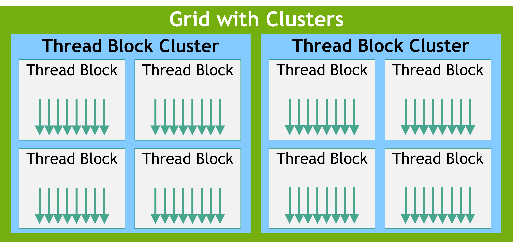

# 1.2 Programming Model-编程模型
本章节从宏观层面介绍CUDA编程模型，不涉及任何编程语言。这里介绍的术语和概念适用于任何支持CUDA的编程语言，后续的章节会以C++为例讲解这些概念。

## 1.2.1 Heterogeneous Systems-异构系统
CUDA编程模型假定是异构计算系统，异构系统指同时具有CPU和GPU的系统。其中CPU和与它直接连接的内存分别称为*host-主机*和*host memory-主机内存*。 GPU和与它直接连接的内存称为*device-设备*和*device memory-设备内存*。在一些片上系统（SoC）中，这些可能被集成在同一个封装中。在一些规模较大的系统中，可能有多个CPU或GPU。

CUDA应用程序中的部分代码在GPU上执行，但程序始终在CPU上开始执行。
主机代码（运行在CPU上的代码）它可以使用CUDA API在主机内存和设备内存之间复制数据，启动GPU上的代码运行，并等待数据拷贝或者GPU代码运行结束。CPU和GPU能够同时执行代码，通常通过最大限度的利用CPU和GPU可以获得最佳性能。

程序中在GPU上运行的代码叫做*device code-设备代码*，因为一些历史原因，把在GPU上运行的函数叫做*kernel-核函数*。启动kernel运行的动作被成为*launching-启动*kernel。kernel启动可以理解为启动许多个线程，他们在GPU上并行执行kernel。GPU线程操作与CPU线程类似，但是它们在一些对正确性和性能都很重要的方面存在差异，后续的章节中会详细说明([3.2.2.1.1]())。

## 1.2.2 GPU Hardware Model-GPU硬件模型
与任何编程模型一样，CUDA也依赖底层硬件的概念模型。就CUDA编程的而言，GPU可以被看成是*Streaming Multiprocessors(SM)-流式多处理器*的集合，这些SM被组织成叫*Graphics Processing Clusters(GPCs)-图形处理集群*的组。每个SM拥有一个本地寄存器文件，一个统一数据缓存和多个执行计算的功能单元。统一数据缓存为共享内存和L1缓存提供物理资源。统一数据缓存到L1和共享内存的分配可以在运行时配置。不同类型的内存大小和SM内的功能单元数量在不同的GPU架构中可能存在不同。

#### Note
GPU的真实硬件布局或执行编程模型的物理方式可能不同。这些差异对于使用CUDA编程模型编写的软件来说没有影响。

|  |
| :--: |
| *图2*：GPU有更多的流式多处理器（SM），每个SM拥有多个功能单元。  图形处理集群（GPC）是SM的集合。  GPU是连接到GPU内存的GPC集合。  CPU通常包含多个核心和一个连接到系统内存的内存控制器。  CPU和GPU通过像PCIe或NVLINK的之类的互联技术连接。 |

### 1.2.2.1 Thread Blocks and Grids-线程块和网格
当应用程序启动kernel，它会使用许多线程，通常有百万个线程。这些线程被组织成 *blocks-块*。组织成块的线程,顾名思义，被称为*thread block-线程块*。线程块以*grid-网格*形式排列。同一个网格中的所有线程块具有相同的大小和维度。

<u>[图3](../assets/img/grid-of-thread-blocks.png)</u>展示了线程块网格的示意图。

|  |
| :--: |
| *图3*：线程块网格。每个箭头代表一个线程（箭头的数量并不代表线程的真实数量） |

线程块和网格可以是1维,2维,或3维。这些维度可以将每个线程到工作单元或者数据项的映射过程简化。

当启动kernel时，使用特定的执行配置，该配置指定网格和线程块维度。执行配置还可以包含一些可选的参数，例如cluster大小、流和SM配置设置，这些参数在后续章节会介绍。

通过内置变量，执行kernel的每个线程都可以确定其在对应块中的位置，以及该块在对应网格中的位置。线程还可以通过这些内置变量确定线程块的维度以及kernel启动所在的网格。这给每个执行kernel的线程一个唯一身份标识。该身份标识经常用来确定线程负责哪些数据和操作。

线程块中的所有线程都在同一个SM中执行。这使得线程块内的线程能够高效的通信和同步。线程块内的所有线程都可以访问片上共享内存，该内存可用于线程块内的线程间信息交换。

一个网格可能包含数百万个线程块，而执行该网格的GPU可能只有几十或者几百个SM。线程块内的所有线程都由单个SM执行，并且在大多数情况下<a href="#fn-non-completion">[1]</a>，在该SM上运行直到完毕。线程块间的调度没有保证，因此一个线程块不可以依赖其他线程块的结果，因为其他线程块可能必须等到该线程块完成后才能被调度。<u>[图4](../assets/img/thread-block-scheduling.png)</u>展示了如何将网格中的线程块分配给SM的示例

|  |
| :--: |
| *图4*：每个SM都有一个或多个活动线程块。在这个示例中，每个SM同时调度了3个线程块。  无法保证网格中的线程块分配给SM的顺序。 |

CUDA编程模型允许任何大小的GPU能够运行任意规模的网格，无论GPU只有一个SM还是有数千个SM。为了实现这点，CUDA编程模型（除少数例外情况外），要求不同线程块间的线程没有数据依赖关系。也就是说，一个线程不应该依赖于同一个网格中不同线程块内线程的结果，也不应与其进行同步。线程块内的所有线程同时运行在同一个SM上。网格内不同的线程块会在可用的SM间调度，并且可能按任意顺序执行。简单来说，CUDA编程模型要求线程块能以任意顺序并行或串行执行。

#### 1.2.2.1.1 Thread Block Clusters-线程块集群
除了线程块之外，计算能力为9.0及以上的GPU还具有一个叫*cluster-集群*的可选分组级别。cluster是一组线程块，它与线程块和网格类似，也可以是1维、2维或3维的。
<u>[图5](../assets/img/grid-of-clusters.png)</u>展示了一个线程块网格，其中线程块被组织成cluster。指定cluster不会改变网格维度和网格内线程块的索引。

|  |
| :--: |
| *图5*：当指定cluster后，线程块在网格中的位置不变，但同时也在包含它的cluster内具有特定位置。 |

指定cluster会将相邻的线程块分组到cluster中，并在cluster级别增加一些同步和通信的额外机会。具体来说，cluster内部的所有线程块都在单个GPC（图形处理集群）中执行。<u>[图6](../assets/img/thread-block-scheduling-with-clusters.png)</u>展示了当指定cluster后，GPC中如何将线程块调度到SM。由于线程块是在单个GPC上同时调度的，因此同一cluster内不同块内的线程可以使用<u>[*Cooperative Groups-合作组*]()</u>提供的软件接口互相通信和同步。cluster内的线程可以访问cluster内所有块的共享内存，这叫做*distributed shared memory-分布式共享内存*。cluster的最大规模取决于硬件，并且因设备而异。

[图6](../assets/img/thread-block-scheduling-with-clusters.png)展示了cluster内的线程块是如何在GPC内的SM上同时调度。cluster内的线程块在网格中始终彼此相邻。

|  |
| :--: |
| *图6*：当指定cluster后，cluster中的线程块在网格中按照cluster形状排列。  cluster中的线程块将同时调度到单个GPC的各个SM中。|

### 1.2.2.2 Warps and SIMT-线程束和单指令多线程
在一个线程块内，线程被组织成每32个线程一组的组，这些组称为*warps-线程束*. warp以*Single-Instruction Multiple-Thread(SIMT)-单指令多线程*的模式执行kernel代码。在SIMT中，warp内的所有线程都执行相同的kernel代码,但每个线程可以执行代码的不同分支。也就是说，尽管程序的所有线程执行相同的代码，但线程不需要遵循相同的执行路径。

当线程在wrap中执行时，它们被分配到一个*warp lane-线程束管道*. warp lanes的编号为0-31,线程块中的线程按照<u>[Hardware Multithreading-硬件多线程]()</u>中详细描述的可预测方式分配到各个warp中。

同一warp中的所有线程同时执行相同的指令。如果warp中的某些线程在执行过程中遵循某些控制流分支，而其他线程不遵循，那不遵循分支的线程会被*masked off-屏蔽*，遵循分支的线程继续执行。举例来说，如果某个条件仅对warp中的一半线程成立，则在活动线程执行这些指令时，warp的另外一半会被遮罩。这种情况如<u>[图7](../assets/img/active-warp-lanes.png)</u>所示。当warp中的不同线程执行不同代码路径，有时这被称为*warp divergence-线程束发散*。因此，当warp内的所有线程执行相同的控制流路径时GPU的利用率能达到最大化。

|  |
| :--: |
| *图7*：在这个例子中，只有线程索引为偶数的线程才会执行if分支内的代码，当if分支执行时其他线程被屏蔽。|

在SIMT模型中，warp内的所有线程以*lock step-锁步*方式共同执行kernel。硬件实际执行方式可能不同。有关此区别重要性的详细信息，请参考<u>[Independent Thread Execution-独立线程执行]()</u>。不鼓励将warp实际执行的知识映射到真实硬件。CUDA编程模型和SIMT都指出warp内的所有线程同步执行代码。只要遵循编程模型，硬件就可以以对程序透明的方式优化被屏蔽的通道。如果程序违反该模型，可能导致未定义行为，且该行为在不同GPU硬件上可能不同。

虽然编写CUDA代码时不必考虑warp，理解warp执行模型有助于理解如<u>[global memory coalescing-全局内存合并]()</u>和<u>[shared memory bank access patterns-共享内存存储体访问模式]()</u>等概念。一些高级编程技术会在线程块内对warp进行特化，以减少线程发散并最大化利用率。此类优化及其他优化方法都的利用了“线程在执行时被组织成warp“这一知识。

wrap执行的一个含义是线程块最好指定线程总数是32的倍数。使用任意数量的线程数是合法的，但当总数不是32的倍数时，执行时线程块的最后一个warp可能有一些管道不会被使用。这可能导致较差的功能单元利用率和内存访问率。

  SIMT常被拿来与<i>Single Instruction Multiple Data(SIMD)-单指令多数据</i>并行计算相比较，但两者之间存在一些重要的差异。在SIMD中，执行时遵循单一控制流路径，但是在SIMT中，每个线程都可以遵循自己的控制流路径。因此，SIMT不像SIMD那样拥有固定数据宽度。更多关于SIMT的详细讨论可以在<u>[SIMT Execution Model-SIMT执行模型]()</u>章节找到。

## 1.2.3 GPU Memory-GPU内存
在现代的计算机系统中，高效利用内存与最限度利用执行计算的功能单元同样重要。异构系统拥有多个内存空间，GPU除了缓存外还有各种类型的可编程片上内存。接下来的章节会更详细地介绍这些内存空间。

### 1.2.3.1 DRAM Memory in Heterogeneous Systems-异构系统中的DRAM内存
GPU和CPU都有直接连接的DRAM芯片。在有多个GPU的系统中，每个GPU都有它自己的内存。从设备代码的角度来看，与GPU相连接的DRAM称为全局内存，因为它可以被GPU上的所有SM访问。但这并不意味着它在系统内的任何地方都一定可以访问。与CPU直接连接的DRAM叫做*system memory-系统内存*或者*host memory-主机内存*.

与CPU类似，GPU使用虚拟内存地址。在所有现在支持的系统中，CPU和GPU使用同一个统一的虚拟内存空间。这意味着系统中的每个GPU的虚拟内存地址范围都是唯一的，且与CPU和系统中的其他所有GPU的虚拟内存地址范围都不同。对于给定的虚拟内存地址，可以确定该地址位于GPU内存还是系统内存中，并且在有多个GPU的系统中，还可以确定该地址位于哪块GPU中。

CUDA API可以分配GPU内存、CPU内存、以及在CPU与GPU之间、单个GPU内部或多GPU系统中不同GPU之间复制内存。数据的位置可以根据需要显示控制。下文会讨论的<u>[Unified Memory-统一内存](#1233-unified-memory-统一内存)</u>允许CUDA运行时或系统硬件自动处理内存占位。

### 1.2.3.2 On-Chip Memory in GPUs-GPU中的片上内存
除了全局内存外，每个GPU都有一些片上内存。每个SM都有自己的寄存器文件和共享内存。这些内存是SM的一部分，SM内部执行的线程可以极速访问它们，但其他SM中运行的线程访问不到他们。

寄存器文件存储线程局部变量，这些变量由编译器分配。线程块或cluster内的所有线程都可以访问共享内存。共享内存可用于线程块或cluster内线程间的数据交换。

SM中的寄存器文件和统一数据缓存的大小是有限的。SM的寄存器文件大小、统一数据缓存、以及如何配置统一数据缓存以实现L1和共享内存平衡，可以在<u>[Memory Information per Compute Capability-每个计算能力的内存信息]()</u>中找到。寄存器文件、共享内存空间、和L1缓存由线程块中的所有线程共享。

要将线程块调度到SM中，每个线程需要的寄存器总数乘以线程块中线程数必须小于或等于SM中可用的寄存器数量。如果线程块需要的寄存器总量大于寄存器文件的大小，则kernel无法启动，必须减少线程块中线程数量才能让线程块启动。

共享内存分配是在线程块层级做的，也就是说，与每个线程都进行寄存器分配不同，共享内存的分配是整个线程块通用的。

#### 1.2.3.2.1 Caches-缓存
除了可编程内存外，GPU还有L1和L2缓存。每个SM都有一个L1缓存，它是统一数据缓存的一部分。GPU中所有SM共享一个更大的L2缓存。这可以从<u>[图2](../assets/img/gpu-cpu-system-diagram.png)</u>的GPU框图中看到。每个SM还有一个独立的常量缓存，用于缓存kernel生命周期内声明为常量值的全局内存值。编译器也有可能将kernel的参数放在常量内存中。通过将kernel参数与L1数据缓存分开缓存到SM中可以提高kernel性能。

### 1.2.3.3 Unified Memory-统一内存
当应用程序在GPU或者CPU上显示分配内存时，该内存只能由在该设备上运行的代码访问。也就是说，CPU内存只能由CPU代码访问，GPU内存只能由运行在GPU<a href="#fn-mapped-memory-system-access">[2]</a>上的kernel访问。CUDA API用于在CPU和GPU间复制内存，以便将数据在正确的时间显式的复制到正确的内存中。

一个称为*unified memory-统一内存*的CUDA功能允许应用程序分配既能被CPU访问也能被GPU访问的内存。CUDA运行时或底层的硬件会在需要时允许访问数据或将数据重新定位到正确的位置。即使采用统一内存，想要达到更好的性能需要保持最小化内存迁移，并且尽可能的直接从与内存相连的处理器中访问数据。

系统的硬件特性决定了内存空间之间数据访问和交换的实现方式。<u>[Unified Memory-统一内存]()</u>一节介绍了不同类型的统一内存系统，该节也包括了关于统一内存在各种情况下的使用和行为的更多细节。

##### <B id="fn-non-completion">[1]</B> 
在某些情况下，比如使用<u>[CUDA Dynamic Parallelism-CUDA动态并行]()</u>等功能，线程块可能挂载到内存中。意味着SM的状态会被保存在GPU内存中由系统管理的区域，而SM会被释放用来执行其他线程块。这与CPU中的上下文交换类似。这种情况并不常见。

##### <B id="fn-mapped-memory-system-access">[1]</B> 
但</u>[mapped memory-映射内存]()</u>是个例外，它是CPU分配的内存，其属性允许GPU直接访问它。然而，映射内存访问通过PCIe或者NVLINK连接。GPU无法通过并行处理掩盖高延迟和低带宽，因此映射内存并不能有效的替代统一内存或把数据放在合适的内存空间中。

| [上一页](./1.1-简介.md) | [下一页](./1.3-CUDA平台.md) |
| :--- | ---: |

