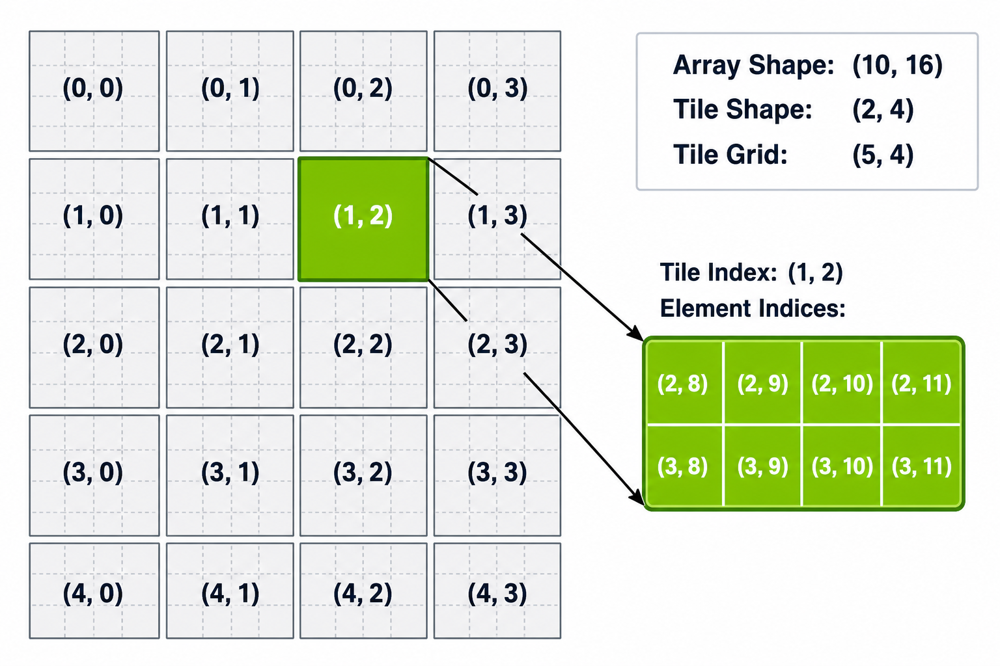

# 2.4. 编写 Tile kernel

CUDA Tile 提供了一种与前面章节介绍的单指令多线程 (SIMT) 模型不同的编写 GPU kernel代码的方法。Tile 编程允许程序员以不同的方式表达并行性，并将最低级别的并行性留给编译器和内置操作。通过这样做，Tile 提供了一种更简单的方式来访问 NVIDIA GPU 的最新性能特性，例如张量内存加速器 (TMA) 单元和张量核心。

*   CUDA Tile 编程通过 cuTile Python 包 `cuda.tile` 在 Python 中可用。
*   从 13.3 版本开始，CUDA 工具包中提供了 CUDA Tile C++。

对于分配设备内存、在主机和设备之间传输数据以及排序kernel启动等围绕 tile kernel的应用程序代码，与前面章节中针对 SIMT kernel描述的完全相同。Tile kernel操作于使用标准 CUDA API 分配的全局内存，并且其结果以相同的方式复制回主机。唯一变化的是程序员在kernel内部编写的代码。

在 SIMT kernel中，程序员从单个线程的角度思考：计算全局线程索引、加载线程的元素、对其执行操作以及存储结果。在 tile kernel中，程序员从整个块的角度思考：加载包含许多元素的 tile，对整个 tile 执行操作，以及存储结果。编译器负责将 tile 操作映射到每个块的硬件线程，而 SIMT 程序员显式处理这个问题。

本章仅关注这种差异：如何编写kernel入口点及其内部的 tile 操作。每个模式都在 CuTile Python (`cuda.tile`) 和 CUDA Tile C++ (`cuda::tiles`) 中演示，它们共享一个共同的编译器后端 (CUDA Tile IR)，因此共享相同的执行语义。

按照惯例，tile API 在两种语言中都别名为 `ct`。

*   Python 中：`import cuda.tile as ct`
*   C++ 中：`namespace ct = cuda::tiles`

在 Python 中，tile API 位于模块 `cuda.tiles` 中，如上所示导入。

在 C++ 中，tile API 位于命名空间 `cuda::tiles` 中，由头文件 `cuda_tile.h` 暴露。

```cuda
#include "cuda_tile.h"
namespace ct = cuda::tiles;
```

下面代码片段中的 `ct.` / `ct::` 前缀指的是您正在阅读的任何语言中的 tile API。

## 2.4.1. kernel和函数声明

Tile kernel是 GPU 入口点，它在启动网格中的每个块执行一次。Tile 函数可以从 tile kernel或其他 tile 函数中调用，但它本身不是入口点。与 SIMT kernel一样，tile kernel不能直接从主机代码调用；它们必须被启动。

在 CUDA Tile C++ 中：

*   `__tile_global__` 是 `__global__` 的 tile 模拟，标记 tile kernel入口点
*   `__tile__` 是 `__device__` 的 tile 模拟，表示应为 GPU 编译并可从其他 `__tile__` 或 `__tile_global__` 函数调用的函数。

数组和标量参数的传递方式与 SIMT kernel相同。Tile 代码和 SIMT 代码可以共存：单个 `.cu` 文件可以同时定义 `__tile_global__` 和 `__global__` kernel，并且单个主机程序可以启动两者。

> **注意**
> 目前，不能从 `__global__` 或 `__device__` 函数调用 `__tile__` 函数。类似地，不能从 `__tile_global__` 或 `__tile__` 函数调用 `__device__` 函数。此限制可能在未来的 CUDA 版本中解除。

在 cuTile Python 中：

*   `@ct.kernel` 装饰器将函数标记为 tile kernel入口点
*   `@ct.function` 装饰器标记可从 tile kernel或其他 tile 函数调用的函数。

实际上，从kernel调用的任何函数都会自动编译为 tile 代码，因此 `@ct.function` 装饰器是可选的。数组参数接受任何暴露 DLPack 或 CUDA 数组接口的设备驻留数组。例如，PyTorch 张量和 CuPy 数组。标量参数直接传递。

```C++
// C++
#include "cuda_tile.h"

// Tile kernel entry point. Cannot be called directly; must be launched.
__tile_global__ void my_kernel(float* a, float* b, float* c) {
    ...
}

// Tile function. Callable from tile kernels and tile functions.
__tile__ float helper(float x, float y) {
    return x + y;
}
```

```python
# python
import cuda.tile as ct

# Tile kernel entry point. Cannot be called directly; must be launched.
@ct.kernel
def my_kernel(a, b, c):
    ...

# Tile function. Callable from tile kernels and tile functions.
# @ct.function is optional, any function called from tile code
# is automatically compiled as tile code.
@ct.function
def helper(x, y):
    return x + y
```

## 2.4.2. 启动kernel

Tile kernel在 tile 块网格上启动，就像 SIMT kernel在线程块网格上启动一样。程序员指定网格形状，最多三维。从程序员的角度来看，每个 tile 块由单个逻辑线程执行。块内的并行性由编译器管理。

在 C++ 中，tile kernel重用 SIMT 中熟悉的三括号启动语法。第一个尖括号参数是网格形状（tile 块数）。第二个参数是 SIMT 的每块线程数；对于 tile kernel，编译器内部确定线程数，第二个参数**必须为** `1`。Tile kernel也是一个普通的 CUDA kernel，因此它可以通过运行时的现有 API `cudaLaunchKernel` 和 `cudaLaunchKernelEx` 以相同的 `grid, 1` 配置启动。当将 tile kernel集成到已经通过这些 API 驱动启动的代码库中时，这很有用。

在 Python 中，`ct.launch` 接受四个位置参数：一个 CUDA 流、一个指定每个维度中 tile 块数的网格元组、kernel对象以及kernel参数的元组。

```C++
my_kernel<<<dim3(num_blocks_x, num_blocks_y), 1>>>(a, b, c);  // second arg must be 1
```

```python
# python
import torch

stream = torch.cuda.current_stream()     # CUDA stream object
grid = (num_blocks_x, num_blocks_y, 1)   # tile-block grid (x, y, z)
ct.launch(stream, grid, my_kernel, (a, b, c))
```

### 2.4.2.1. 网格大小确定模式

一种常见的模式是启动足够多的块来覆盖整个数组，包括最后一个可能在一个或多个维度上超出数组大小的块。

```C++
// C++
int num_blocks = (N + tile_size - 1) / tile_size;   // ceil division -> covers partial tail
kernel<<<num_blocks, 1>>>(in, out, N);
```

```python
# python
import math

grid = (math.ceil(N / TILE),)   # ceil division -> covers partial tail
ct.launch(stream, grid, my_kernel, (arr_in, arr_out, TILE))
```

处理数组大小不能被 tile 大小完美整除的情况在[第 2.4.6 节](#246-加载和存储-tiles)的子节中讨论。

## 2.4.3. 查询块位置

每个块需要知道它在网格中的位置，以便确定要处理哪部分数据。在 SIMT 中，程序员结合 `blockIdx` 和 `threadIdx` 来计算全局线程索引。在 tile 代码中，只需要块索引。编译器处理块内的所有线程级索引。

在 C++ 中，`ct::bid()` 返回一个包含所有三个维度上块索引的 `uint3`。`ct::num_blocks()` 返回一个 `dim3`，包含每个维度上的总块数（由kernel启动参数确定）。各个分量通过 `.x`、`.y`、`.z` 访问。

在 Python 中，`ct.bid(axis)` 返回当前块沿给定轴（0、1 或 2）的索引，作为一个 `int32` 标量。`ct.num_blocks(axis)` 返回沿该轴的总块数——对于边界检查和循环计数很有用。

```C++
// C++
#include "cuda_tile.h"

__tile_global__ void my_kernel(float* a, float* b, float* c) {
    namespace ct = cuda::tiles;
    int bid_x = ct::bid().x;          // block index along .x
    int bid_y = ct::bid().y;          // block index along .y
    int num_x = ct::num_blocks().x;   // total blocks along .x
}
```

```python
# python
@ct.kernel
def my_kernel(a, b, c):
    bid_x = ct.bid(0)          # block index along axis 0
    bid_y = ct.bid(1)          # block index along axis 1
    num_x = ct.num_blocks(0)   # total blocks along axis 0
```

## 2.4.4. 创建 Tiles

确定了块的身份后，下一个问题是 tile kernel实际操作的是什么。那就是 tile：一个固定大小的、多维的标量元素数组，其形状和元素类型在编译时已知。Tile 的每个维度必须是 2 的幂。Tiles 具有值语义。这意味着复制一个 tile 会复制其元素，并且两个副本完全独立。尽管如此，复制是廉价的，因为编译器控制着 tile 在硬件中的表示方式。程序员不为 tiles 分配或释放内存。

在实践中，tiles 要么通过从数组加载数据来创建（[Tile 空间加载和存储](#2461-tile-空间加载和存储)），要么通过使用生成填充有指定模式的 tiles 的工厂函数来创建。

在 C\++ 中，tile 类型是显式的：`ct::tile<T, ct::shape<dims...>>`，其中 `T` 是元素类型，`ct::shape<dims...>` 将维度编码为模板参数（整数值是沿每个轴的编译时大小）。例如，`ct::tile<float, ct::shape<8>>` 是一个包含 8 个浮点数的一维 tile，`ct::tile<float, ct::shape<4, 4>>` 是一个 4×4 的浮点数 tile。由于形状是类型的一部分，它总是在编译时已知。

工厂函数将完整的 tile 类型（下面的 `Tile`）作为模板参数：

*   `ct::zeros<Tile>()` 和 `ct::ones<Tile>()` - 填充零或一的 tiles。
*   `ct::full<Tile>(val)` - 每个元素都具有值 `val` 的 tile。
*   `ct::iota<Tile>()` - 包含 `(0, 1, ..., N-1)` 的 tile，其中 `N` 是 tile 的大小。

本章中的 C\++ 示例使用 `using` 别名（例如，`using f32x4x4 = ct::tile<float, ct::shape<4, 4>>`）来使调用点的 tile 类型更具可读性。

在 Python 中，tile 工厂的 `shape` 元组和 `dtype` 参数都是编译时值。Python 字面量（如 `(64, 64)` 和 `ct.float32`）自然满足这一点。它们也可以使用下面[Python Constant[T]](#2451-python-constantt) 中所示的带有 `Constant` 注解的kernel参数来提供。生成的 tile 暴露了 `.shape`、`.dtype` 和 `.ndim` 属性，反映了其编译时属性。

工厂函数有：

*   `ct.zeros(shape, dtype)` 和 `ct.ones(shape, dtype)` - 填充零或一的 tiles。
*   `ct.full(shape, fill_value, dtype)` - 具有任意常量值的 tile。
*   `ct.arange(size, dtype=...)` - 包含 `[0, 1, ..., size-1]` 的一维 tile。

```C++
// C++
#include "cuda_tile.h"

__tile__ void factories() {
    namespace ct = cuda::tiles;

    using i32x8   = ct::tile<int,   ct::shape<8>>;      // 1-D: 8 ints
    using f32x4x4 = ct::tile<float, ct::shape<4, 4>>;   // 2-D: 4x4 floats

    auto z      = ct::zeros<f32x4x4>();       // all zeros
    auto o      = ct::ones<f32x4x4>();        // all ones
    auto filled = ct::full<f32x4x4>(3.14f);   // all 3.14
    auto seq    = ct::iota<i32x8>();          // {0, 1, 2, 3, 4, 5, 6, 7}
}
```

```python
# python
import cuda.tile as ct

@ct.function
def factories():
    zeros  = ct.zeros((64, 64), dtype=ct.float32)            # 64x64 tile of 0.0
    ones   = ct.ones((128,), dtype=ct.float16)               # 128-element tile of 1.0
    filled = ct.full((32, 32), 3.14, dtype=ct.float32)       # 32x32 tile of 3.14
    seq    = ct.arange(8, dtype=ct.int32)                    # [0, 1, 2, 3, 4, 5, 6, 7]
```

## 2.4.5. 编译时常量

Tile 编译器为 tile 形状、数据类型和其他结构参数的每种组合生成专门的机器代码。因此，影响生成代码的值必须在编译时已知。也就是说，tile 的形状和数据类型必须在编译时已知。[创建 Tiles](#244-创建-tiles) 使用字面量来指定 tile 形状和数据类型：`ct.zeros((64, 64), dtype=ct.float32)` 和 `ct::tile<int, ct::shape<8>>`。

形状也可以通过kernel接口作为编译时已知的值传递，如下节所示。

### 2.4.5.1. Python Constant[T]

kernel参数上的 `ct.Constant[T]` 类型提示将其标记为 *常量嵌入*。这意味着kernel内部对该参数的每次使用都好像字面值被写在了那个位置。类型参数是可选的，不带类型参数的 `ct.Constant` 嵌入任何类型的常量。`ct.Constant` 最常用于整数 `ct.Constant[int]`，用于驱动 tile 形状和循环边界的参数。

```python
import cuda.tile as ct

@ct.kernel
def my_kernel(TILE: ct.Constant[int]):
    # TILE is constant-embedded: wherever TILE appears, the compiler sees its
    # literal value (e.g., 128) and generates specialized code. Here TILE drives
    # the shape of a factory-built tile.
    zeros = ct.zeros((TILE,), dtype=ct.float32)
```

### 2.4.5.2. C++ integral_constant 和 _ic 字面量

在 CUDA Tile C\++ 中，编译时值通过 `ct::integral_constant` 表示，这是一个其数值编码在类型本身中的类型。来自 `ct::literals` 命名空间的 `_ic` 字面量提供了一个简洁的简写：`0_ic` 生成一个 `ct::integral_constant<0>` 值。

接受编译时值的 API 既接受非类型模板参数 (NTTP) 形式，也接受 `_ic` 字面量形式。例如，`ct::cat` 沿给定维度连接两个 tiles，该维度必须在编译时已知。下面两行以相同的编译时轴调用 `ct::cat`；它们仅在编译时值的书写位置不同：

```C++
#include "cuda_tile.h"

__tile__ void concat_demo() {
    namespace ct = cuda::tiles;
    using namespace ct::literals;

    using T = ct::tile<int, ct::shape<4, 8>>;
    T lhs = ct::full<T>(0);
    T rhs = ct::full<T>(1);

    auto a = ct::cat<0>(lhs, rhs);     // NTTP form
    auto b = ct::cat(lhs, rhs, 0_ic);  // _ic form
}
```

还有另一个地方通常会用到 `_ic` 字面量。`ct::extents` 和 `ct::shape` 各自都有 NTTP 形式（例如，`ct::extents<std::uint32_t, 4, 8>`）和花括号形式。与 NTTP 形式不同，花括号形式接受运行时值，因此当一个或多个维度仅在启动时已知时，您可以使用这种形式：编译时维度使用 `_ic` 字面量，运行时维度使用普通变量。像 `ct::tensor_span` 和 `ct::partition_view` 这样的 Tile 空间 API（在[Tile 空间加载和存储](#writing-tile-kernels-tile-space-loads-and-stores)中介绍）使用这种形式来包装此类数组：

```C++
auto shape2d = ct::extents{8_ic, length};  // 8 is compile-time; length is runtime
```

`_ic` 字面量是编译时值的统一简写，只要值形式的 API 参数需要编译时值（例如 `ct::cat` 的维度或 `extents` 或 `shape` 的分量），就可以使用它。

## 2.4.6. 加载和存储 Tiles

如[第 1.2.2.3.1 节](../chapter-1-CUDA简介/1.2-编程模型.md#12231-数组和-tiles)首次介绍的，CUDA tile 编程模型中有两个关键的内存对象：数组和 tiles。数组是全局内存中元素的多元容器，对 tile kernel的所有块可见。Tile 也是元素的多元容器，但它是单个 CUDA tile 代码块的本地数据。Tile 通常是数组元素的子集。本节讨论如何从数组加载到 tiles 以便在 tile kernel中使用，以及将 tiles 存储回数组。

后续小节介绍了加载和存储 tiles 的两种方法：

*   [Tile 空间加载和存储](#2461-tile-空间加载和存储) 涵盖了使用 tile 空间索引的加载和存储，这些索引使用视图对象，这些视图对象规定了数组元素如何映射到 tiles 的可预测模式。
*   [聚集和散射](#2462-聚集和散射) 涵盖了使用索引或指针 tile 的加载和存储，这些索引或指针指示了加载或存储时 tile 元素的源或目标数组元素。

**性能说明**：在支持的硬件上，编译器可以将 Tile 空间加载降级为张量内存加速器 (TMA)，这比逐元素聚集要快得多。（对于 C\++ 方面，另请参阅[C++ 性能提示](#2412-c-性能提示)。）

程序员必须决定在加载时越界元素的值。在 Python 中，越界写入会被静默丢弃；在 C\++ 中使用掩码变体时也是如此。

### 2.4.6.1. Tile 空间加载和存储

使用 Tile 空间加载时，会创建一个视图对象，该对象指定如何将数组划分为 tile 大小的区域网格。这种映射称为 *tile 空间*，tile kernel可以使用 tile 空间索引一次加载或存储一个区域。

Tile 空间加载的核心概念是数组的 *分块视图*，它指定了数组元素如何映射到指定大小的 tiles。[图 19](../assets/img/cutile-tile-space-indexing.png) 中显示的分块视图是一个 *分区视图*，它是一个 tile 空间，具有指定大小的非重叠 tiles，tile 之间没有间隙。

<figure class="align-center" id="writing-tile-kernels-figure-tile-space-indexing">

<figcaption style="text-align: center;">
<p><span class="caption-number">图 19 </span><span class="caption-text">分区视图的 tile 空间索引。一个形状为 <code class="docutils literal notranslate"><span class="pre">(10,</span> <span class="pre">16)</span></code> 的二维数组被划分为形状为 <code class="docutils literal notranslate"><span class="pre">(2,</span> <span class="pre">4)</span></code> 的 tiles，产生一个形状为 <code class="docutils literal notranslate"><span class="pre">(5,</span> <span class="pre">4)</span></code> 的 tile 网格。每个单元格显示其 tile 空间索引 <code class="docutils literal notranslate"><span class="pre">(i,</span> <span class="pre">j)</span></code>。在 tile 空间索引 <code class="docutils literal notranslate"><span class="pre">(1,</span> <span class="pre">2)</span></code> 处高亮的区域覆盖元素索引 <code class="docutils literal notranslate"><span class="pre">(2,</span> <span class="pre">8)</span></code> 到 <code class="docutils literal notranslate"><span class="pre">(3,</span> <span class="pre">11)</span></code>。</p>
</figcaption>
</figure>

当数组维度不能完美地划分为 tiles 时，在一个或多个维度上跨越数组边界的 tiles 将被部分填充。程序员可以指定加载这些 tiles 时的行为，这将在[第 2.4.6.1.3 节](#24613-tile-空间边界处理)中介绍。

> **注意**
> 这里的示例和描述使用分区视图来说明 tile 空间加载和存储，因为这是 CUDA Tile 代码中支持的第一种视图类型。预计在后续版本的 CUDA Tile 中将添加其他视图类型。

#### 2.4.6.1.1. 分区视图加载和存储

结构化的 tile 空间加载是在全局内存和 tiles 之间移动数据的首选方式。kernel必须首先构建一个定义 tile 空间的视图对象，然后通过 tile 空间索引一次加载或存储一个 tile。

在 C\++ 中，分区视图分两步构建：

*   `ct::tensor_span` - 将原始指针与 `ct::extents` 配对，赋予指针多维结构。
*   `ct::partition_view` - 将跨度划分为固定大小的 tiles 网格，并暴露在 tile 空间坐标中操作的 `.load(idx...)` / `.store(tile, idx...)` 方法。

在 Python 中，`Array.tiled_view(tile_shape)` 返回一个 `TiledView`，它将数组划分为给定形状的 tiles。该视图暴露了 `.load(index)` / `.store(index, tile)` 方法，这些方法接受 tile 空间索引，直接镜像 C++ 的 `partition_view`。

> **注意**
> 本章中的 C\++ 示例代码使用 `__restrict__` 注解指针参数，并在kernel体开头附近调用 `ct::assume_aligned(ptr, 16_ic)`。这些是重要的性能注解，在[第 2.4.12 节](#writing-tile-kernels-cpp-perf-tips)中有进一步介绍。数字字面量上的 `_ic` 后缀（例如 `128_ic`、`8_ic`）将它们标记为编译时常量，如[编译时常量](#writing-tile-kernels-compile-time-constants)中所述。

```C++
__tile_global__ void vec_add(float* __restrict__ a, float* __restrict__ b, float* __restrict__ out) {
    namespace ct = cuda::tiles;
    using namespace ct::literals;

    a   = ct::assume_aligned(a,   16_ic);
    b   = ct::assume_aligned(b,   16_ic);
    out = ct::assume_aligned(out, 16_ic);

    // Step 1: attach a shape to each raw pointer. 128_ic marks 128 as a compile-time constant.
    auto aSpan = ct::tensor_span{a,   ct::extents{128_ic}};
    auto bSpan = ct::tensor_span{b,   ct::extents{128_ic}};
    auto oSpan = ct::tensor_span{out, ct::extents{128_ic}};

    // Step 2: partition each span into a tile space of fixed 8-element tiles.
    auto aView = ct::partition_view{aSpan, ct::shape{8_ic}};
    auto bView = ct::partition_view{bSpan, ct::shape{8_ic}};
    auto oView = ct::partition_view{oSpan, ct::shape{8_ic}};

    int  bx    = ct::bid().x;             // this block's tile-space index along .x
    auto aTile = aView.load(bx);          // pick the bx-th tile of a
    auto bTile = bView.load(bx);
    oView.store(aTile + bTile, bx);       // write the tile back at the bx-th position of out
}
```

```python
# python
@ct.kernel
def vec_add(a, b, c, TILE: ct.Constant[int]):
    a_view = a.tiled_view((TILE,))
    b_view = b.tiled_view((TILE,))
    c_view = c.tiled_view((TILE,))

    bid = ct.bid(0)
    a_tile = a_view.load((bid,))
    b_tile = b_view.load((bid,))
    c_view.store((bid,), a_tile + b_tile)
```

#### 2.4.6.1.2. Python 单次调用加载和存储

Python 还提供了一种单次调用形式，在每次加载和存储时内联指定 tile 形状，无需显式视图对象。`ct.load(array, index, shape)` 在给定的 tile 空间索引处读取给定形状的 tile。`ct.store(array, index, tile)` 是对应的写入。

`ct.load`/`ct.store` 和 `Array.tiled_view` 都表达了相同的 tile 空间访问模式。区别在于 tile 形状的存储位置。使用 `Array.tiled_view`，tile 形状被绑定到视图对象一次。使用 `ct.load`/`ct.store`，tile 形状在每次调用时内联提供。当相同分区在多个加载和存储之间重用时，首选使用 `tiled_view`。当单个一次性加载更简洁时，使用 `ct.load`/`ct.store`。

```python
@ct.kernel
def vec_add(a, b, c, TILE: ct.Constant[int]):
    bid = ct.bid(0)                                    # this block's tile-space index along axis 0
    a_tile = ct.load(a, index=(bid,), shape=(TILE,))   # (index, shape) = pick the bid-th TILE-sized region of a
    b_tile = ct.load(b, index=(bid,), shape=(TILE,))
    ct.store(c, index=(bid,), tile=a_tile + b_tile)    # write the tile back to the bid-th region of c
```


#### 2.4.6.1.3. Tile 空间边界处理

在 C\++ 中，`partition_view` 提供了非掩码和掩码变体：

*   `.load(idx...)` / `.store(tile, idx...)` 假设 tile 完全在边界内。部分越界访问是未定义行为。
*   `.load_masked(idx...)` / `.store_masked(tile, idx...)` 安全地处理部分边缘 tile。
    *   `.load_masked()` 默认用零填充越界位置；可以选择其他填充模式（例如，对于浮点 tile 使用 NaN）。
    *   `.store_masked()` 静默丢弃越界写入。

当数组大小可以被 tile 大小完美整除时，首选使用非掩码加载和存储变体。当必须处理边界条件时，即使对于完全填充的 tile，也可以使用掩码变体。

这也是本指南中第一个数组维度是运行时值的 C\++ 示例。`ct::extents{N}` 接受运行时维度，`ct::extents` 支持编译时（`_ic`）和运行时值的任意混合，因此 span 和分区视图可以包装大小仅在kernel启动时已知的数组。

在 Python 中，`ct.load` 接受一个 `padding_mode` 参数，控制越界元素接收的值。两种常用的模式是：

*   `PaddingMode.ZERO` - 越界元素用零填充。
*   `PaddingMode.UNDETERMINED`（默认）- 越界元素值由实现决定。当程序员知道 tile 完全在边界内时，这是合适的。

对于存储，`ct.store` 总是静默丢弃对越界位置的写入，不需要 `padding_mode` 参数。同样的规则适用于 `tiled_view`，它在视图创建时固定其 `padding_mode`。


```C++
// C++
__tile_global__ void edge_safe(float* __restrict__ in, float* __restrict__ out, int N) {
    namespace ct = cuda::tiles;
    using namespace ct::literals;

    in  = ct::assume_aligned(in,  16_ic);
    out = ct::assume_aligned(out, 16_ic);

    // ct::extents{N} uses a runtime dimension; 128_ic stays compile-time.
    auto inView  = ct::partition_view{ct::tensor_span{in,  ct::extents{N}}, ct::shape{128_ic}};
    auto outView = ct::partition_view{ct::tensor_span{out, ct::extents{N}}, ct::shape{128_ic}};

    int  bx   = ct::bid().x;
    auto tile = inView.load_masked(bx);    // masked load: OOB lanes default to 0
    outView.store_masked(tile, bx);        // masked store: OOB writes silently discarded
}
```

```python
# python
@ct.kernel
def edge_safe(arr_in, arr_out, TILE: ct.Constant[int]):
    bid = ct.bid(0)
    tile = ct.load(arr_in, index=(bid,), shape=(TILE,),
                   padding_mode=ct.PaddingMode.ZERO)   # OOB lanes of a partial edge tile become 0
    ct.store(arr_out, index=(bid,), tile=tile)         # OOB writes are silently discarded
```


在 C\++ kernel内部，`.load_masked()` 和 `.store_masked()` 处理部分边缘 tile。在 Python kernel内部，加载时的 `PaddingMode.ZERO` 确保部分边缘 tile 被零填充，`ct.store` 静默丢弃超出数组边界的写入。有关完整的填充模式、掩码选项和填充值集，请参阅每种语言的 API 参考（[CUDA Tile C++ 视图填充](https://docs.nvidia.com/cuda/cuda-tile-cpp-api-reference/constant_wrappers_and_flags.html#view-padding)，[cuTile Python 填充模式](https://docs.nvidia.com/cuda/cutile-python/data.html#padding-modes)）。

从完全位于数组外部的 tile 加载或存储是未定义的。这里讨论的边界处理仅适用于部分越界的 tile（在一个或多个维度上）。

### 2.4.6.2. 聚集和散射

[Tile 空间加载和存储](#2461-tile-空间加载和存储)中的 tile 空间加载使用了分区视图，它定义了数组的规则、块对齐的分区。当访问模式是不规则的或依赖于数据的（例如查找表或置换）时，聚集和散射操作允许从数组的非均匀和非连续元素加载和存储 tile。

聚集和散射操作在 C\++ 和 Python 中看起来略有不同：

*   Python 使用传递给 `ct.gather()` / `ct.scatter()` 的整数索引 tile，具有内置边界检查。
*   C\++ 使用传递给 `ct::load()` / `ct::store()` 的指针 tile，具有掩码变体 `ct::load_masked()` 和 `ct::store_masked()`，它们接受布尔掩码 tile 来处理数组边界处的 tile。

在 C\++ 中，聚集和散射通过形成指针 tile（每个元素一个指针）并将指针 tile 传递给 `ct::load()` 或 `ct::store()` 来工作。标量指针与整数 tile 之间的算术运算是逐元素执行的，生成一个指针 tile。这是在 C++ 中构造聚集/散射索引 tile 的标准习惯用法。

在 Python 中，`ct.gather` 加载索引 tile 中每个索引处的元素。边界检查默认开启：越界索引返回填充值（默认零，可通过 `padding_value=` 配置），并且可以通过 `check_bounds=False` 禁用。`ct.scatter` 为每个索引存储一个值；越界写入被静默丢弃。


```C++
// C++
__tile_global__ void vec_add_gather(int* __restrict__ a, int* __restrict__ b, int* __restrict__ out) {
    namespace ct = cuda::tiles;
    using namespace ct::literals;
    using i32x8 = ct::tile<int, ct::shape<8>>;

    a   = ct::assume_aligned(a,   16_ic);
    b   = ct::assume_aligned(b,   16_ic);
    out = ct::assume_aligned(out, 16_ic);

    int bx       = ct::bid().x;
    auto offsets = 8 * bx + ct::iota<i32x8>();   // element-level offsets, one per lane

    // scalar pointer + int tile = tile of pointers (one pointer per offset).
    auto aPtrs = a + offsets;
    auto bPtrs = b + offsets;

    auto aTile = ct::load(aPtrs);                // gather: one load per pointer
    auto bTile = ct::load(bPtrs);
    ct::store(out + offsets, aTile + bTile);     // scatter: one store per pointer
}
```

```python
# python
@ct.kernel
def vec_add_gather(a, b, c, TILE: ct.Constant[int]):
    bid = ct.bid(0)
    indices = bid * TILE + ct.arange(TILE, dtype=ct.int32)   # one element index per lane

    a_tile = ct.gather(a, indices)                           # load a[indices[i]] per lane
    b_tile = ct.gather(b, indices)
    ct.scatter(c, indices, a_tile + b_tile)                  # store one value per index into c
```

#### 2.4.6.2.1. 聚集和散射边界处理

在[聚集和散射](#2462-聚集和散射)中介绍的聚集/散射操作的边界处理遵循不同的规则。

在 Python 中，`ct.gather` 和 `ct.scatter` 默认是边界安全的。越界读取返回填充值（默认零），越界写入被静默丢弃。当您可以证明每个索引都在范围内时，可以禁用边界检查；这样做会使越界访问成为未定义行为。有关可选的掩码和填充值参数的详细信息，请参阅 API 参考（[CUDA Tile C++ 加载操作](https://docs.nvidia.com/cuda/cuda-tile-cpp-api-reference/memory_operations.html#load-operations)，[cuTile Python 加载/存储操作](https://docs.nvidia.com/cuda/cutile-python/operations.html#load-store)）。

在 C\++ 中，边界检查不是自动的。程序员构造一个布尔掩码（例如，通过将偏移量与数组长度进行比较）并将其传递给 `ct::load_masked` 或 `ct::store_masked`：


```C++
__tile_global__ void gather_safe(int* __restrict__ arr, int* __restrict__ out, int N) {
    namespace ct = cuda::tiles;
    using namespace ct::literals;
    using i32x8 = ct::tile<int, ct::shape<8>>;

    arr = ct::assume_aligned(arr, 16_ic);
    out = ct::assume_aligned(out, 16_ic);

    int bx       = ct::bid().x;
    auto offsets = 8 * bx + ct::iota<i32x8>();   // element-level offsets, one per lane
    auto mask    = offsets < N;                  // boolean tile: true where the offset is in-bounds

    auto ptrs = arr + offsets;                   // tile of pointers, one per offset
    auto tile = ct::load_masked(ptrs, mask, 0);  // masked lanes get the pad value 0
    ct::store_masked(out + offsets, tile, mask); // masked lanes are skipped on the store
}
```


## 2.4.7. 控制流

从程序员的角度来看，tile kernel每个块遵循单个控制流路径。条件和循环边界中的标量值驱动控制流，而主体中的 tile 操作由编译器分配到硬件线程。

并非所有控制流结构都受支持。例如，不允许从循环内部返回。有关限制的完整列表，请参阅每种语言的 API 参考（[CUDA Tile C++ 一般原则](https://docs.nvidia.com/cuda/cuda-tile-cpp-api-reference/general_principles.html)，[cuTile Python 控制流](https://docs.nvidia.com/cuda/cutile-python/execution.html#control-flow)）。

### 2.4.7.1. 循环

一种常见的模式是迭代数组中的 tiles，依次处理每个 tile。

在 C\++ 中，`ct::irange` 是一个前向范围，表示从下界到上界（不包括）的递增整数序列，可选步长。使用 `ct::irange` 为编译器提供有关迭代边界的结构化信息，这可用于更好地优化生成的代码。为了使优化生效，循环变量必须通过范围 for 表达式在 `ct::irange` 上绑定。

在 Python 中，tile 代码支持内置的 `range()`、`for`、`while` 和嵌套循环。

步长参数必须严格为正；不支持负步长范围。

以下单块kernel求和一维数组的所有 tiles：

```C++
__tile_global__ void tile_sum(float* __restrict__ arr, float* __restrict__ out, int num_tiles) {
    namespace ct = cuda::tiles;
    using namespace ct::literals;
    using f32x8 = ct::tile<float, ct::shape<8>>;

    arr = ct::assume_aligned(arr, 16_ic);
    out = ct::assume_aligned(out, 16_ic);

    auto inView  = ct::partition_view{ct::tensor_span{arr, ct::extents{8 * num_tiles}},
                                      ct::shape{8_ic}};
    auto outView = ct::partition_view{ct::tensor_span{out, ct::extents{8_ic}},
                                      ct::shape{8_ic}};

    auto acc = ct::full<f32x8>(0.0f);
    // range-for over ct::irange gives the compiler structured iteration bounds.
    for (auto k : ct::irange(0, num_tiles)) {
        auto tile = inView.load(k);
        acc = acc + tile;                               // accumulate the k-th tile into acc
    }
    outView.store(acc, 0);                              // write the final result as the 0-th tile of out
}
```

```python
# python
@ct.kernel
def tile_sum(arr, out, TILE: ct.Constant[int], N_TILES: ct.Constant[int]):
    # Intended grid: (1,) -- a single block sums all tiles of arr.
    acc = ct.zeros((TILE,), dtype=ct.float32)
    for k in range(N_TILES):                            # range() works natively in tile code
        tile = ct.load(arr, index=(k,), shape=(TILE,))
        acc = acc + tile                                # accumulate the k-th tile into acc
    ct.store(out, index=(0,), tile=acc)                 # write the final result as the 0-th tile of out
```

### 2.4.7.2. 条件语句

标准的 `if`/`else` 条件语句正常工作。由于每个块遵循单个控制流路径，因此关于 warp 内分支发散的考虑不适用于 tile kernel。


```C++
__tile_global__ void conditional_load(float* __restrict__ arr, float* __restrict__ out, int N) {
    namespace ct = cuda::tiles;
    using namespace ct::literals;
    using f32x8 = ct::tile<float, ct::shape<8>>;

    arr = ct::assume_aligned(arr, 16_ic);
    out = ct::assume_aligned(out, 16_ic);

    auto inView  = ct::partition_view{ct::tensor_span{arr, ct::extents{N}}, ct::shape{8_ic}};
    auto outView = ct::partition_view{ct::tensor_span{out, ct::extents{N}}, ct::shape{8_ic}};

    int bx   = ct::bid().x;
    int nb_x = ct::num_blocks().x;

    auto tile = ct::full<f32x8>(0.0f);    // default for the last-block branch
    // Scalar condition -> one control-flow path per block; no divergence to reason about.
    if (bx < nb_x - 1) {
        tile = inView.load(bx);           // all blocks except the last
    }
    outView.store_masked(tile, bx);       // masked to handle a potentially partial final tile
}
```

```python
# python
@ct.kernel
def conditional_load(arr, out, TILE: ct.Constant[int]):
    bid = ct.bid(0)
    # Scalar condition -> one control-flow path per block; no divergence to reason about.
    if bid < ct.num_blocks(0) - 1:
        tile = ct.load(arr, index=(bid,), shape=(TILE,))    # all blocks except the last
    else:
        tile = ct.zeros((TILE,), dtype=ct.float32)          # last block: emit zeros
    ct.store(out, index=(bid,), tile=tile)
```

## 2.4.8. 逐元素算术和广播

Tiles 支持标准的逐元素算术。当两个操作数具有兼容但不同的形状时，在执行操作之前，较小的操作数会被广播以匹配较大的操作数。

### 2.4.8.1. 广播

广播遵循 NumPy 语义：标量被复制到整个 tile，单例维度（长度为 1）被拉伸以匹配另一个操作数的相应维度，并且通过将缺失的前导维度视为单例，将较低秩的操作数对齐到较高秩操作数的尾部维度。如果两个相应的维度都是非单例且不相等，则操作是非法的。

下面的示例在单个加法中同时展示了单例拉伸和秩提升：一个形状为 8x2 的秩 2 tile 被提升到 1x8x2，然后与一个形状为 4x1x2 的秩 3 tile 广播到公共形状 4x8x2。


```C++
// C++
auto x = ct::iota<ct::tile<int, ct::shape<8, 2>>>();      // 8x2   (rank 2)
auto y = ct::iota<ct::tile<int, ct::shape<4, 1, 2>>>();   // 4x1x2 (rank 3)
auto z = x + y;                                           // x promoted to 1x8x2, then broadcasts to 4x8x2
```

```python
# python
x = ct.full((8, 2),    3, dtype=ct.int32)   # 8x2   (rank 2)
y = ct.full((4, 1, 2), 5, dtype=ct.int32)   # 4x1x2 (rank 3)
z = x + y                                    # x promoted to 1x8x2, then broadcasts to 4x8x2
```


### 2.4.8.2. 算术运算符

所有支持的算术运算符都逐元素应用于 tiles，并生成一个广播形状的新 tile。与 tile 结合的标量被广播到每个元素。当操作数类型不同时，优先选择保留更多信息的类型：

*   **Tile 与 Tile 结合**：结果是具有更高精度或更大范围的类型的 tile。例如：
    *   `int + float` 产生 `float`
    *   `int16 + int32` 产生 `int32`
*   **标量与 Tile 结合**：当标量的类型可以精确地表示在 tile 的元素类型中时（例如，整数文字 `2` 与 `int` tile 结合，或 `2.0f` 与 `float` tile 结合），操作以 tile 的元素类型进行。当标量必须缩小以适应 tile 的元素类型时（例如，文字 `2.5` 与 `int` tile 结合），两种语言的处理方式不同：
    *   Python 将结果提升为可以容纳两者的类型
    *   C++ 拒绝该表达式，认为其格式错误

下面的片段说明了标量-tile 情况的分歧：


```C++
// C++
using i32x8 = ct::tile<int, ct::shape<8>>;
i32x8 x = ct::full<i32x8>(3);

x + 2;       // OK - int literal matches int tile element type
x + 2.5;     // ill-formed - 2.5 would narrow to int
```

```python
# python
x = ct.full((8,), 3, dtype=ct.int32)

x + 2          # int32 - int literal matches int32 tile dtype
x + 2.5        # float32 - result promoted to hold both
```


在实践中，尽可能以 tile 的元素类型编写标量字面量，并在需要不同精度时显式转换。当操作数是加载的 tile 时，相同的规则适用于kernel内部：


```C++
// C++
__tile_global__ void elementwise(float* __restrict__ a, float* __restrict__ b, float* __restrict__ out, int N) {
    namespace ct = cuda::tiles;
    using namespace ct::literals;

    a   = ct::assume_aligned(a,   16_ic);
    b   = ct::assume_aligned(b,   16_ic);
    out = ct::assume_aligned(out, 16_ic);

    auto aView = ct::partition_view{ct::tensor_span{a,   ct::extents{N}}, ct::shape{8_ic}};
    auto bView = ct::partition_view{ct::tensor_span{b,   ct::extents{N}}, ct::shape{8_ic}};
    auto cView = ct::partition_view{ct::tensor_span{out, ct::extents{N}}, ct::shape{8_ic}};

    int  bx = ct::bid().x;
    auto x  = aView.load(bx);
    auto y  = bView.load(bx);
    // 2.0f matches the float tiles' element type, so no narrowing conversion is required.
    // The scalar is broadcast across every element; + then runs elementwise.
    auto z  = 2.0f * x + y;
    cView.store(z, bx);
}
```

```python
# python
@ct.kernel
def elementwise(a, b, c, TILE: ct.Constant[int]):
    bid = ct.bid(0)
    x = ct.load(a, index=(bid,), shape=(TILE,))
    y = ct.load(b, index=(bid,), shape=(TILE,))
    # 2.0 is a loosely typed float constant; with float tiles, the result stays float.
    # Scalars are broadcast across every element of the tile, then + runs elementwise.
    z = 2.0 * x + y
    ct.store(c, index=(bid,), tile=z)
```


当需要对舍入模式或次正规数处理进行显式控制时，CUDA Tile API 提供了接受这些作为参数的数学函数（例如，`ct.add`、`ct::add`）。

## 2.4.9. Tile 原语

工厂函数（[创建 Tiles](#244-创建-tiles)）、加载和存储（[Tile 空间加载和存储](#2461-tile-空间加载和存储)）以及逐元素算术（[逐元素算术和广播](#248-逐元素算术和广播)）都是 *tile 原语*，即语言的一部分操作。程序员以 tile 粒度编写它们，编译器将它们映射到硬件，包括可用的张量核心。本节介绍 CUDA tile 中可用的其他原语。

### 2.4.9.1. 矩阵乘法

两个 tiles 的矩阵乘法是实现两个数组之间矩阵乘法的基础操作。CUDA Tile 提供了两种 tiles 之间的矩阵乘法形式：纯矩阵乘法 (matmul) `a @ b` 和矩阵乘加 (mma) `a @ b + acc`。在 mma 中，累加器将一个 K-tile 的部分乘积传递到下一个。这在分块矩阵乘法的内循环中很有帮助。`matmul` 和 `mma` 都支持 2D 矩阵乘法和 3D 批量乘法，以及混合操作数和累加器的数据类型（精度）。秩和元素类型约束记录在操作的 API 参考中（[CUDA Tile C++ 矩阵乘法](https://docs.nvidia.com/cuda/cuda-tile-cpp-api-reference/matrix_multiplication.html)，[cuTile Python matmul](https://docs.nvidia.com/cuda/cutile-python/operations.html#matmul)）。

下面kernel中使用的一种常见模式是，无论输入精度如何，都以 FP32 累加，并在存储时转换为输出元素类型。在 Python 中，这是使用 FP32 类型的 `acc` 的 `ct.mma(a, b, acc)`。在 C\++ 中，这是使用显式 FP32 累加器类型的 `ct::mma(a, b, acc)`。K 循环迭代 `ceil(K / tk)` 次，以便覆盖 A 的右边缘和 B 的下边缘；部分 K-tiles 在加载时被零填充（Python 中的 `PaddingMode.ZERO`，C\++ 中的 `.load_masked()`），C 侧的边缘部分 M/N tiles 通过存储侧的越界丢弃（Python 中的 `ct.store`，C++ 中的 `.store_masked()`）来处理。


```C++
// C++
__tile_global__ void gemm(const __half* __restrict__ A, const __half* __restrict__ B, float* __restrict__ C,
                          std::size_t M, std::size_t K, std::size_t N) {
    namespace ct = cuda::tiles;
    using namespace ct::literals;
    using f32_acc = ct::tile<float, ct::shape<32, 32>>;

    A = ct::assume_aligned(A, 16_ic);
    B = ct::assume_aligned(B, 16_ic);
    C = ct::assume_aligned(C, 16_ic);

    constexpr auto tm = 32_ic;
    constexpr auto tn = 32_ic;
    constexpr auto tk = 16_ic;

    auto aView = ct::partition_view{ct::tensor_span{A, ct::extents{M, K}}, ct::shape{tm, tk}};
    auto bView = ct::partition_view{ct::tensor_span{B, ct::extents{K, N}}, ct::shape{tk, tn}};
    auto cView = ct::partition_view{ct::tensor_span{C, ct::extents{M, N}}, ct::shape{tm, tn}};

    auto [bx, by, bz] = ct::bid();
    auto acc = ct::full<f32_acc>(0.0f);                 // FP32 accumulator

    std::size_t num_k = (K + tk - 1) / tk;
    for (auto k : ct::irange(std::size_t{0}, num_k)) {
        acc = ct::mma(aView.load_masked(bx, k),         // zero-pad partial K-tile
                      bView.load_masked(k, by),
                      acc);                             // acc += a @ b
    }
    cView.store_masked(acc, bx, by);                    // drop OOB edge lanes
}
```

```python
# python
@ct.kernel
def gemm(A, B, C,
         tm: ct.Constant[int], tn: ct.Constant[int], tk: ct.Constant[int]):
    bx, by = ct.bid(0), ct.bid(1)
    num_k  = ct.num_tiles(A, axis=1, shape=(tm, tk))    # number of K-tiles

    acc = ct.full((tm, tn), 0, dtype=ct.float32)        # FP32 accumulator
    for k in range(num_k):
        a = ct.load(A, index=(bx, k), shape=(tm, tk),
                    padding_mode=ct.PaddingMode.ZERO)   # zero-pad partial K-tile
        b = ct.load(B, index=(k, by), shape=(tk, tn),
                    padding_mode=ct.PaddingMode.ZERO)
        acc = ct.mma(a, b, acc)                         # acc += a @ b

    ct.store(C, index=(bx, by), tile=acc.astype(C.dtype))  # cast + store
```

### 2.4.9.2. 规约和扫描

规约是一种将 tile 折叠为标量或标量行的工具。计算 softmax 的分母、层归一化的均值和方差，或注意力评分中的最大值都涉及规约操作。

值得提前内化的一点是结果的形状。Python 默认丢弃被规约的轴（传递 `keepdims=True` 将其保留为长度 1）；C++ 始终保留它，保持 tile 的秩。下面的两个片段都沿着轴 1 规约一个 2x4 的 tile；输出形状是可见的区别。

```C++
using namespace ct::literals;
using i32x2x4 = ct::tile<int, ct::shape<2, 4>>;

auto x = ct::iota<i32x2x4>();                         // [[0,1,2,3],[4,5,6,7]]
auto row_sums = ct::sum(x, 1_ic);                     // shape (2, 1) - axis kept
// row_sums == [[6], [22]]
```

```python
# python
x   = ct.arange(8, dtype=ct.int32).reshape((2, 4))    # [[0,1,2,3],[4,5,6,7]]
s   = ct.sum(x, axis=1)                               # shape (2,)    - axis dropped
s_k = ct.sum(x, axis=1, keepdims=True)                # shape (2, 1)  - axis kept
# s == [6, 22];  s_k == [[6], [22]]
```

扫描是规约的对应操作，它沿着一个轴产生累积结果。例如，前缀和 (`cumsum`) 产生一个与输入维度相同的输出，其中给定索引处的值是沿指定轴到该索引（包括）的所有元素之和。有关每种语言中可用的完整集合，请参阅 API 参考（[CUDA Tile C++ 规约和扫描](https://docs.nvidia.com/cuda/cuda-tile-cpp-api-reference/reductions_and_scans.html)，[cuTile Python 规约](https://docs.nvidia.com/cuda/cutile-python/operations.html#reduction) 和 [扫描](https://docs.nvidia.com/cuda/cutile-python/operations.html#scan)）。

### 2.4.9.3. 转置和置换

两个相关的原语在不接触数据的情况下重新排序 tile 的轴：`transpose` 交换前两个轴，`permute` 执行任意重新排序。只要 tile 的逻辑布局必须在操作之间更改，例如实现 matmul 操作数的转置、在注意力块中交换行和列，或在广播之前对齐轴，就会使用它们。

在 Python 中，`ct.transpose(x)` 在秩为 2 的 tile 上交换其两个轴；对于更高秩的 tile，它接受显式的 `axis0` / `axis1` 参数。`ct.permute(x, axes)` 接受一个轴索引元组。在 C++ 中，`ct::transpose(x)` 交换前两个维度（尾部维度保持不变），`ct::permute(x, map)` 接受一个描述新顺序的 `ct::dimension_map`。


```C++
using namespace ct::literals;
using t2d = ct::tile<int, ct::shape<2, 4>>;
using t3d = ct::tile<int, ct::shape<2, 2, 2>>;

auto tx = ct::iota<t2d>();
auto ty = ct::transpose(tx);                                     // shape (4, 2)

auto tz = ct::iota<t3d>();
auto tw = ct::permute(tz, ct::dimension_map{2_ic, 0_ic, 1_ic});  // axes (0,1,2) -> (2,0,1)
```

```python
# python
tx = ct.arange(8, dtype=ct.int32).reshape((2, 4))
ty = ct.transpose(tx)                                            # shape (4, 2)

tz = ct.arange(8, dtype=ct.int32).reshape((2, 2, 2))
tw = ct.permute(tz, (2, 0, 1))                                   # axes (0,1,2) -> (2,0,1)
```

### 2.4.9.4. 逐元素选择

逐元素选择是条件语句的 tile 形式：给定一个布尔 tile 和两个操作数 tile，每个输出元素根据相应的布尔值从其中一个操作数中选择。条件被广播到操作数的形状；操作数类型必须兼容（有关每种语言中确切规则，请参阅 API 参考：[CUDA Tile C++ select](https://docs.nvidia.com/cuda/cuda-tile-cpp-api-reference/tile_operations.html#cuda-tiles-select)，[cuTile Python selection](https://docs.nvidia.com/cuda/cutile-python/operations.html#selection)）。Python 中拼写为 `ct.where(cond, x, y)`；C\++ 中拼写为 `ct::select(cond, lhs, rhs)`。


```C++
// C++
using namespace ct::literals;
auto cond = ct::iota<ct::tile<int, ct::shape<4>>>() < 2;   // {T, T, F, F}
auto t    = ct::full<ct::tile<float, ct::shape<4>>>( 1.0f);
auto f    = ct::full<ct::tile<float, ct::shape<4>>>(-1.0f);
auto r    = ct::select(cond, t, f);                        // {1, 1, -1, -1}
```

```python
# python
cond    = ct.arange(4, dtype=ct.int32) < 2                 # [T, T, F, F]
x_true  = ct.full((4,),  1.0, dtype=ct.float32)
x_false = ct.full((4,), -1.0, dtype=ct.float32)
result  = ct.where(cond, x_true, x_false)                  # [1, 1, -1, -1]
```

### 2.4.9.5. 数学函数

在 tile 代码中，常见的逐元素数学运算作为 `ct` 命名空间中的函数可用：

*   `add`, `sub`, `mul`
*   `truediv`, `floordiv`, `cdiv`
*   `mod`
*   `pow`
*   `exp`, `exp2`, `log`, `log2`
*   `sqrt`, `rsqrt`
*   `sin`, `cos`, `tan`
*   `sinh`, `cosh`, `tanh`
*   `minimum`, `maximum`
*   `negative`
*   `floor`, `ceil`

每个函数将其操作逐元素应用于输入 tile，并返回相同形状的 tile。这些操作也适用于 tile 代码中的标量。

有关受支持的逐元素操作的精确细节和完整列表，请参阅 API 参考：

*   [cuTile Python 数学运算](https://docs.nvidia.com/cuda/cutile-python/operations.html#math)
*   [CUDA Tile C++ 数学运算](https://docs.nvidia.com/cuda/cuda-tile-cpp-api-reference/math_operations.html)

## 2.4.10. 原子内存操作

在 tile 代码中，有两种情况需要使用内存原子操作：

*   **跨块竞争**：每个块产生一个部分结果，并使用原子操作将其与全局内存位置中其他块的部分结果合并。
*   **块内竞争**：一个 tile 的多个元素写入内存中的同一位置。

对 tile 执行原子操作会为 tile 的*每个元素*执行一次原子更新。逐元素操作是原子的，但整个调用不是。逐元素原子操作的顺序未指定。

在 Python 中，原子操作通过数组索引来定位目标，使用与 `ct.gather` 和 `ct.scatter` 相同的约定。可选参数控制边界检查、内存顺序和线程范围。默认值（边界检查开启，`ACQ_REL`，设备范围）允许普通调用仅传递数组、索引和更新。`TiledView` 也以实例方法的形式暴露相同的原子操作（例如，`TiledView.atomic_add(index, update)`）；这些方法通过 tile 空间索引定位目标，不返回值，并降级为 PTX 中的原子规约。当不需要先前的值时，为获得更好的性能，首选 `TiledView` 形式。

在 C\++ 中，原子操作接受一个指针和一个相应的值：单个位置使用原始指针和标量，或者指针 tile 和值 tile。内存顺序是调用点的编译时类型标签，例如 `ct::memory_order_relaxed_t{}`。线程范围是相同形式的类型标签，省略时默认为系统范围可见性。

### 2.4.10.1. 跨块竞争

在下面的代码示例中，发生跨块竞争是因为不同的块正在写入相同的内存位置 `out`。如果没有原子操作，并行运行的块将导致错误的答案。在此示例中，使用了设备线程范围（C\++ 中的 `ct::thread_scope_device_t{}`，Python 中线程范围默认为设备范围），因为内存操作的结果必须对设备上运行的所有块可见。Python kernel使用 `TiledView.atomic_add`，因为每个块的部分和被累加到 `out[0]` 中并立即丢弃。


```C++
__tile_global__ void block_sum(int* __restrict__ arr, int* __restrict__ out, std::size_t N) {
    namespace ct = cuda::tiles;
    using namespace ct::literals;
    constexpr auto TILE = 16_ic;

    arr = ct::assume_aligned(arr, 16_ic);
    out = ct::assume_aligned(out, 16_ic);

    auto aView = ct::partition_view{ct::tensor_span{arr, ct::extents{N}},
                                    ct::shape{TILE}};
    int bid = ct::bid().x;
    auto tile    = aView.load_masked(bid);        // partial final tile -> OOB lanes default to 0
    auto partial = ct::sum(tile, 0_ic);           // reduce to a 1-element tile

    ct::atomic_add(out, (int)partial,             // accumulate the scalar into out[0]
                   ct::memory_order_relaxed_t{},  // single-location accumulator -> relaxed suffices
                   ct::thread_scope_device_t{});  // visible across the device
}
```

```python
# python
@ct.kernel
def block_sum(arr, out, TILE: ct.Constant[int]):
    bid = ct.bid(0)
    # partial final tile -> OOB lanes default to 0
    tile    = ct.load(arr, index=(bid,), shape=(TILE,),
                      padding_mode=ct.PaddingMode.ZERO)
    partial = ct.sum(tile)                               # reduce to a scalar
    out.tiled_view((1,)).atomic_add((0,), partial)       # atomically accumulate into out[0]
```


### 2.4.10.2. 块内竞争

在下面的代码片段中，发生块内竞争是因为一个 tile 的所有值都被原子地添加到内存中的单个位置。

在此示例中，`ptrs` tile 中的每个元素都指向内存中的同一位置 `slot`。由 `ct::iota<i32x16>()` 创建的 tile 的每个元素都被原子地添加到存储在该内存位置的值中。从 tile 到单个内存地址的多个原子操作的执行顺序未指定。使用块线程范围 `ct::thread_scope_block_t{}` 指定原子操作的结果只需在此线程块内可见。


```C++
using i32x16 = ct::tile<int, ct::shape<16>>;

int* slot = /* pointer to the contended location */;

// 16 lanes all aim at the same address. Add is commutative, so the
// unspecified ordering doesn't affect this sum; block scope suffices
// since contention stays within one block.
auto ptrs = ct::full<ct::tile<int*, ct::shape<16>>>(slot);
ct::atomic_add(ptrs, ct::iota<i32x16>(),
            ct::memory_order_relaxed_t{},
            ct::thread_scope_block_t{});
```


> **注意**
> 这仅用于说明目的。要将一个 tile 求和为块内的标量，[第 2.4.9.2 节](#2492-规约和扫描)中显示的 tile 规约操作是首选方法。

### 2.4.10.3. 支持的原子操作

Tile 代码支持多种原子内存操作，它们在传递的值与内存中现有值的组合方式上有所不同：

*   `atomic_and` - 在传递的值和内存中的值之间执行逐元素原子按位与
*   `atomic_or` - 在传递的值和内存中的值之间执行逐元素原子按位或
*   `atomic_xor` - 在传递的值和内存中的值之间执行逐元素原子按位异或
*   `atomic_max` - 在传递的值和内存中的值之间执行逐元素比较，并将较大的值存储到内存中
*   `atomic_min` - 在传递的值和内存中的值之间执行逐元素比较，并将较小的值存储到内存中
*   `atomic_add` - 将传递的值加到内存中的值上，并将结果存储到内存中
*   `atomic_xchng` - 将传递的值写入内存，并返回写入前内存中的值
*   `atomic_cas` - 在内存中的值和作为参数传递的期望值之间执行逐元素比较。如果它们匹配，则用期望值替换内存中的值

有关所有支持的原子内存操作的完整文档，请参阅 [CUDA Tile C++ API 参考](https://docs.nvidia.com/cuda/cuda-tile-cpp-api-reference/memory_operations.html) 或 [cuTile Python API 参考](https://docs.nvidia.com/cuda/cutile-python/operations.html#atomic) 的内存操作部分。

## 2.4.11. 优化提示

优化提示是附加到源结构（tile kernel函数、加载/存储调用点等）的元数据，用于指导编译器的代码生成。提示不会改变程序的语义：无论有无提示，kernel都会编译并运行相同，因此可以在不影响正确性的情况下自由添加、删除或调整提示。编译器也可能忽略任何提示。

提示共享两个一般属性：

*   **提示是每个结构的。** 提示适用于其附加的特定kernel函数或特定调用表达式，而不是周围的代码。
*   **提示可以按架构指定。** 每个提示可以为不同的 GPU 架构设置为不同的值，或者设置为适用于每个目标的单个值。

两种语言以不同的方式暴露提示：

*   C++ 使用一个 C++ 属性，将其放在相关的声明或语句上。
*   Python 使用kernel装饰器上和单个内存操作调用点上的关键字参数。

提示类型的集合（每个提示实际控制的内容）在两种语言之间共享，并在[提示类型](#24113-提示类型)中记录。

### 2.4.11.1. C++ – `cutile::hint` 属性

在 C\++ 中，提示使用 C++ 属性 `cutile::hint` 表示：

```C++
[[ cutile::hint(arch, kind1=value1, kind2=value2, ...) ]]
```

第一个参数是目标架构，编码为使用与 `__CUDA_ARCH__` 宏相同约定的整数（例如，`900` 对应 `sm_90`，`1000` 对应 `sm_100`）。特殊值 `0` 表示适用于每个目标架构的*架构无关*提示。其余每个参数是一个指定提示类型及其值的 `kind=value` 对。

`cutile::hint` 属性适用于它前面的结构：

*   对于 tile kernel函数，将属性放在函数声明上。
*   对于内存操作，如 `ct::load`、`ct::store` 和 `ct::partition_view` 的加载/存储，将其放在包含该调用的表达式语句上。

其他位置有限制；有关完整的规则集，请参阅 [CUDA Tile C++ 提示规范](https://docs.nvidia.com/cuda/cuda-tile-cpp-api-reference/optimization_hints.html#hint-specification)。

下面的kernel展示了两种放置位置：一个kernel级提示，为 `sm_90` 和 `sm_100` 设置不同的 `num_cta_in_cga`；一个表达式语句提示，将特定的加载标记为带宽密集型。


```C++
[[ cutile::hint(900,  num_cta_in_cga=4),    // sm_90:  prefer 4 CTAs per cluster
   cutile::hint(1000, num_cta_in_cga=8) ]]  // sm_100: prefer 8 CTAs per cluster
__tile_global__ void optimization_hints(float* __restrict__ in,
                                        float* __restrict__ out) {
    namespace ct = cuda::tiles;
    using namespace ct::literals;

    in  = ct::assume_aligned(in,  16_ic);
    out = ct::assume_aligned(out, 16_ic);

    auto inSpan  = ct::tensor_span{in,  ct::extents{128_ic}};
    auto outSpan = ct::tensor_span{out, ct::extents{128_ic}};
    auto inView  = ct::partition_view{inSpan,  ct::shape{8_ic}};
    auto outView = ct::partition_view{outSpan, ct::shape{8_ic}};

    int bx = ct::bid().x;

    // Expression-statement hint: tag this particular load as bandwidth-heavy.
    ct::tile<float, ct::shape<8>> tile;
    [[ cutile::hint(0, latency=8) ]]
    tile = inView.load(bx);

    outView.store(tile, bx);
}
```

当多个相同类型的提示应用于同一结构时，架构特定的提示会覆盖架构无关的提示。

### 2.4.11.2. Python – 装饰器参数和调用点关键字

Python 以两种方式暴露提示：

*   **kernel级提示** 是 `@ct.kernel(...)` 装饰器的关键字参数。编译后的kernel对象也有一个 `.replace_hints(**hints)` 方法，该方法返回一个具有覆盖提示的新kernel；新kernel有自己的 JIT 缓存，这使得 `replace_hints` 成为自动调优循环的自然构建块。
*   **每次调用提示** 是内存操作调用点上的关键字参数：`ct.load` / `ct.store`、`TiledView.load` / `TiledView.store` 以及 `ct.gather` / `ct.scatter`。

对于按架构的值，将值包装在 `cuda.tile.ByTarget(*, default=..., sm_XXX=..., sm_YYY=...)` 中。架构键必须是 `"sm_<major><minor>"` 形式的字符串（例如，`"sm_100"` 或 `"sm_120"`）。普通（非 `ByTarget`）值适用于每个目标——它相当于 C++ 中 `arch=0` 的架构无关提示。

下面的kernel是[上面 C++ 示例](#writing-tile-kernels-optimization-hints-cpp)的直接 Python 对应物：`ByTarget` 携带kernel级提示，`latency=8` 关键字携带每次调用提示，`replace_hints` 产生一个重新调优的kernel而无需编辑源代码。


```python
# python
@ct.kernel(num_ctas=ByTarget(sm_90=4, sm_100=8))
def optimization_hints(in_, out, TILE: ct.Constant[int]):
    bid = ct.bid(0)

    # Per-call hint: this particular load is bandwidth-heavy.
    tile = ct.load(in_, index=(bid,), shape=(TILE,), latency=8)

    ct.store(out, index=(bid,), tile=tile)


# Autotuning: produce a new kernel with overridden hints without editing the
# source. The new kernel has its own JIT cache.
tuned_kernel = optimization_hints.replace_hints(num_ctas=8)
```

### 2.4.11.3. 提示类型

以下提示在两种语言之间共享。在每个提示中，**C++ 名称**和**Python 名称**条目是同一底层提示的不同拼写；其他一切相同：提示的应用位置、其值、其含义。

#### 2.4.11.3.1. 每个簇的 CTA 数量

*   **C++ 名称：** `num_cta_in_cga`（kernel属性）。
*   **Python 名称：** `num_ctas`（`@ct.kernel` 装饰器参数）。
*   **允许的值：** `1`, `2`, `4`, `8`, `16`。在 `sm_80` 上，只有 `1` 适用。
*   **含义：** 启动kernel时，编译器应首选每个协作组数组 (CGA) 的协作线程数组 (CTA) 数量。

#### 2.4.11.3.2. 占用率

*   **C++ 名称：** `occupancy`（kernel属性）。
*   **Python 名称：** `occupancy`（`@ct.kernel` 装饰器参数）。
*   **允许的值：** 闭区间 `[1, 32]` 内的任何整数。
*   **含义：** 每个流式多处理器 (SM) 的目标活动 CTA 数量。编译器将该值视为建议，并将在代码生成期间尝试遵循它。

#### 2.4.11.3.3. 内存访问延迟

*   **C\++ 名称：** `latency`（包含调用的表达式语句上的属性）。
*   **Python 名称：** `latency`（调用点上的关键字参数）。
*   **应用于：** tile 空间加载和存储（C\++ 中的 `ct::partition_view`；Python 中的 `Array.tiled_view` 和 `ct.load` / `ct.store`）以及聚集/散射（C++ 中使用指针 tile 的 `ct::load` / `ct::store`；Python 中的 `ct.gather` / `ct.scatter`）。
*   **允许的值：** 闭区间 `[1, 10]` 内的任何整数，其中 `1` 表示轻 DRAM 流量，`10` 表示重流量。较大的值通常会导致编译器调度更大的预取深度。

#### 2.4.11.3.4. 允许 TMA

*   **C++ 名称：** `allow_tma`（包含调用的表达式语句上的属性）。
*   **Python 名称：** `allow_tma`（调用点上的关键字参数）。
*   **应用于：** 仅 tile 空间加载和存储（C\++ 中的 `ct::partition_view`；Python 中的 `Array.tiled_view` 和 `ct.load` / `ct.store`）。聚集和散射操作不接受此提示。
*   **允许的值：** `true` / `false`（C\++）或 `True` / `False`（Python）。默认允许 TMA；将提示设置为 `false`/`False` 指示编译器不要在支持的硬件上将此特定加载或存储降级为 TMA。

## 2.4.12. C++ 性能提示

本指南中的 C\++ kernel都使用相同的少数注解和惯用法。本节解释它们的作用以及为什么重要。

### 2.4.12.1. 为内存中的数组使用 `__restrict__` 指针

`__restrict__` 关键字告诉编译器，通过指针访问的内存区域在指针的生命周期内将仅通过该指针访问。参见[第 5.4.1.4 节]()。

在 tile C++ 中，使用符合这些条件的数组并将指向它们的指针用 `__restrict__` 关键字标记，对于良好的内存操作性能至关重要。

为了理解原因，考虑一个使用指针不是 `__restrict__` 的数组的逐元素复制：


```C++
__tile_global__ void tile_elementwise_copy(float* out, float const* in) {
    namespace ct = cuda::tiles;

    using f32x64 = ct::tile<float, ct::shape<64>>;
    using i32x64 = ct::tile<int, ct::shape<64>>;

    auto inPtrs  = in  + 64 * ct::bid().x + ct::iota<i32x64>();
    auto outPtrs = out + 64 * ct::bid().x + ct::iota<i32x64>();

    auto data = ct::load(inPtrs);   // (1)
    ct::store(outPtrs, data);       // (2)
}
```


在 CUDA Tile 程序中，编译器如何并行化 tile 操作通常可以被忽略。然而，我们在这里考虑它，以理解为什么使用非重叠数组能使编译器生成性能更好的代码。

考虑编译器将如何并行化 `load` 和 `store` tile 操作。如果输入和输出数组不重叠，`load` 可以并行化为一组独立的内存读取操作。类似地，`store` 可以并行化为多个内存写入操作，每个操作仅依赖于它写入的数据元素的加载操作。

然而，如果输入和输出数组可能重叠，那么编译器必须确保整个 tile 的所有内存加载操作在其发出任何内存存储操作之前完成，以确保正确的程序语义。否则，存储操作可能会在加载操作读取之前执行并覆盖一个元素，导致错误的程序执行。这限制了编译器交错读取和写入的能力，因为所有读取必须在任何写入发出之前完成。

简而言之，当编译器不能保证非重叠数组时，它必须生成更保守的代码。这就是为什么使用非重叠数组并通过在其指针上使用 `__restrict__` 关键字告知编译器有助于获得最佳性能。

当内存区域可以被另一个指针访问时，用 `__restrict__` 标记指针将导致未定义行为。

### 2.4.12.2. 将数组指针标记为 16 字节对齐

使用 `ct::assume_aligned` 将指向数组的指针标记为 16 字节对齐：

```C++
__tile_global__ void foo(float* __restrict__ in) {
    namespace ct = cuda::tiles;
    using namespace ct::literals;

    in = ct::assume_aligned(in, 16_ic);

    ct::tensor_span t{in, ct::extents{256_ic, 256_ic}};
    ct::partition_view{t, ct::shape{4_ic, 4_ic}};

    // ...
}
```

这种对齐保证对于 `ct::partition_view` 使用张量内存加速器 (TMA) 是必要的。使用此技术时，必须在运行时提供 16 字节对齐的指针，否则行为未定义。

由 CUDA 内存分配器（如 `cudaMalloc`）返回的指针保证至少 16 字节对齐。

### 2.4.12.3. 优先使用 `ct::partition_view` 进行内存访问

对于结构化内存访问，优先使用 `ct::partition_view` 而不是聚集和散射形式的 `ct::load` 和 `ct::store`。基于视图的形式可以在支持的硬件上降级为张量内存加速器 (TMA)，这比逐元素聚集快得多。有关聚集/散射的上下文，请参见[聚集和散射](#2462-聚集和散射)。

### 2.4.12.4. 对循环使用 `ct::irange`

在固定范围内迭代时，使用 `ct::irange` 而不是普通的 `for` 循环。结构化的形式允许编译器应用诸如流水线和向量化等优化，而当循环边界和步长是不透明的整数表达式时，这些优化不可用（参见[控制流](#247-控制流)）：

```C++
for (auto idx : ct::irange(lowerBound, upperBound, step)) {
    // ...
}
```