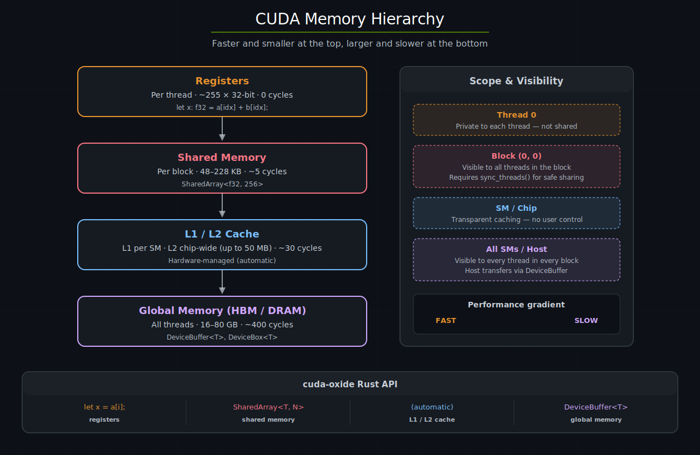
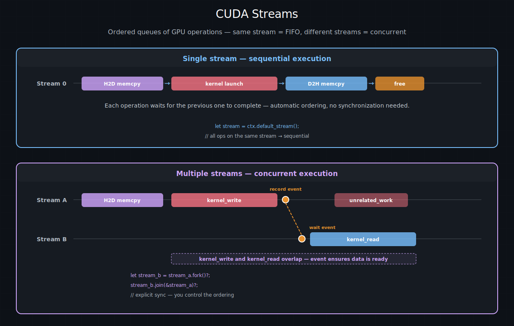
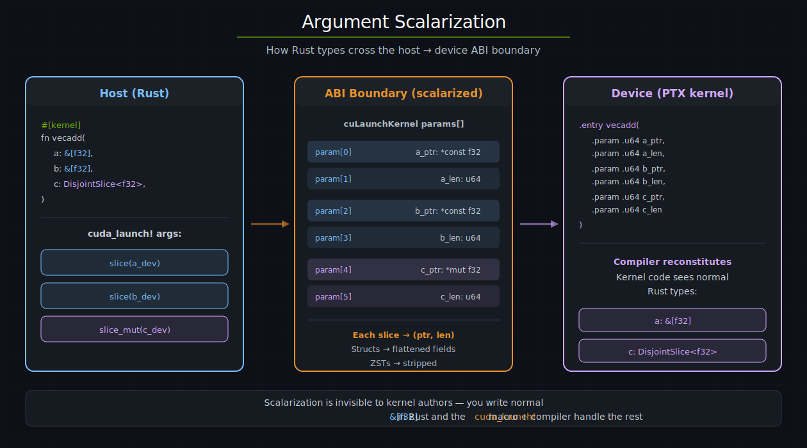

# 内存与数据移动 — cuda-oxide

GPU 拥有自己的内存，与主机内存分离。将数据传输到设备以及从设备传出 —— 并在数据到达设备后选择合适的内存类型 —— 是每个 CUDA 程序的基础。本章涵盖 cuda-oxide 的内存抽象，从主机/设备传输到共享内存和kernel ABI。

---

## CUDA 内存层级

NVIDIA GPU 暴露了几层内存，每层具有不同的容量、延迟和作用域：

| 内存 | 作用域 | 典型大小 | 延迟 | cuda-oxide API |
|------|--------|----------|------|----------------|
| 寄存器 | 每线程 | ~255 × 32-bit | 0 周期 | 局部变量 |
| 共享内存 | 每块 | 48–228 KB（架构相关） | ~5 周期 | `SharedArray`、`DynamicSharedArray` |
| L1 缓存 | 每 SM | 与共享内存合并 | 硬件管理 | 自动 |
| L2 缓存 | 整芯片 | 最高 50 MB（Hopper） | ~30 周期 | 自动 |
| 全局内存（DRAM） | 所有线程 | 16–80 GB（HBM） | ~400 周期 | `DeviceBuffer`、`DeviceBox` |


指导原则：将频繁访问的数据移动到更快、更近的内存中。寄存器最快但每个线程独占；共享内存很快且对整个线程块可见；全局内存容量大但速度慢。



*CUDA 内存层级，从最快（寄存器，每线程）到最大（全局 DRAM，所有线程）。每一层都在容量和延迟之间权衡。右侧面板显示作用域和每层对应的 cuda-oxide API。*

---

## 上下文和流

在深入内存 API 之前，需要先介绍两个出现在每个代码示例中的主机端概念：**上下文**和**流**。

**CUDA 上下文**（`CudaContext`）将主机线程绑定到特定的 GPU。它拥有该设备上的所有资源 —— 模块、流、分配。你通常在程序开始时创建一个：

```rust
use cuda_core::CudaContext;

let ctx = CudaContext::new(0).unwrap();   // 绑定到 GPU 0
```

**CUDA 流**（`CudaStream`）是一个有序的 GPU 操作队列。在**同一**流上入队的操作按 FIFO 顺序执行 —— 每个操作都能看到前面操作的所有副作用。**不同**流上的操作可以重叠并发执行，它们之间没有顺序保证。

```rust
let stream = ctx.default_stream();     // 隐式的、始终可用的默认流
let work_stream = stream.fork()?;      // 新流，连接到父流当前位置
```

每次内存传输和kernel启动都需要一个流。对于单流程序（本书大多数示例都属于此类），**默认流**就是你所需要的一切 —— 所有操作都是顺序的，按构造就是正确的。多流流水线可以解锁计算与数据移动之间的重叠，但需要通过事件或 `join` 进行显式同步：

```
同一条流:       [kernel_A] → [memcpy_B] → [kernel_C]     (自动排序)
不同流:         [kernel_A on stream 1] | [memcpy_B on stream 2]  (并发，需要事件)
```



*上图：单流执行，操作自动按 FIFO 排序。下图：多流执行，流 A 和 B 并发运行，通过事件建立 kernel_write 和 kernel_read 之间的数据依赖。*

---

## `DeviceBuffer` —— 主机/设备传输

`cuda_core` 中的 `DeviceBuffer<T>` 是分配设备内存以及在主机和 GPU 之间移动数据的主要方式：

```rust
use cuda_core::{CudaContext, DeviceBuffer};

let ctx = CudaContext::new(0).unwrap();
let stream = ctx.default_stream();

// 主机 → 设备：将主机切片拷贝到 GPU 内存
let a_dev = DeviceBuffer::from_host(&stream, &host_data).unwrap();

// 分配清零的设备内存
let mut c_dev = DeviceBuffer::<f32>::zeroed(&stream, 1024).unwrap();

// 设备 → 主机：读取结果回来
let results = c_dev.to_host_vec(&stream).unwrap();
```

### 关键方法

| 方法 | 方向 | 说明 |
|------|------|------|
| `from_host(&stream, &[T])` | 主机 → 设备 | 分配 + 异步拷贝 |
| `zeroed(&stream, len)` | — | 分配 + 零填充 |
| `to_host_vec(&stream)` | 设备 → 主机 | 异步拷贝 + 返回 `Vec<T>` |
| `copy_to_host(&stream, &mut [T])` | 设备 → 主机 | 拷贝到现有切片 |
| `cu_deviceptr()` | — | 用于 FFI 的原始 `CUdeviceptr` |

### 所有权和析构

`DeviceBuffer` 在析构时通过 `cuMemFree` **同步**释放其分配。这是一个阻塞的驱动调用 —— 它在内部同步整个设备，以确保没有正在执行的kernel仍在访问该内存。实际上这意味着：

- **在kernel运行时析构**会阻塞主机线程，直到 GPU 完全空闲，然后才释放内存。
- **在同步后析构**（例如在 `to_host_vec` 或 `stream.synchronize()` 之后）没有额外开销，因为设备已经空闲。

对于单流工作负载这没有问题 —— 所有操作按 FIFO 顺序执行，所以当你读取结果回来时，所有kernel都已完成，释放是瞬时的。在多流场景中成本会变得明显，此时你希望重叠计算与内存操作；在一个流上的同步释放可能阻塞所有其他流上的工作。

---

## `DeviceBox` —— 异步友好的设备内存

`cuda_async` 中的 `DeviceBox<T>` 解决了同步释放的问题。在析构时，它通过 `cuMemFreeAsync` 在**专用的释放流**上释放内存。这是一个流排序的操作 —— 释放操作在释放流上入队，并且只在该流上所有前面的工作完成后才执行。关键是，它**不会**同步整个设备：

```rust
use cuda_async::device_box::DeviceBox;
use cuda_async::device_context::init_device_contexts;

init_device_contexts(0, 1)?;  // 初始化设备上下文映射（默认设备 0）

// DeviceBox 包装设备指针；析构时异步释放
let dev_ptr: DeviceBox<f32> = /* 由 DeviceOperation 链分配 */;
// 当 dev_ptr 析构时，cuMemFreeAsync 在释放流上被调用。
// 其他流继续运行而不阻塞。
```

### 如何选择

| | `DeviceBuffer` | `DeviceBox` |
|---|---|---|
| Crate | `cuda_core` | `cuda_async` |
| 析构时释放 | `cuMemFree`（同步 —— 阻塞设备） | `cuMemFreeAsync`（异步 —— 不阻塞） |
| 配合 | 类型化同步启动 | 类型化异步启动 |
| 主机回读 | `to_host_vec()` | 通过显式 memcpy 操作 |
| 最适合 | 单流、阻塞工作负载 | 多流、流水线工作负载 |

> **提示**
> 对于多流流水线中延迟敏感的析构，优先选择 `DeviceBox`。对于简单的单流示例，`DeviceBuffer` 更简单，且同步释放实际上是零成本的。

---

## 参数标量化

当你写一个接受 `&[f32]` 的kernel时，主机和设备在内存中表示 Rust 切片的方式不一致 —— 结构体布局在主机的 x86 ABI 和 NVPTX ABI 之间可能不同。cuda-oxide 通过在kernel边界**标量化**聚合类型来解决这个问题：将它们分解为双方都能一致解释的基本值。

| kernel参数类型 | 主机实际传递的内容 |
|-------------|------------------|
| `&[T]` | `ptr: *const T` + `len: u64` |
| `DisjointSlice<T>` | `ptr: *mut T` + `len: u64` |
| `T`（标量） | `T` 直接传递 |
| `Struct { a: u32, b: f32 }` | 一个 byval 值（整个结构体） |
| 闭包（含 N 个捕获） | 一个 byval 值（整个结构体） |
| 零大小类型 | 完全剥离 |

这就是为什么类型化的 `#[cuda_module]` 方法对 `&[T]` 接受 `&DeviceBuffer<T>`，对可写的切片类参数接受 `&mut DeviceBuffer<T>`。生成的方法为你提取指针和长度。在kernel内部，编译器从标量参数重新组装切片结构体，所以你的kernel代码看到的是正常的 `&[T]` 类型。



*参数标量化：主机将 Rust 切片作为 (ptr, len) 对通过 ABI 边界传递。设备kernel接收扁平化的标量参数，编译器在kernel内部重新组装原始 Rust 类型。*

> **提示**
> 标量化在正常kernel代码中是完全不可见的。你在签名中写 `&[f32]`，并像普通切片一样使用它。生成的启动方法和编译器处理其他一切。

---

## `DisjointSlice` —— 安全的并行写入

在 CUDA C++ 中，并行输出的标准模式是每个线程索引的原始 `__global__` 指针。这本质上是不安全的 —— 没有任何机制阻止两个线程写入同一位置。

cuda-oxide 提供了 `DisjointSlice<T, IndexSpace>` 作为安全的替代方案。它包装一个可变切片，只允许通过与其自身 `IndexSpace` 匹配的 `ThreadIndex` 进行写入，确保每个线程访问唯一的元素：

```rust
use cuda_device::{kernel, DisjointSlice};

#[kernel]
pub fn double(input: &[f32], mut out: DisjointSlice<f32>) {
    if let Some((out_elem, idx)) = out.get_mut_indexed() {
        *out_elem = input[idx.get()] * 2.0;
    }
}
```

- `get_mut_indexed()` 是一步到位的调用形式：它铸造每个线程的见证 (witness)，并一次性解析为 `&mut T`。`None` 同时覆盖越出网格的线程（例如 `col >= ROW_STRIDE` 的 2D 情况）和越出切片的索引。
- 当你需要对多个切片进行并行算术运算时，显式的两步形式 `let idx = thread::index_1d(); out.get_mut(idx)` 也可用。
- 对于多个线程有意写入同一位置的模式（如归约），`get_unchecked_mut`（unsafe）提供了逃生舱。

### 为什么 `ThreadIndex` 让这变得安全

`DisjointSlice` 安全性的关键在于 `ThreadIndex<'kernel, IndexSpace>` —— 一个没有公开构造函数的透明见证 (witness)。获取它的唯一方式是通过从硬件内置变量（`threadIdx`、`blockIdx`、`blockDim`）派生值的受信任索引函数：

```rust
let idx = thread::index_1d();          // ThreadIndex<'_, Index1D> -- 合法
let bad = ThreadIndex::new(42);        // 不存在 -- 私有构造函数
```

这之所以有效，是因为 CUDA 的线程索引是**硬件提供的统一值**：块中的每个线程从 GPU 的线程束调度器接收唯一的 `threadIdx`。对于一维网格启动（仅使用 x 维度），从 `blockIdx.x * blockDim.x + threadIdx.x` 派生的全局索引在整个网格中是唯一的。

该见证也是 `!Send + !Sync + !Copy + !Clone`，且其 `'kernel` 生命周期从宏注入的栈局部作用域借用 —— 因此线程不能将其 `ThreadIndex` 存放在共享内存中供邻居稍后拾取，且该见证不能比kernel体活得更久。再结合 `IndexSpace` 参数（`Index1D`、`Index2D<S>`、`Runtime2DIndex`），类型系统也能在编译时拒绝不匹配的 2D 步幅 —— 数据竞争隐患变成了类型错误。

---

## 共享内存

**共享内存**是对块内所有线程可见的高速片上内存。它是块内线程间通信和数据复用的主要工具，在速度和作用域上介于寄存器（每线程）和全局内存（所有线程）之间。

### 静态共享内存 —— `SharedArray`

当大小在编译时已知，使用 `SharedArray<T, N>`：

```rust
use cuda_device::{kernel, thread, SharedArray, DisjointSlice};

static mut TILE: SharedArray<f32, 256> = SharedArray::UNINIT;

#[kernel]
pub fn smem_example(input: &[f32], mut out: DisjointSlice<f32>) {
    let idx = thread::index_1d();
    let tid = thread::threadIdx_x() as usize;

    // 从全局内存加载到共享内存
    unsafe { TILE[tid] = input[idx.get()]; }
    thread::sync_threads();

    // 从共享内存读取邻居（比全局内存快得多）
    let neighbor = if tid > 0 {
        unsafe { TILE[tid - 1] }
    } else {
        0.0
    };
    thread::sync_threads();

    if let Some(out_elem) = out.get_mut(idx) {
        *out_elem = unsafe { TILE[tid] } + neighbor;
    }
}
```

每个 `static mut SharedArray` 映射到 PTX 中单独的 `.shared` 分配。`sync_threads()` 屏障确保所有线程完成写入后，任何线程才开始读取。

### 动态共享内存 —— `DynamicSharedArray`

当大小取决于运行时参数，使用 `DynamicSharedArray<T>` 并通过 `LaunchConfig::shared_mem_bytes` 指定分配大小：

```rust
use cuda_device::{kernel, thread, DynamicSharedArray, DisjointSlice};

#[kernel]
pub fn dynamic_smem_example(input: &[f32], mut out: DisjointSlice<f32>) {
    let smem = DynamicSharedArray::<f32>::get();
    let tid = thread::threadIdx_x() as usize;

    unsafe { *smem.add(tid) = input[thread::index_1d().get()]; }
    thread::sync_threads();
    // ... 使用 smem ...
}
```

在主机端，在启动时设置大小：

```rust
let config = LaunchConfig {
    grid_dim: (num_blocks, 1, 1),
    block_dim: (256, 1, 1),
    shared_mem_bytes: 256 * std::mem::size_of::<f32>() as u32,
};
```

多个动态数组可以通过 `DynamicSharedArray::offset(byte_offset)` 共享同一分配，对其进行分区。

### 对齐

| 类型    | 默认对齐   | 说明    |
| ------ | ----------- | ------------- |
| `SharedArray<T, N>`          | `align_of::<T>()` | 标准对齐          |
| `SharedArray<T, N, 128>`     | 128 字节            | TMA 操作所需      |
| `DynamicSharedArray<T>`      | 16 字节             | 与 nvcc 兼容的默认值 |
| `DynamicSharedArray<T, 128>` | 128 字节            | TMA 所需        |


### 常见陷阱

- **缺少 `sync_threads()`：** 在共享内存写入和读取之间没有屏障，线程可能读取到陈旧或未初始化的数据。
- **超出 SM 限制：** 请求过多共享内存会导致 `CUDA_ERROR_LAUNCH_OUT_OF_RESOURCES`。请检查你的架构限制。

---

## 统一内存和 HMM

默认情况下，GPU 在**独立的地址空间**中运行，与 CPU 分离。GPU 不能解引用普通的主机指针 —— 该地址在 GPU 的页表中根本不映射到任何东西。因此传统的 CUDA 工作流程需要在设备内存中显式分配，然后进行显式拷贝：

```
┌──────────────────┐              ┌──────────────────┐
│   CPU 内存       │    PCIe /    │   GPU 内存       │
│   (主机 DRAM)    │◄────────────►│   (设备 HBM)     │
│                  │   NVLink     │                  │
└──────────────────┘    拷贝       └──────────────────┘
   独立的地址空间 -- GPU 不能解引用主机指针
```

CUDA 提供了放宽此限制的机制，允许 GPU 透明地访问主机内存，代价是首次访问时的页错误延迟。

### 内存访问模式一览

| 模式 | GPU 可访问的内容 | 所需分配 | 首次访问开销 | 硬件要求 |
|------|----------------|----------|------------|----------|
| 显式拷贝 | 仅设备内存 | `DeviceBuffer` | 无（数据预先拷贝） | 任何 CUDA GPU |
| 固定内存（映射） | 特定主机缓冲区 | `cudaHostAlloc` | 高（每次访问约 10–20 µs） | 任何 CUDA GPU |
| 统一内存 | 托管分配 | `cudaMallocManaged` | 中等（页面迁移） | Kepler+ (sm_30+) |
| HMM | 任何主机内存 | 无 | 中等（页错误 + 获取） | Turing+ on Linux |

cuda-oxide 主要对批量数据使用**显式拷贝**（`DeviceBuffer`、`DeviceBox`），对非移动闭包捕获和小型配置数据使用 **HMM**。

### 统一内存

统一内存是 CUDA 的托管内存分配器（`cudaMallocManaged`）。生成的指针在 CPU 和 GPU 上都有效 —— CUDA 运行时跟踪哪个处理器"拥有"每个页面，并在需要时迁移它。当 GPU 访问当前驻留在主机 DRAM 中的页面时，运行时在kernel读取数据之前透明地将其拷贝到设备内存。这种迁移对你的代码不可见，但并非免费：从"错误"一侧的首次访问会产生页错误和互联上的 DMA 传输。后续对同一页面的访问命中 GPU 本地缓存。

cuda-oxide 目前不直接包装 `cudaMallocManaged`。对于托管内存工作流，你需要通过原始绑定使用 CUDA 驱动 API。实际上，`DeviceBuffer::from_host`（显式拷贝）覆盖了大多数用例，并提供可预测的性能。

### HMM(Heterogeneous Memory Management)-异构内存管理

HMM 是 Linux kernel的一项功能，它将统一内存的按需分页模型扩展到**所有系统内存** —— 堆分配、`mmap` 区域，甚至栈变量。启用 HMM 后，GPU 可以解引用任何有效的主机指针，无需特殊的 CUDA 分配器：

```rust
let factor = 5i32;                           // 普通栈变量
let scale = |x: i32| x * factor;            // 捕获 &factor（非移动）
cuda_launch! { kernel: scale, args: [...] }  // GPU 通过 HMM 读取 &factor
```

与统一内存不同，HMM 不需要特殊的分配 API —— 指针就是普通的主机地址。当 ATS（地址转换服务）在 Grace Hopper 等硬件一致性平台上可用时，它取代 HMM 并在缓存行粒度提供硬件一致性；HMM 自动禁用。

### 页错误时会发生什么

当kernel从设备内存中不驻留的页面地址加载时，硬件和驱动协同获取它：

1. SM 执行全局加载（`ld.global`）获取虚拟地址。
2. **GPU MMU** 在 TLB 中查找地址。未命中时，遍历设备页表。
3. 如果页表没有映射，GPU 引发**页错误**。故障线程束停滞；同一 SM 上的其他线程束可以继续执行。
4. **CUDA 驱动故障处理程序**确定页面的来源：
   - *统一内存* —— CUDA 运行时识别托管分配并启动迁移。
   - *HMM* —— Linux kernel的 HMM 层解析主机虚拟地址，固定主机页面，并迁移它或创建远程映射。
5. 通过 PCIe 或 NVLink 的 **DMA 传输** 将页面从主机 DRAM 拷贝到设备 HBM。GPU 内存控制器写入数据；主机内存控制器服务读取。
6. GPU 页表更新，TLB 回填，**线程束恢复执行**。该页面现在本地驻留并缓存在 L2 中；后续访问仅需数百个周期。

第 5 步的延迟取决于互联方式：

| 互联 | 带宽 | 故障延迟 | 说明 |
|------|------|----------|------|
| PCIe 4.0 x16 | ~25 GB/s | ~10–20 µs | 大多数台式机 / 工作站 GPU |
| PCIe 5.0 x16 | ~50 GB/s | ~5–15 µs | Ada Lovelace 及更新的平台 |
| NVLink 4.0 | ~900 GB/s | ~1–5 µs | 数据中心 GPU（H100、B100） |
| Grace Hopper C2C | ~900 GB/s | <1 µs | 硬件一致性 —— 使用 ATS，而非 HMM |

由于故障以页面粒度（4 KB 或 2 MB）操作，单个故障可以满足许多线程。线程束级合并也有帮助：32 个线程读取连续的 4 字节元素最多触及一两个页面，而不是 32 个。在 PCIe 系统上，单个故障的成本大致与小型 `cudaMemcpy` 相当 —— 按需分页的优势在于你只需为实际触及的页面付费。

### cuda-oxide 如何使用 HMM

cuda-oxide 以两种方式利用 HMM：

1. **非移动闭包捕获。** 当非 `move` 闭包传递给kernel时，捕获的变量保留在主机栈上，GPU 通过 HMM 指针访问它们。这避免了拷贝kernel只读取一次或不频繁读取的数据。

2. **带动态布局的结构体 ABI。** cuda-oxide 在设备端匹配 Rust 的实际结构体布局（包括 `#[repr(Rust)]` 字段重排），因此通过 HMM 访问的主机结构体无需 `#[repr(C)]` 或手动布局规范即可正确读取。编译器向 `rustc` 查询字段偏移量，并构建带显式填充的匹配 LLVM 结构体类型。

### HMM 系统要求

| 要求 | 最低版本 |
|------|----------|
| GPU 架构 | Turing（计算能力 7.5+） |
| Linux kernel | 6.1.24+、6.2.11+ 或 6.3+ |
| CUDA 驱动 | 535+（使用开放kernel模块） |

检查你的系统上 HMM 是否激活：

```bash
nvidia-smi -q | grep Addressing
# Addressing Mode : HMM  ← HMM 已启用
```

### 何时使用 HMM vs 显式拷贝

| 场景 | 推荐方案 |
|------|----------|
| 大量线程处理的大数组 | `DeviceBuffer::from_host`（显式拷贝） |
| 小型只读配置数据 | HMM（传递指针，让 GPU 页错误获取） |
| CPU 和 GPU 迭代共享的数据 | 显式拷贝 + 双缓冲 |
| 原型设计 / 快速实验 | HMM（最简单 —— 无需拷贝） |

> **提示**
> HMM 是便利设施，不是性能策略。对于带宽敏感的kernel，显式拷贝到设备内存总是更快，因为它避免了页错误开销并使用完整的内存总线宽度。

