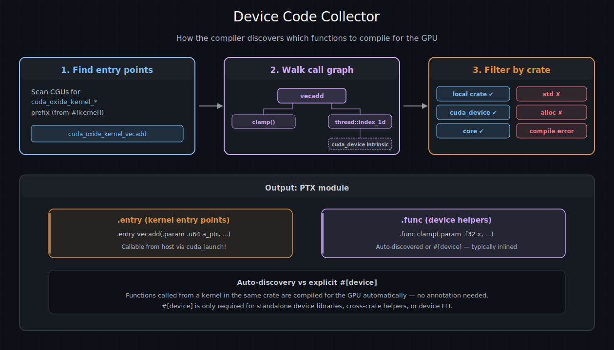

# kernel与设备函数 — cuda-oxide

**核函数 (Kernel)** 是在 GPU 上运行的函数 —— 主机启动它，使其在数千个线程上执行。 **设备函数 (Device Function)** 是在 GPU 上运行的辅助函数，但只能从另一个设备函数或核函数中调用，绝不能从主机调用。本章涵盖两者，以及在设备代码中支持（和不支持）的 Rust 模式。

---

## `#[kernel]` —— GPU 入口点

用 `#[kernel]` 注解函数，告诉 cuda-oxide 将其编译为 GPU 入口点。该函数必须返回 `()` —— kernel通过写入输出缓冲区来传递结果，而不是通过返回值。

```rust
use cuda_device::{kernel, thread, DisjointSlice};

#[kernel]
pub fn vecadd(a: &[f32], b: &[f32], mut c: DisjointSlice<f32>) {
    let idx = thread::index_1d();
    if let Some(c_elem) = c.get_mut(idx) {
        *c_elem = a[idx.get()] + b[idx.get()];
    }
}
```

在底层，`#[kernel]` 做三件事：

1. **重命名**函数到保留的 `cuda_oxide_kernel_<hash>_<name>` 命名空间，使编译器的收集器能将其识别为设备入口点。确切的前缀由工作区内部的 `reserved-oxide-symbols` crate 拥有；`<hash>` 后缀使该命名空间对用户代码不可猜测。

2. **添加 `#[no_mangle]`**，以在生成的 PTX 中保留符号名称。

3. **生成一个标记结构体**，实现 `CudaKernel`（泛型kernel则为 `GenericCudaKernel`），以便主机启动代码能在编译时查找正确的 PTX 入口点。

在生成的 PTX 中，kernel变为 `.entry` 指令 —— GPU 版的 `main`：

```ptx
.entry vecadd(.param .u64 a, .param .u64 a_len, ...) { ... }
```

### 参数约束

kernel参数通过**参数标量化**跨越主机/设备 ABI 边界（详见[内存与数据移动](../编写GPU程序/内存和数据移动.md)章节）。关键规则：

- **切片**（`&[T]`、`DisjointSlice<T>`）变为指针 + 长度对。
- **标量**（`u32`、`f32` 等）直接传递。
- **按值传递的结构体和闭包**作为一个 byval `.param` 传递。字段级扁平化仍然适用于内部设备到设备的调用，但kernel边界本身接收整个聚合体作为单个值，以匹配主机启动器推送的单个数据包槽位。
- **不支持堆分配类型**（`Vec`、`String`、`Box`）—— `alloc` crate 允许通过编译器，但目前未配置设备端的 `#[global_allocator]`。即使有，设备端的 `malloc` 也极其缓慢。

---

## 设备辅助函数

并非所有 GPU 代码都属于kernel本身。你可以将逻辑提取到辅助函数中，编译器也会将它们编译到 GPU 上。

### 自动发现的辅助函数

最简单的方法：写一个普通的 Rust 函数，然后从你的kernel中调用它。编译器的**收集器**从每个 `#[kernel]` 入口点遍历调用图，自动编译每个可达函数到 GPU —— 无需注解：

```rust
fn clamp(x: f32, lo: f32, hi: f32) -> f32 {
    if x < lo { lo } else if x > hi { hi } else { x }
}

#[kernel]
pub fn apply_clamp(input: &[f32], mut out: DisjointSlice<f32>) {
    let idx = thread::index_1d();
    if let Some(out_elem) = out.get_mut(idx) {
        *out_elem = clamp(input[idx.get()], 0.0, 1.0);
    }
}
```

`clamp` 函数被编译为 PTX `.func`（设备函数），并通常由编译器内联，因此没有调用开销。

### 何时需要 `#[device]`

在自动发现不足够的三种特定场景中，需要 `#[device]` 属性：
| 场景 | 为何需要 `#[device]` |
|------|------------------------|
| 独立的设备库 | crate 中没有 `#[kernel]`，因此收集器没有入口点可供遍历 |
| 跨 crate 设备函数 | 函数位于与kernel不同的 crate 中 |
| 设备 FFI | 函数通过 `#[device] extern "C"` 暴露，用于通过 LTOIR 与 CUDA C++ 链接 |


```rust
use cuda_device::device;

#[device]
pub fn magnitude(x: f32, y: f32) -> f32 {
    (x * x + y * y).sqrt()
}
```

### `#[kernel]` 与 `#[device]` 对比

| 特性 | `#[kernel]` | `#[device]` | 自动发现 |
|------|-------------|-------------|----------|
| PTX 指令 | `.entry` | `.func` | `.func`（或内联） |
| 可从主机启动 | 是，通过类型化模块 | 否 | 否 |
| 可返回值 | 否（必须是 `()`） | 是 | 是 |
| 可从设备代码调用 | 是 | 是 | 是 |
| 需要注解 | 总是 | 仅独立库/跨 crate/FFI 场景 | 从不 |

---

## GPU 上哪些 Rust 可用

cuda-oxide 通过 `rustc` 编译标准 Rust —— 它不是子集语言。也就是说，GPU 代码运行在 `no_std` 环境中，且未配置设备端堆分配器，因此某些 Rust 特性目前不可用。以下是当前的支持矩阵：

### 支持的

| 特性 | 说明 |
|------|------|
| 基本类型（`u8`..`u64`、`f32`、`f64`、`bool`） | 完整支持 |
| 结构体和元组 | 在 ABI 边界处分解 |
| 枚举（`Option<T>`、`Result<T,E>`、自定义） | 包含 `match` |
| `match` / `if` / `if let` | 多路分支 |
| `for` 循环和 `while` 循环 | 基于范围和基于迭代器 |
| 迭代器（`.iter()`、`.enumerate()`） | 通过 MIR 去除语法糖 |
| `break` 和 `continue` | 循环内部 |
| 数组（`[T; N]`） | 读取、写入、索引 |
| 切片（`&[T]`） | 只读；通过 `DisjointSlice` 进行可变写入 |
| 闭包（设备代码内） | 正常 Rust 语义 |
| 泛型函数 | 按调用点单态化 |
| `unsafe` 块和原始指针 | 用于高级模式 |

### 不支持的
| 特性 | 原因 | 替代方案 |
|------|------|----------|
| `String`、`Vec`、`Box` | 需要堆分配器（目前无设备端 `#[global_allocator]`） | 使用固定大小数组或切片 |
| `format!`、`println!` | 需要格式化机制 + I/O | 使用 `gpu_printf!` |
| `std` I/O、网络、文件系统 | GPU 上无操作系统 | 通过缓冲区通信 |
|  trait 对象（`dyn Trait`） | 需要虚表分发 | 使用泛型（单态化） |
| 带消息的 `panic!` | 格式化 + 分配 | 使用 `gpu_assert!` 或 `debug::trap()` |


> **提示**
> 
> 如果你不小心使用了不支持的特性，编译器会产生明确的错误：`"CUDA-OXIDE: FORBIDDEN CRATE IN DEVICE CODE"`，并附带允许的 crate 列表（`core`、`alloc`、`cuda_device` 和你的本地 crate）。

---

## `#[launch_bounds]` —— 占用率提示

`#[launch_bounds]` 属性告诉编译器你打算每块启动多少个线程。这让 PTX 汇编器做出更好的寄存器分配决策，并可以提高占用率：

```rust
#[kernel]
#[launch_bounds(256, 2)]
pub fn optimized_kernel(mut out: DisjointSlice<f32>) {
    // ...
}
```

| 参数 | 是否必需 | PTX 指令 | 描述 |
|------|----------|----------|------|
| `max_threads` | 是 | `.maxntid` | 每块最大线程数 |
| `min_blocks` | 否 | `.minnctapersm` | 每 SM 最小并发块数 |

生成的 PTX 包含这些指令：

```ptx
.entry optimized_kernel .maxntid 256, 1, 1 .minnctapersm 2 { ... }
```

> **提示**
> 
> `#[launch_bounds]` 必须出现在 `#[kernel]` **之后**：
> 
> ```rust
> #[kernel]
> #[launch_bounds(256, 2)]   // 正确
> pub fn my_kernel(...) { }
> ```

---

## 收集器 —— 设备代码如何被发现

当你使用 `cargo oxide` 构建时，`rustc-codegen-cuda` 后端运行一个**收集器**过程，确定哪些函数需要编译到 GPU：

1. 扫描所有编译单元中保留的 `cuda_oxide_kernel_<hash>_` 命名空间中的函数（由 `#[kernel]` 生成）。

2. 对每个kernel，**遍历调用图**并收集所有传递可达的函数。

3. **过滤**每个被调用者，对照允许的 crate 列表：

| Crate | 是否允许 | 原因 |
|-------|----------|------|
| 你的本地 crate | 是 | 你的kernel和辅助代码 |
| `cuda_device` | 是 | GPU 内联函数（线程、线程束、共享内存） |
| `core` | 是 | `no_std` Rust 核心库 |
| `std` | 否 | 需要 GPU 上不可用的操作系统设施 |
| `alloc` | 允许通过收集器 | 通过收集器检查，但目前尚未接入设备端分配器。今天会产生链接时错误。 |


如果收集器遇到对禁止 crate 的调用，它会报告编译时错误，而不是生成损坏的 PTX。



*设备代码收集器：从 `#[kernel]` 入口点开始，编译器遍历调用图以发现所有可达的设备函数，然后过滤每个被调用者（本地 crate、`cuda_device`、`core`）。输出是一个包含 `.entry` 和 `.func` 指令的 PTX 模块。*

---

## `no_std` 与 panic 行为

设备代码运行在隐式的 `#![no_std]` 环境中。你不需要自己添加这个属性 —— 编译器后端会处理它。

**Panic 行为：** MIR 中的所有展开路径都被视为不可达。如果 panic 在运行时实际触发（例如数组边界检查失败），GPU 执行 **trap 指令**，导致主机收到 `CUDA_ERROR_ILLEGAL_INSTRUCTION`。这在语义上等价于 `panic=abort`，但不需要任何特殊编译器标志。

实际上这意味着：

- `unwrap()` 和 `expect()` 可用，但在 `None`/`Err` 上会使 GPU 陷入 trap。
- `assert!` 和 `debug_assert!` 可用，但失败时会使 GPU 陷入 trap。
- `panic!("message")` **不支持**（格式化机制不可用）—— 请改用 `gpu_assert!` 或 `debug::trap()`。

| [上一页](./cuda执行模型.md) | [下一页](./内存和数据移动.md) |
| :--- | ---: |