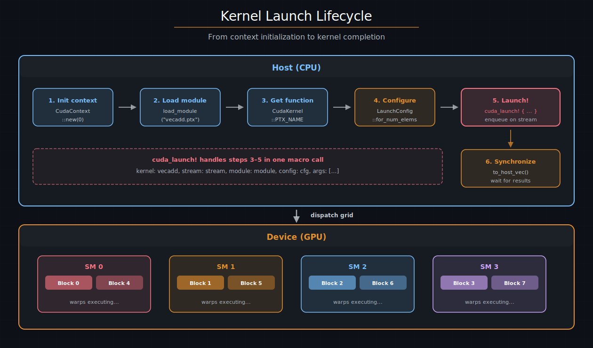

# 启动kernel — cuda-oxide

编写kernel只是故事的一半。主机必须加载设备代码、配置启动网格、编排参数，并将工作分派给 GPU。cuda-oxide 的主要启动路径是 `#[cuda_module]`：它将生成的设备产物嵌入主机二进制文件，并生成类型化的启动方法。当你需要显式加载附属产物或自定义启动代码时，底层的 `load_kernel_module` 和 `cuda_launch!` API 仍然可用。

---

## 启动生命周期

每次kernel启动都遵循相同的序列：

1. **初始化 CUDA 上下文** —— 绑定到一个 GPU 设备。
2. **加载设备模块** —— 通常从嵌入的产物包加载。
3. **查找kernel函数** —— 通过其 PTX 入口点名称。
4. **配置网格** —— 块维度、网格维度、共享内存。
5. **启动** —— 在流上入队kernel。
6. **同步** —— 等待结果（显式或隐式）。



*kernel启动生命周期。主机初始化上下文、加载设备模块、配置网格，并通过类型化方法启动。GPU 调度器将块分派到 SM。*

实际上，`#[cuda_module]` 在生成的 Rust API 背后处理步骤 2–5。你通常只需与上下文创建、`kernels::load` 和类型化方法调用交互。

---

## `#[cuda_module]` —— 类型化启动

将kernel包装在内联的 `#[cuda_module]` 模块中，以生成类型化的加载器和每个 `#[kernel]` 对应一个方法。该方法在 CUDA 意义上是"同步的"：你提供特定的流，kernel立即入队，但在你同步之前，GPU 执行仍然与主机重叠。

```rust
use cuda_device::{cuda_module, kernel, thread, DisjointSlice};
use cuda_core::{CudaContext, DeviceBuffer, LaunchConfig};

#[cuda_module]
mod kernels {
    use super::*;

    #[kernel]
    pub fn vecadd(a: &[f32], b: &[f32], mut c: DisjointSlice<f32>) {
        let idx = thread::index_1d();
        let i = idx.get();
        if let Some(c_elem) = c.get_mut(idx) {
            *c_elem = a[i] + b[i];
        }
    }
}

fn main() {
    let ctx = CudaContext::new(0).unwrap();
    let stream = ctx.default_stream();
    let module = kernels::load(&ctx).unwrap();

    let a = DeviceBuffer::from_host(&stream, &[1.0f32; 1024]).unwrap();
    let b = DeviceBuffer::from_host(&stream, &[2.0f32; 1024]).unwrap();
    let mut c = DeviceBuffer::<f32>::zeroed(&stream, 1024).unwrap();

    module
        .vecadd(&stream, LaunchConfig::for_num_elems(1024), &a, &b, &mut c)
        .expect("kernel启动失败");

    let result = c.to_host_vec(&stream).unwrap();
    assert_eq!(result[0], 3.0);
}
```

### 逐字段拆解

| 组件 | 说明 |
|------|------|
| `#[cuda_module]` | 生成加载器和启动方法 |
| `kernels::load(&ctx)` | 加载嵌入的产物包 |
| `module.vecadd(...)` | 入队类型化的kernel启动 |
| `LaunchConfig` | 网格/块维度和共享内存 |

### 参数映射

生成的方法将kernel参数映射为主机值：

| kernel参数 | 主机参数 | GPU ABI |
|----------|----------|---------|
| `&[T]` | `&DeviceBuffer<T>` | 指针 + 长度 |
| `&mut [T]` | `&mut DeviceBuffer<T>` | 指针 + 长度 |
| `DisjointSlice<T>` | `&mut DeviceBuffer<T>` | 指针 + 长度 |
| 标量/原始指针 | 相同值 | 直接传递值 |

### 返回值

类型化启动方法返回 `Result<(), DriverError>`。`Ok` 情况意味着kernel已成功**入队** —— 而不是已完成。要检查运行时错误（例如越界 trap），请随后同步流或上下文。

---

## `cuda_launch!` —— 底层启动

`cuda_launch!` 是旧代码和有意加载特定模块的示例所使用的显式启动 API。当你需要手动选择附属 PTX/cubin/LTOIR 产物时，它仍然有用。

```rust
use cuda_host::{cuda_launch, load_kernel_module};

let module = load_kernel_module(&ctx, "vecadd").unwrap();

cuda_launch! {
    kernel: vecadd,
    stream: stream,
    module: module,
    config: LaunchConfig::for_num_elems(1024),
    args: [slice(a), slice(b), slice_mut(c)]
}
.expect("kernel启动失败");
```

`args` 中的包装器产生与生成的 `#[cuda_module]` 方法相同的主机数据包：`slice(...)` 和 `slice_mut(...)` 推送 `(ptr, len)` 对，标量参数直接推送其值，闭包或按值结构体作为单个 byval 值推送（kernel边界将其作为一个 `.param` 接收，而不是按字段扁平化的参数）。

---

## 产物策略

`#[cuda_module]` 是一个启动表面特性，而非目标选择特性。它加载编译器放置在主机二进制文件中的嵌入载荷。诸如 PTX 与 LTOIR、cubin 与 fatbin、单架构与多架构打包等决策，存在于编译器和产物/运行时加载器层。将这种策略分离，使得生成的 Rust 启动方法在载荷格式演进时保持稳定。

---

## `LaunchConfig`

`LaunchConfig` 指定网格形状：

```rust
use cuda_core::LaunchConfig;

let config = LaunchConfig {
    grid_dim: (num_blocks, 1, 1),
    block_dim: (256, 1, 1),
    shared_mem_bytes: 0,
};
```

| 字段 | 类型 | 说明 |
|------|------|------|
| `grid_dim` | `(u32, u32, u32)` | x、y、z 方向的块数量 |
| `block_dim` | `(u32, u32, u32)` | x、y、z 方向每块的线程数 |
| `shared_mem_bytes` | `u32` | 每块动态共享内存字节数 |

### `for_num_elems` 辅助方法

对于一维数据并行kernel，常见模式是每个元素一个线程：

```rust
let config = LaunchConfig::for_num_elems(N as u32);
```

这使用每块 256 个线程，并通过向上取整除法计算网格大小：`grid_x = (N + 255) / 256`。这是大多数逐元素操作的正确默认值。

### 2D 和 3D 配置

对于矩阵操作，使用 2D 块和网格维度：

```rust
let config = LaunchConfig {
    grid_dim: ((cols + 15) / 16, (rows + 15) / 16, 1),
    block_dim: (16, 16, 1),
    shared_mem_bytes: 0,
};
```

在kernel内部，将 `threadIdx_x()` / `blockIdx_x()` 与它们的 `_y()` 对应物组合，以计算行和列索引。

### 选择块大小

块大小是最重要的调优参数（详见[执行模型](../编写GPU程序/cuda执行模型.md)章节）。快速指南：

- **256** 是大多数kernel的安全默认值。
- **2 的幂**（128、256、512）与线程束边界对齐。
- 使用 `#[launch_bounds]` 向编译器提示你打算使用的块大小。

---

## 类型化异步启动

启用 `cuda-host` 异步特性后，`#[cuda_module]` 还会生成借用和拥有的异步方法。这些方法返回惰性的 `DeviceOperation` 值，而不是立即入队。启动时不指定流 —— 调度策略在执行操作时选择一个：

```rust
use cuda_async::device_context::init_device_contexts;
use cuda_async::device_operation::DeviceOperation;

init_device_contexts(0, 1)?;
let module = kernels::load_async(0)?;

let op = module.vecadd_async(
    LaunchConfig::for_num_elems(1024),
    &a_dev,
    &b_dev,
    &mut c_dev,
)?;

// 执行并等待
op.sync()?;
```

当操作必须作为 `'static` future 生成或存储时，使用拥有的形式：

```rust
use std::future::IntoFuture;

let op = module.vecadd_async_owned(
    LaunchConfig::for_num_elems(1024),
    a_dev,
    b_dev,
    c_dev,
)?;

let (a_dev, b_dev, c_dev) = tokio::spawn(op.into_future()).await??;
```

### 异步缓冲区生命周期

异步启动是惰性的，因此指针生命周期很重要：

| 形式 | 行为 |
|------|------|
| 原始指针形式 | 从 `CUdeviceptr` 构建操作 → 释放缓冲区 → 稍后运行操作 → **悬垂指针** |
| 借用类型化形式 | 从 `&DeviceBuffer` 构建操作 → Rust 保持缓冲区被借用直到操作完成 |
| 拥有类型化形式 | 将 `DeviceBox` 移入操作 → 生成任务拥有分配直到完成 |

`cuda_launch_async!` 作为底层迁移 API 仍然存在，但新代码优先选择生成的借用或拥有方法。仅当调用者能证明指向的分配比惰性操作活得更久时，原始指针异步启动才是正确的。

### `.sync()` 与 `.await`

| 方法 | 作用 |
|------|------|
| `.sync()` | 在默认调度策略上执行，阻塞当前线程直到完成 |
| `.await` | 执行并让出当前异步任务（需要 Tokio 运行时） |

---

## 组合 GPU 工作

`DeviceOperation` 支持函数式组合。使用 `and_then` 链式连接操作，使用 `zip!` 并行运行独立工作：

```rust
use cuda_async::zip;

let forward_pass = layer1_op
    .and_then(|output1| layer2_op(output1))
    .and_then(|output2| layer3_op(output2));

// 并发运行两个独立操作
let combined = zip!(branch_a, branch_b);
let (result_a, result_b) = combined.sync()?;
```

链中的每个操作仅在执行时才被调度到流上。`and_then` 组合子将一个操作的输出作为输入传递给下一个，形成一个惰性计算图。

> **另请参阅**
> 
> [异步 GPU 编程](../异步GPU编程/DeviceOperation模型.md)章节深入涵盖了 `DeviceOperation`、调度策略和流管理。

---

## 集群启动

线程块集群（Hopper 及更新架构）允许块通过**分布式共享内存**（DSMEM）在共享内存之外进行协作。要使用集群启动，在kernel上添加 `#[cluster_launch]` 并在启动中包含 `cluster_dim`：

```rust
use cuda_device::{kernel, cluster, cluster_launch, DisjointSlice};

#[kernel]
#[cluster_launch(4, 1, 1)]
pub fn cluster_kernel(mut out: DisjointSlice<u32>) {
    let rank = cluster::block_rank();
    // 块 0-3 可以通过 DSMEM 通信
}
```

在主机端，启动使用 `launch_kernel_ex`（扩展启动 API）并指定集群维度。`cuda_launch!` 通过 `cluster_dim` 字段支持此功能：

```rust
cuda_launch! {
    kernel: cluster_kernel,
    stream: stream,
    module: module,
    config: config,
    cluster_dim: (4, 1, 1),
    args: [slice_mut(out_dev)]
}
.expect("集群启动失败");
```

> **提示**
> 
> 集群启动需要 **Hopper (sm_90)** 或更新架构。最大集群大小通常为 16 个块。使用 `cargo oxide build --arch sm_90` 以 Hopper 为目标。

---

## 常见启动错误

| 错误 | 可能原因 | 修复方法 |
|------|---------|---------|
| `CUDA_ERROR_INVALID_VALUE` | 网格或块维度为零或超出限制 | 检查 `LaunchConfig` 值；最大块为 1024 个线程 |
| `CUDA_ERROR_NOT_FOUND` | PTX 入口点名称不匹配 | 验证 `#[kernel]` 名称与加载的模块匹配 |
| `CUDA_ERROR_LAUNCH_OUT_OF_RESOURCES` | 每块共享内存或寄存器过多 | 减少 `shared_mem_bytes` 或块大小；使用 `#[launch_bounds]` |
| `CUDA_ERROR_ILLEGAL_INSTRUCTION` | kernel触发 trap（panic、断言失败、越界） | 使用 `cargo oxide debug` 或 `gpu_printf!` 调试 |
| `CUDA_ERROR_NO_BINARY_FOR_GPU` | PTX 为错误架构编译 | 使用匹配 GPU 的 `--arch` 重新构建 |

| [上一页](./内存和数据移动.md) | [下一页](./闭包和泛型.md) |
| :--- | ---: |