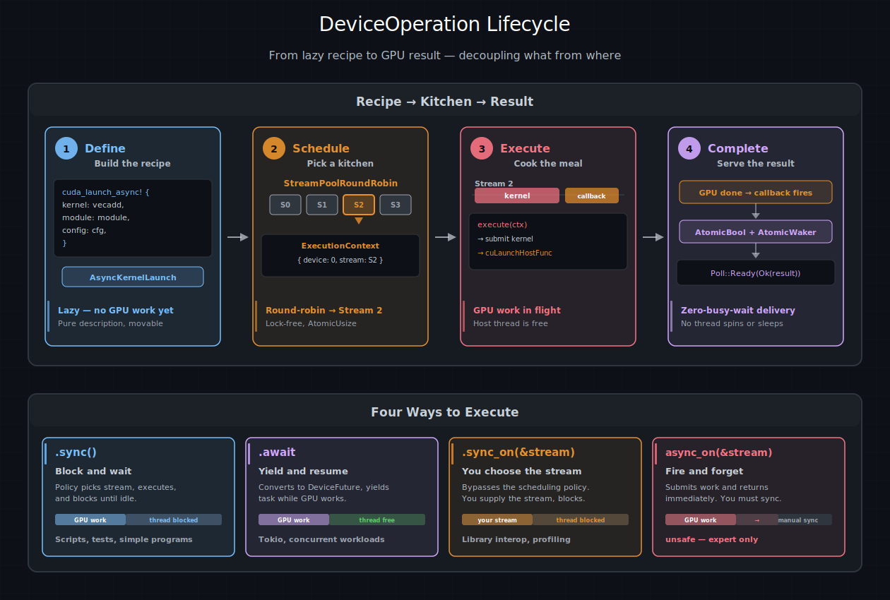

# 设备操作模型 — cuda-oxide

在《编写 GPU 程序》一章中，你了解到类型化同步启动会在显式流上排队工作，而类型化异步启动则返回一个惰性句柄，将流的选择推迟到后面。本章深入探讨这个惰性句柄背后的抽象——**`DeviceOperation` trait**——并解释为什么将 GPU **应该做什么**与它在**哪个流上运行**解耦，是 cuda-oxide 中可组合异步 GPU 编程的基础。

## 为什么需要惰性操作？ 

在 CUDA C++ 中，你通过创建多个 `cudaStream_t` 句柄并将kernel启动和内存拷贝显式放置到它们之上来构建并发性。程序员在每个调用点决定使用哪个流。这将 GPU 工作的**定义**与**调度决策**耦合在一起，使得事后组合和重新安排工作变得困难。

cuda-oxide 采取了一种不同的方法。`DeviceOperation` 描述 GPU 工作而不绑定到任何流。你可以使用组合子（`and_then`、`zip!`）组合操作，将它们跨函数边界传递，存储在集合中，并只在最后一刻决定如何调度它们。这与 Rust 的 `Iterator` 背后的理念相同——惰性构建流水线，在执行点急切执行。

 | 方式 | 流由谁选择 | 可组合？ |
|:---|:---|:---|
| 类型化同步启动 | 调用者 | 否，立即入队 |
| 类型化异步启动 | 调度策略 | 是，返回 `DeviceOperation` |



**设备操作生命周期。** 阶段 1：类型化异步方法构建一个惰性配方（无 GPU 工作）。阶段 2：调度策略从其池中选择一个流。阶段 3：`execute()` 提交 GPU 工作和一个 `cuLaunchHostFunc` 回调。阶段 4：回调触发，唤醒异步运行时，并交付结果。底部：四种执行方法，从最简单（`.sync()`）到最手动（`async_on`）。

## 配方与厨房 

将 `DeviceOperation` 想象为一张**配方卡**。卡片描述了这道菜的每一步——将哪些原料混合，在什么温度下，持续多长时间——但它没有说明**哪个厨房**来烹饪它。你可以将卡片交给任何厨房，复印它，将两张卡片订在一起做成多道菜，或者归档以备后用。只有当有人走进厨房并开始按照说明操作时，这道菜才开始烹饪。

在 cuda-oxide 的模型中：

- **配方**是一个 `DeviceOperation`——GPU 工作的惰性描述。
- **厨房**是一个 CUDA 流——工作实际运行的有序队列。
- **主厨**是一个 `SchedulingPolicy`——决定哪个厨房处理每个配方的逻辑。
- **餐点**是 `Output`——当一切完成时你得到的结果。

这种分离正是系统可组合的原因。你可以编写一个返回"上传数据、运行 GEMM、应用 ReLU"配方的函数，而无需关心哪个流将执行它。调用者可以在配方上链接更多步骤，在特定流上运行它，或者将其交给调度策略然后离开。

## 你的第一次异步启动

创建 `DeviceOperation` 的最简单方式是使用生成的 `{kernel}_async` 方法。它看起来与同步方法类似，但没有流参数，并且返回一个配方而不是立即执行：

```rust
use cuda_async::device_context::init_device_contexts;
use cuda_core::LaunchConfig;

// 一次性设置：为调度创建流池
init_device_contexts(0, 1)?;

// 构建配方（尚无 GPU 工作）
let module = kernels::load_async(0)?;
let op = module.vecadd_async(LaunchConfig::for_num_elems(1024), &a_dev, &b_dev, &mut c_dev)?;

// 现在执行它：选择一个流，启动，等待结果
op.sync()?;
```

在创建 `op` 时，GPU 上什么都没有发生。该方法构建了一个 `AsyncKernelLaunch` 值，它记住要调用哪个函数、传递什么参数以及如何配置网格——但它不接触任何流。它是一张放在柜台上的配方卡。

当你调用 `.sync()` 时，调度策略从其池中选择一个流，提交kernel，并阻塞直到流空闲。这一行就是配方变成烹饪好的餐点的地方。

## 什么构成了 `DeviceOperation`

在幕后，`DeviceOperation` 是一个 trait。任何描述 GPU 工作的类型都可以实现它。该 trait 有一个必需方法和一个关联类型：

```rust
pub trait DeviceOperation: Send + Sized + IntoFuture {
    type Output: Send;

    unsafe fn execute(
        self,
        context: &ExecutionContext,
    ) -> Result<Self::Output, DeviceError>;
}
```

**`Output`** 是操作完成时产生的 Rust 值。对于kernel启动，这是 `()`——kernel为了设备内存上的副作用而运行。对于设备到主机的拷贝，它可能是 `Vec<f32>`。对于内存分配，它可能是拥有指针的 `DeviceBox<[f32]>`。

**`execute`** 是实际 GPU 工作发生的地方。它接收一个 `ExecutionContext`——分配的厨房——并向其中的流提交工作。该方法是 `unsafe` 的，因为 GPU 工作可能在它返回时仍在进行中；调用者负责在读取结果之前进行同步。

`Send` 约束意味着操作可以跨线程移动（对 `tokio::spawn` 至关重要）。`IntoFuture` 约束使得 `.await` 能够工作——稍后会详细介绍。

你很少需要自己实现 `DeviceOperation`。该 crate 提供了一组实现它的类型，你可以使用组合子来组合它们：

- **`AsyncKernelLaunch`**——由类型化异步启动方法产生。启动一个kernel。
- **`Value<T>`**——包装主机端值。无 GPU 工作。立即返回 `T`。
- **`AndThen`**——链式连接两个操作：运行 A，将结果传递给 B。
- **`Zip`**——运行两个操作并将两个结果作为元组返回。
- **`StreamOperation`**——将构造推迟到流已知时。

这些是每个异步流水线的构建块。《组合子与组合》章节详细介绍了每一个。

## `ExecutionContext`

当配方被执行时，它需要知道自己在哪个厨房里。`ExecutionContext` 携带这些信息：

```rust
pub struct ExecutionContext {
    device: usize,              // 哪个 GPU
    cuda_stream: Arc<CudaStream>,   // 哪个流
    cuda_context: Arc<CudaContext>, // 哪个 CUDA 上下文
}
```

操作本身从不创建流。调度策略（在《调度与流》中介绍）创建 `ExecutionContext` 并将其传递给 `execute`。这就是分离的核心：操作描述**什么**，上下文提供**在哪里**。

在 `execute` 实现内部，你使用 `ctx.get_cuda_stream()` 访问流，使用 `ctx.get_cuda_context()` 访问 CUDA 上下文。对于大多数操作，这就是你需要的全部——在流上排队一个kernel或内存拷贝，然后你就完成了。

## 执行配方：四种执行方式 

一旦你有了 `DeviceOperation`，你需要触发它。cuda-oxide 提供了四种路径，范围从"为我做所有事"到"我自己处理"。

### `.sync()`——阻塞并等待 

最简单的选项。调度策略选择一个流，运行操作，并阻塞调用线程直到流空闲：

```rust
let result: Vec<f32> = d2h_operation.sync()?;
```

这对于脚本、测试以及任何你只想立即得到答案的地方来说是完美的。不需要 Tokio 运行时。

### `.await`——让出并恢复 

在异步运行时内部，`.await` 做同样的事情，但不阻塞线程。它将操作转换为 `DeviceFuture`，提交 GPU 工作，并让出当前任务。当 GPU 完成时，它唤醒任务并交付结果：

```rust
#[tokio::main]
async fn main() -> Result<(), Box<dyn std::error::Error>> {
    init_device_contexts(0, 1)?;

    let module = kernels::load_async(0)?;
    module
        .vecadd_async(LaunchConfig::for_num_elems(1024), &a_dev, &b_dev, &mut c_dev)?
        .await?;

    Ok(())
}
```

当 GPU 工作时，Tokio 运行时可以自由轮询其他任务——没有线程空闲等待硬件。这是并发运行多个 GPU 流水线的关键，我们在《并发执行》中探讨这一点。

### `.sync_on(&stream)`——你选择流 

当你需要特定流时——为了与现有 CUDA 库互操作，或者为了保证与该流上其他工作的顺序——`sync_on` 让你直接提供它并阻塞直到完成：

```rust
let stream = ctx.new_stream()?;
operation.sync_on(&stream)?;
```

### `unsafe async_on(&stream)`——即发即弃 

最手动的选项。它向流提交工作并立即返回，**不**进行同步。调用者必须确保在读取结果之前同步流。这对于在单个同步之前将多个操作批量处理到一个流上很有用：

```rust
let stream = ctx.new_stream()?;
unsafe { op_a.async_on(&stream)? };
unsafe { op_b.async_on(&stream)? };
stream.synchronize()?;  // 现在两个都完成了
```

## 使用 `value()` 提升主机数据 

流水线中的并非每一步都涉及 GPU。有时你需要将一个主机端值——一个配置参数、一组维度、一个预加载的权重向量——输入到设备操作链中。`value()` 函数将任何 `Send` 类型包装在一个无操作的 `DeviceOperation` 中，立即返回它：

```rust
use cuda_async::device_operation::value;

let weights = vec![1.0f32; 1024];
let op = value(weights);  // impl DeviceOperation<Output = Vec<f32>>
```

单独来看，`value()` 看起来毫无意义。它的威力在组合中显现。如果你要将主机到设备的传输和配置结构体压缩在一起，`value()` 使配置适配流水线：

```rust
let (device_buf, config) = zip!(
    h2d(raw_data),
    value(ModelConfig { dim: 64, layers: 3 })
).sync()?;
```

`zip!` 的两臂都必须是 `DeviceOperation`。`value()` 是使主机数据与设备工作良好配合的适配器。

## 使用 `with_context` 与流对话 

某些操作在执行时需要访问流本身。内存分配（`malloc_async`）、异步拷贝（`memcpy_htod_async`）和事件记录都需要原始的 `CUstream` 句柄。但请记住——`DeviceOperation` 在创建时不知道它将在哪个流上运行。流是后来由调度策略分配的。

`with_context` 弥合了这个差距。它创建一个操作，其主体推迟到 `ExecutionContext` 可用时：

```rust
use cuda_async::device_operation::{with_context, value};
use cuda_core::memory::{malloc_async, memcpy_htod_async};

fn h2d(host_data: Vec<f32>) -> impl DeviceOperation<Output = DeviceBox<[f32]>> {
    with_context(move |ctx| {
        let stream = ctx.get_cuda_stream();
        let n = host_data.len();
        let num_bytes = n * std::mem::size_of::<f32>();
        unsafe {
            let dptr = malloc_async(stream.cu_stream(), num_bytes).unwrap();
            memcpy_htod_async(dptr, host_data.as_ptr(), num_bytes, stream.cu_stream())
                .unwrap();
            value(DeviceBox::from_raw_parts(dptr, n, ctx.get_device_id()))
        }
    })
}
```

闭包接收 `ExecutionContext` 并必须返回另一个 `DeviceOperation`。这里它返回一个包装新分配的设备指针的 `Value`。内部操作在同一流上立即执行。

这种模式——`with_context` 包装需要 `CUstream` 的原始驱动调用，最后返回 `value()`——是你将任何底层 CUDA 操作转换为可组合构建块的方式。`async_mlp` 示例将其用于 `h2d`、`d2h` 和 `zeros` 辅助函数，它们可以干净地插入到 `and_then` 链中。

> **提示**
> 
> `with_context` 是需要 `CUstream` 的原始驱动调用的逃生舱口。对于kernel启动，优先使用生成的异步启动方法，因为它们处理参数编组和缓冲区生命周期。

## GPU 如何告诉 Rust 它已完成 

当你 `.await` 一个 `DeviceOperation` 时，幕后发生了一些有趣的事情。该操作变成一个 `DeviceFuture`——一个实现 Rust 的 `std::future::Future` 的类型——异步运行时轮询它。但是一个基于轮询的系统如何知道**硬件**何时完成了它的工作？

答案是 `cuLaunchHostFunc`，一个将主机端回调排队到流中的 CUDA 驱动 API。当该流上所有前面的 GPU 工作完成时，驱动程序在一个驱动线程上调用回调。cuda-oxide 使用这在 CUDA 和 Rust 的异步模型之间构建了一个零忙等待桥接。

`DeviceFuture` 是一个三状态机：

```
  空闲 ───poll()───► 执行中 ───回调触发───► 完成
                         │                               │
                   (提交 GPU 工作               (将结果返回
                    + 排队回调)                   给运行时)
```

**第一次轮询**时，future：

1. 在操作上调用 `execute()`，向流提交 GPU 工作。
2. 在**同一流**上排队一个 `cuLaunchHostFunc` 回调，紧接在 GPU 工作之后。CUDA 保证流顺序：这个回调在kernel完成之前不会触发。
3. 返回 `Poll::Pending`。异步运行时停放任务并继续。

当 **GPU 完成**kernel时，CUDA 驱动程序在一个驱动线程上调用主机回调。回调设置一个 `AtomicBool` 标志并唤醒任务的 `AtomicWaker`。异步运行时注意到唤醒并重新轮询 future。

**第二次轮询**时，future 看到标志并返回 `Poll::Ready(Ok(result))`。任务用该值恢复。

关键特性：**没有主机线程在 GPU 工作时自旋或睡眠**。异步执行器可以自由运行其他任务——包括其他流上的其他 `DeviceFuture`。这就是 cuda-oxide 如何实现真正的并发执行，而无需为每个 GPU 操作 dedicating 一个线程。

> **参见**
> 
> 《组合子与组合》章节展示了如何从这些原语构建多阶段流水线，《调度与流》解释了调度策略如何选择流并创建将所有内容联系在一起的 `ExecutionContext`。

| [上一页](../03-GPU安全/安全模型.md) | [下一页](./组合子与组合.md) |
| :--- | ---: |