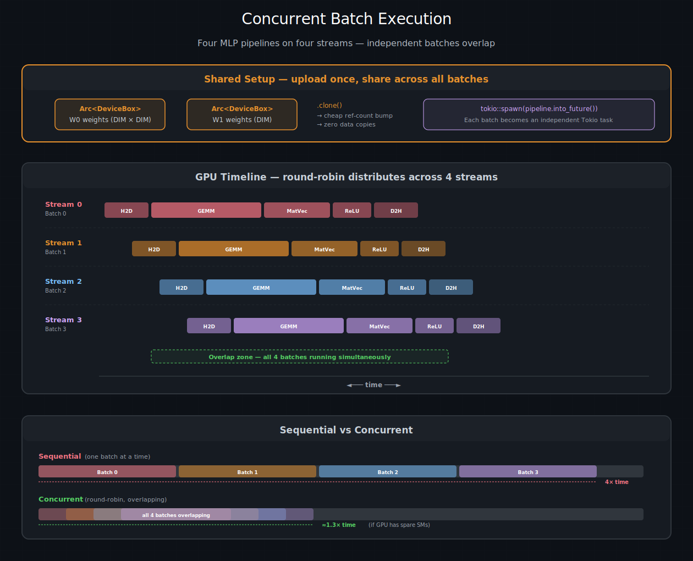

# 并发执行

你已经知道如何使用 `DeviceOperation` 描述 GPU 工作，使用 `and_then` 和 `zip!` 组合多级流水线，并让调度策略分配流。现在到了收获的时候：**同时**运行多个流水线。本章从头到尾讲解 `async_mlp` 示例，展示 Tokio 任务、轮询调度器和 Rust 的所有权模型如何协同工作，在一个 GPU 上并发处理四个批次。

> 另请参阅：[CUDA 编程指南 – 多设备系统](https://docs.nvidia.com/cuda/cuda-programming-guide/#multi-device-system) —— 了解 CUDA 关于多 GPU 上下文、对等访问和跨设备内存的规则。

## 场景

你在运行一个三层 MLP 的前向传播：**GEMM**（矩阵乘法）、**MatVec**（矩阵-向量乘法）和 **ReLU**（激活函数）。你在 GPU 上加载了两个权重矩阵，并且有四个批次的输入数据需要处理。每个批次都是独立的——批次 0 不依赖批次 1——但它们共享相同的权重。



四个 MLP 前向传播并发运行。顶部：共享权重作为 <code>Arc&lt;DeviceBox&gt;</code> 一次性上传，每个批次廉价克隆。中间：GPU 时间线 —— 轮询策略将四个批次分发到四个流上，错开的流水线相互重叠。底部：顺序处理耗时约为单个批次的 4 倍；如果 GPU 有空闲的 SM，并发处理仅需约 1.3 倍。

顺序方法一次处理一个批次：

```text
Batch 0:  ████ GEMM ████ MatVec ██ ReLU █ D2H █
                                                  Batch 1:  ████ GEMM ████ ...
```

并发方法将它们重叠在不同的流上：

```text
Stream 0:  ████ GEMM ████ MatVec ██ ReLU █ D2H █
Stream 1:    ████ GEMM ████ MatVec ██ ReLU █ D2H █
Stream 2:      ████ GEMM ████ MatVec ██ ReLU █ D2H █
Stream 3:        ████ GEMM ████ MatVec ██ ReLU █ D2H █
```

如果 GPU 有足够的 SM 同时运行多个kernel，重叠版本会明显更快。并且由于每个流水线都是同一个流上的单个 `and_then` 链，批次内的各个阶段仍然是严格有序的——不需要跨流同步。

## 步骤 1：初始化运行时

一切从 `init_device_contexts` 开始。它创建 CUDA 上下文，设置调度策略（默认四个流的轮询策略），并使线程局部状态可用于 `.sync()` 和 `.await`：

```rust
use cuda_async::device_context::init_device_contexts;

#[tokio::main]
async fn main() -> Result<(), Box<dyn std::error::Error>> {
    init_device_contexts(0, 1)?;
    let module = kernels::load_async(0)?;
```

嵌入式模块通过线程局部的异步上下文加载。类型化的模块句柄可以廉价地克隆到每个批次流水线中。

## 步骤 2：上传共享权重

模型有两个权重矩阵：W0 (DIM x DIM) 和 W1 (DIM)。两者需要在所有四个前向传播期间都驻留在设备上。这正是 `zip!` 和 `.arc()` 发挥作用的地方：

```rust
    let w0_host: Vec<f32> = (0..DIM * DIM)
        .map(|i| ((i % 7) as f32 - 3.0) * 0.01)
        .collect();
    let w1_host: Vec<f32> = (0..DIM)
        .map(|i| ((i % 5) as f32 - 2.0) * 0.01)
        .collect();

    let (w0, w1): (Arc<DeviceBox<[f32]>>, Arc<DeviceBox<[f32]>>) = zip!(
        h2d(w0_host).arc(),
        h2d(w1_host).arc()
    ).await?;
```

`zip!` 将两个独立的 H2D 传输捆绑成一个操作。`.arc()` 将每个结果包装在 `Arc` 中，以便共享权重。`.await` 将组合后的操作调度到池中的某个流上，并等待其完成。

在这行代码之后，`w0` 和 `w1` 的类型是 `Arc<DeviceBox<[f32]>>` —— 廉价克隆、安全共享、固定在设备上。

## 步骤 3：构建并生成批次流水线

现在是有趣的部分。对于每个批次，你构建一个惰性流水线（还没有 GPU 工作），并将其交给 `tokio::spawn`：

```rust
    let num_batches = 4;
    let mut handles = vec![];

    for batch_idx in 0..num_batches {
        let w0 = w0.clone();       // Arc clone: ~1 ns
        let w1 = w1.clone();
        let module = module.clone();

        let batch_data: Vec<f32> = (0..DIM * DIM)
            .map(|i| ((i + batch_idx * 37) % 13) as f32 * 0.1)
            .collect();

        let pipeline = zip!(h2d(batch_data), zeros(DIM * DIM), zeros(DIM))
            .and_then(move |(input, hidden, output)| {
                // Stage 1: GEMM — hidden = input × W0
                // ... build AsyncKernelLaunch, push args, chain with and_then ...
            })
            .and_then(move |(hidden, output, w1, module)| {
                // Stage 2: MatVec — output = hidden × W1
                // ...
            })
            .and_then(move |(output, module)| {
                // Stage 3: ReLU — result = max(0, output)
                // ...
            })
            .and_then(d2h);  // Stage 4: copy result to host

        handles.push(tokio::spawn(pipeline.into_future()));
    }
```

让我们分解这里发生的事情：

1. **`pipeline` 是一个 `DeviceOperation`**。它描述了整个前向传播，但不执行任何 GPU 工作。构建它纯粹是主机端计算——分配闭包和结构体。
2. **`.into_future()` 将其转换为 `DeviceFuture`**。这触发了调度策略，策略会选择一个流。批次 0 获得流 0，批次 1 获得流 1，依此类推——轮询分发。
3. **`tokio::spawn` 将 future 交给 Tokio 运行时**。当执行器有空闲容量时，运行时将轮询它。在第一次轮询时，流水线的 `execute()` 运行，将所有 GPU 工作提交到指定的流。
4. **运行时空闲**。第一次轮询后，任务被挂起。GPU 同时在四个流上进行数值计算。没有主机线程在等待。
5. **当 GPU 完成某个流水线的工作后**，`cuLaunchHostFunc` 回调触发，唤醒对应的 Tokio 任务。运行时重新轮询它，交付 `Vec<f32>` 结果。

## 步骤 4：收集结果

```rust
    for (i, handle) in handles.into_iter().enumerate() {
        let result: Vec<f32> = handle.await??;
        println!("Batch {}: {} elements, first 4 = {:?}",
            i, result.len(), &result[..4]);
    }
```

双重的 `?` 解开了两层错误：外层 `JoinError`（当 Tokio 任务 panic 时）和内层 `DeviceError`（当 GPU 工作失败时）。在生产系统中，你会分别处理这些错误。

## `.await` vs `.sync()` vs `tokio::spawn`

我们已经看到这三者各自的实际用法，下面是各自的使用场景：

**`.sync()`** 阻塞调用线程直到 GPU 完成。用于脚本、测试以及任何没有异步运行时的场景。简单，无仪式感，但也没有并发性——主机线程被卡住等待：

```rust
let result = pipeline.sync()?;
```

**`.await`** 在 GPU 工作时让出当前异步任务。同一 Tokio 线程上的其他任务可以取得进展。这在吞吐量方面优于 `.sync()`，但在任务内部仍然是顺序的——`.await` 之后的代码要等到操作完成后才会运行：

```rust
let result = pipeline.await?;
```

**`tokio::spawn(op.into_future())`** 将流水线作为一个完全独立的任务启动。派生代码立即继续执行，结果稍后通过 join handle 到达。这是实现真正并发的方法——多个流水线同时在不同的流上运行：

```rust
let handle = tokio::spawn(pipeline.into_future());
// ... spawn more pipelines, do other work ...
let result = handle.await??;
```

> **提示**：对于一组有依赖关系的操作（如四阶段前向传播），相比于连续的 `.await`，更推荐使用 `and_then` 链。`and_then` 链完全在一个流上运行，阶段之间没有调度开销。而连续的 `.await` 会使每个操作都经过调度策略，可能落在不同的流上，并需要跨流同步。

## 所有权模式

在 Rust 中进行并发 GPU 编程意味着 Rust 的所有权规则正在积极地为你工作——偶尔也会妨碍你。以下是反复出现的几种模式。

### 通过 `and_then` 闭包移动数据

每个 `and_then` 闭包通过 `move` 捕获数据。kernel启动产生 `()`，因此你需要显式地将下一阶段需要的缓冲区向前传递：

```rust
launch_gemm(input, hidden, w0)
    .and_then(move |()| {
        // input 被kernel消耗。hidden 和 module 幸存，
        // 因为它们被捕获但没有被消耗。
        value((hidden, output, w1, module))
    })
```

闭包返回一个包含下一阶段所需所有内容的元组的 `Value`。这个元组就是阶段之间传递的“接力棒”。

### 使用 `Arc` 共享不可变数据

跨流水线共享的模型权重、查找表和其他不可变数据应包装在 `Arc` 中。`.arc()` 组合器会自动为 `DeviceOperation` 的输出做到这一点。对于已有的数据，直接使用 `Arc::new()`：

```rust
let weights = h2d(weight_data).arc().await?;  // Arc<DeviceBox<[f32]>>
for batch in batches {
    let w = weights.clone();  // cheap reference-count bump
    tokio::spawn(forward_pass(batch, w).into_future());
}
```

### 保持设备内存的生命周期

`DeviceBox` 必须存活到 GPU 使用完它。在 `and_then` 链中，这是自动的——闭包拥有 `DeviceBox`，它会一直存活直到下一阶段取得它。危险在于 `with_context` 闭包中，你执行了一个异步拷贝，而 `DeviceBox` 可能在拷贝完成之前就被释放：

```rust
fn d2h(dev: DeviceBox<[f32]>) -> impl DeviceOperation<Output = Vec<f32>> {
    with_context(move |ctx| {
        let stream = ctx.get_cuda_stream();
        let mut host = vec![0.0f32; dev.len()];
        unsafe {
            memcpy_dtoh_async(
                host.as_mut_ptr(), dev.cu_deviceptr(),
                dev.len() * std::mem::size_of::<f32>(),
                stream.cu_stream(),
            ).unwrap();
        }
        // dev 被闭包捕获，并存活到闭包返回。
        // 流在结果被消费之前会同步，因此异步拷贝在 dev 被释放之前完成。
        value(host)
    })
}
```

关键点：`dev` 被 `move` 闭包捕获，直到闭包返回才被释放。由于流在 `DeviceFuture` 交付结果之前会进行同步，因此异步拷贝在 `dev` 被释放之前就完成了。

## 错误处理

来自 GPU 工作的错误会像任何 Rust 代码一样通过 `Result` 链传播。在运行并发批次时，你通常希望即使一个批次失败也继续处理：

```rust
for (i, handle) in handles.into_iter().enumerate() {
    match handle.await {
        Ok(Ok(result)) => {
            println!("Batch {i}: {} elements", result.len());
        }
        Ok(Err(device_err)) => {
            eprintln!("Batch {i}: GPU error: {device_err}");
        }
        Err(join_err) => {
            eprintln!("Batch {i}: task panicked: {join_err}");
        }
    }
}
```

三个分支分别对应：成功、CUDA 驱动或调度错误（例如内存不足、无效的启动配置）、以及 Tokio 任务 panic。

## 多设备执行

对于配备多个 GPU 的系统，向 `init_device_contexts` 传递更高的设备数量：

```rust
init_device_contexts(0, 2)?;  // default device 0, capacity for 2 devices
```

这将默认设备设置为 GPU 0，并为两个设备准备了线程局部映射。每个设备的 CUDA 上下文、调度策略和流池在首次使用时惰性创建。所有策略驱动的操作（`.sync()`、`.await`）都使用默认设备，除非你明确指定不同的设备。`ExecutionContext` 携带设备 ID，因此在 GPU 0 上的操作永远不会干扰 GPU 1 上的流。

> **提示**：多设备编程需要注意内存位置。在 GPU 0 上分配的 `DeviceBox` 在 GPU 1 上是不可访问的，除非启用了对等访问。在构建设备特定操作时，使用 `with_context` 检查 `ctx.get_device_id()`。

## 性能调优

### 流池大小

默认的四个流池对大多数工作负载效果良好，但如果你追求最后几个百分点的吞吐量，合适的池大小取决于你的具体情况：

| 工作负载 | 建议池大小 | 原因 |
|----------|------------|------|
| 每次启动一个大kernel | 1–2 | kernel已经使 GPU 饱和 |
| 许多小kernel | 4–8 | 在流之间重叠启动开销 |
| kernel + memcpy 混合 | 2–4 | 将计算与数据传输重叠 |
| 延迟敏感的在线服务 | 每个请求 1 个 | 避免队头阻塞 |

### 性能分析

Nsight Systems 是可视化流占用的标准工具：

```bash
nsys profile --trace=cuda cargo oxide run async_mlp
nsys-ui report.nsys-rep
```

寻找同一流上kernel之间的间隙（启动开销）、池中空闲的流（工作分配不均衡）以及跨流之间意外的串行化（缺少或多余的依赖关系）。

### 常见陷阱

| 陷阱 | 现象 | 修复 |
|------|------|------|
| 在异步上下文中使用 `.sync()` | 阻塞 Tokio 线程，导致其上的所有任务停滞 | 改用 `.await` |
| `DeviceBox` 在流同步之前被释放 | 释放后使用导致的崩溃或结果损坏 | 在 `and_then` 闭包中保持所有权 |
| 流数量过多 | 调度开销超过重叠带来的好处 | 分析性能，减小池大小 |
| 缺少 `init_device_contexts` | 第一个操作时报错 `DeviceError::Context` | 在程序开始时调用一次 |

> 另请参阅：[异步 MLP 流水线](../构建一个真正的应用程序/项目-异步MLP管道.md) 项目章节包含完整的 `async_mlp` 源代码、构建说明和预期输出。

| [上一页](./调度和流.md) | [下一页](../05-构建一个真正的应用程序/项目-异步MLP管道.md) |
| :--- | ---: |