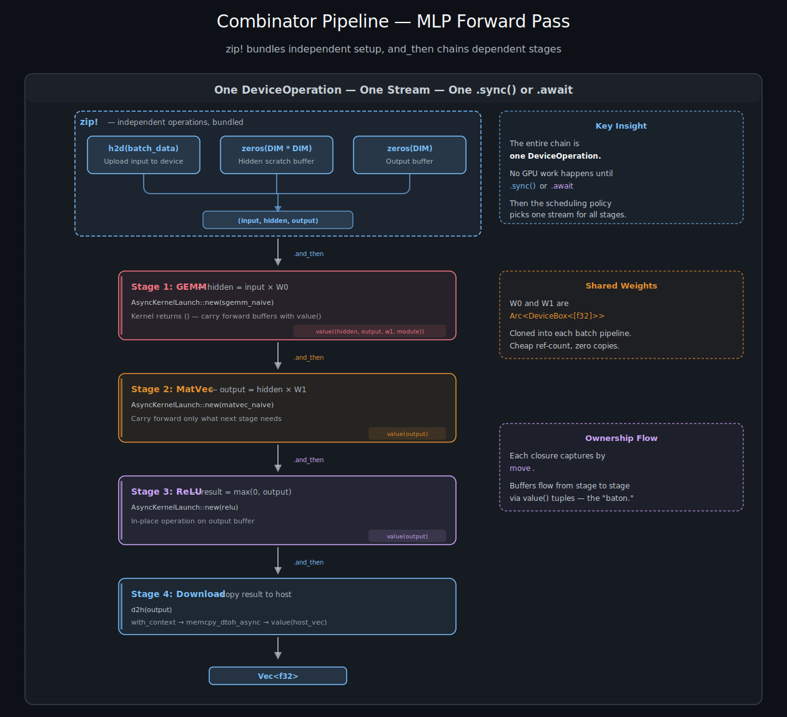

# 组合子与组合 — cuda-oxide

单个kernel启动很少是完整的故事。一个真实的 GPU 工作负载可能需要上传输入数据、将两个矩阵相乘、应用激活函数，然后将结果拷贝回主机——四个必须按严格顺序执行的独立操作。本章展示 cuda-oxide 的组合子系统如何让你将这些片段拼接成一个流水线，保持惰性和流无关性，直到你执行它的那一刻。

## 问题：多步骤 GPU 工作 

想象你正在构建一个简单的神经网络前向传播。步骤如下：

1. **上传**——将输入批次从主机拷贝到设备。
2. **GEMM**——将输入乘以权重矩阵 W0。
3. **ReLU**——对结果应用激活函数。
4. **下载**——将输出拷贝回主机。

每个步骤都依赖于前一个。在上传完成之前你不能运行 GEMM，在 ReLU 完成之前你不能下载。在同步世界中，你会写四个独立的 `.sync()` 调用：

```rust
let input  = h2d(batch_data).sync()?;       // 上传
let hidden = launch_gemm(input, w0).sync()?; // GEMM
let output = launch_relu(hidden).sync()?;    // ReLU
let result = d2h(output).sync()?;            // 下载
```

这能工作，但有个问题。每个 `.sync()` 都经过调度策略，每次可能分配**不同的**流。流之间没有顺序保证——GEMM 可能在另一个流上的上传完成之前就开始。即使策略碰巧选择了同一个流，每个 `.sync()` 都会阻塞主机线程，提交一个操作，再次阻塞，提交下一个，依此类推。你在为"将配方交给厨房，等待菜品，交下一份配方"的往返成本支付四次。

你真正想要的是将整个用餐计划写在一张卡片上，一次性交给厨房。

## `and_then`——"当这个完成时，做那个" 

`and_then` 组合子将两个操作链式连接：运行第一个，将其输出传递给闭包，闭包产生第二个操作。两者在**同一个流**上运行，因此 CUDA 的顺序保证意味着第二个总是能看到第一个的结果：

```rust
let pipeline = h2d(batch_data)
    .and_then(|input| launch_gemm(input, w0))
    .and_then(|hidden| launch_relu(hidden))
    .and_then(|output| d2h(output));

let result: Vec<f32> = pipeline.sync()?;
```

整个链是一个单一的 `DeviceOperation`。编写它时没有 GPU 工作发生——你只是在描述序列。当你调用 `.sync()` 时，调度策略选择**一个**流，链在该流上从上到下运行。去厨房一次，等待一次，四道菜。

### 数据如何流经链 

每个 `and_then` 闭包接收前一阶段的 `Output` 作为其参数。闭包必须返回一个新的 `DeviceOperation`，它成为链中的下一个链接：

```
h2d(batch)         → DeviceBox<[f32]>
    │
    └─ and_then ─► launch_gemm(input, w0)   → DeviceBox<[f32]>
                        │
                        └─ and_then ─► launch_relu(hidden)   → DeviceBox<[f32]>
                                            │
                                            └─ and_then ─► d2h(output)   → Vec<f32>
```

整个链的类型由编译器推断。你无需命名中间类型——它们自动流经闭包。

### 用 `value()` 携带额外数据

kernel启动产生 `()`——它们通过设备内存上的副作用工作，而非返回值。但下一阶段需要缓冲区句柄、模块引用，以及可能的其他元数据。技巧是使用 `value()` 将下一阶段需要的所有东西打包：

```rust
let pipeline = launch_gemm(input, hidden)
    .and_then(move |()| {
        // kernel产生了 ()，但我们仍然拥有来自外围作用域的 `hidden` 和 `module`。
        // 将它们打包供下一阶段使用。
        value((hidden, module))
    })
    .and_then(move |(hidden, module)| {
        launch_relu(hidden, module)
    });
```

`move` 关键字很重要——每个闭包通过所有权捕获它需要的数据。当闭包运行时，它消耗这些值并通过 `value()` 将它们向前传递。这正是 Rust 所有权系统的设计目的：确保每个缓冲区在任一时刻只被一个阶段使用，没有悬空引用。

### `and_then_with_context`——当你需要流时 

有时阶段之间的闭包需要执行原始 CUDA 操作——异步内存拷贝、事件记录或同步调用。这些需要 `CUstream` 句柄，这在普通的 `and_then` 闭包中不可用。`and_then_with_context` 传递前一个结果和 `ExecutionContext`：

```rust
let pipeline = launch_kernel(input)
    .and_then_with_context(|ctx, gpu_result| {
        let stream = ctx.get_cuda_stream();
        copy_result_to_staging(stream, gpu_result)
    });
```

谨慎使用——大多数流水线可以完全用 `and_then` 和内部使用 `with_context` 的辅助函数（`h2d`、`d2h`、`zeros`）构建。

## `zip!`——捆绑独立工作 

并非所有事情都是顺序的。在运行前向传播之前，你需要分配三个缓冲区：输入、隐藏层的暂存缓冲区和输出缓冲区。这些分配是独立的——没有一个依赖于其他。但每个都返回一个你稍后需要的值。

如果你对三个都使用 `and_then`，你会得到尴尬嵌套的闭包来将所有结果向前传递：

```rust
// 不要这样做——它能工作但难以阅读
let pipeline = h2d(batch_data)
    .and_then(|input| {
        zeros(DIM * DIM).and_then(move |hidden| {
            zeros(DIM).and_then(move |output| {
                value((input, hidden, output))
            })
        })
    });
```

`zip!` 通过将独立操作组合成一个返回它们结果元组的单一操作来解决这个问题：

```rust
use cuda_async::zip;

let pipeline = zip!(h2d(batch_data), zeros(DIM * DIM), zeros(DIM));
// pipeline: impl DeviceOperation<Output = (DeviceBox, DeviceBox, DeviceBox)>

let (input, hidden, output) = pipeline.sync()?;
```

清晰多了。`zip!` 接受两个或三个参数，并在同一个流上按顺序执行它们。结果被收集到一个元组中一起返回。

> **提示**
> 
> 名称 `zip` 来自数据组合模式——两个独立的结果压缩成一个元组——而非并行执行。所有臂在同一个流上按顺序运行。对于跨流的真正并发执行，参见《并发执行》。

### 组合 `zip!` 与 `and_then` 

真正的威力在组合时显现。`zip!` 处理独立的设置，`and_then` 处理依赖的流水线：

```rust
let pipeline = zip!(h2d(batch_data), zeros(DIM * DIM), zeros(DIM))
    .and_then(|(input, hidden, output)| launch_gemm(input, hidden, w0))
    .and_then(|hidden| launch_relu(hidden))
    .and_then(|result| d2h(result));
```

这读起来几乎像伪代码："分配三个缓冲区，然后 GEMM，然后 ReLU，然后下载。"整个东西是一个 `DeviceOperation`，当你 `.sync()` 或 `.await` 它时在一个流上运行。

## `.arc()`——跨流水线共享结果 

在批处理场景中，你可能一次性加载模型权重并在多个前向传播中共享它们。每个批次流水线都需要对权重的引用，但 `DeviceOperation` 按值消耗其输出。你不能将同一个 `DeviceBox` 移入四个不同的闭包。

`.arc()` 将输出包装在 `Arc<T>` 中，使其廉价可克隆：

```rust
let (w0, w1) = zip!(
    h2d(w0_host).arc(),
    h2d(w1_host).arc()
).await?;

// w0: Arc<DeviceBox<[f32]>>  -- 克隆到每个批次中
for batch in batches {
    let w0 = w0.clone();
    let w1 = w1.clone();
    tokio::spawn(build_forward_pass(batch, w0, w1).into_future());
}
```

权重缓冲区位于设备上，通过 `Arc` 共享，每个批次流水线持有一个廉价的 `Arc::clone`。只要还有批次在使用它们，权重就保持存活，Rust 的引用计数自动处理清理。

## `unzip!`——拆分成对结果 

偶尔你有一个产生元组的操作，但你想将每个元素送入不同的下游链。`unzip!` 将一个产生对的操作拆分为两个共享执行的独立操作——源最多运行一次：

```rust
use cuda_async::unzip;

let pair_op = zip!(allocate_a(), allocate_b());
let (op_a, op_b) = unzip!(pair_op);

let result_a = op_a.and_then(|a| process_a(a));
let result_b = op_b.and_then(|b| process_b(b));
```

在底层，`unzip!` 创建一个共享的备忘录节点。哪个分支先执行就触发源；第二个读取缓存的结果。这对于将共享的设置步骤拆分为分叉的下游流水线很有用。

## 综合起来：MLP 前向传播 



用组合子构建的 MLP 前向传播的数据流。`zip!` 在顶部捆绑三个独立分配。四个 `and_then` 阶段顺序链接：GEMM、MatVec、ReLU 和 D2H。类型通过 `value()` 元组在阶段间流动。整个链是一个 `DeviceOperation`——直到 `.sync()` 或 `.await` 才会执行。

以下是 `async_mlp` 示例的简化版本，演示了每个组合子协同工作。此函数返回一个描述单个批次整个前向传播的单一 `DeviceOperation`：

```rust
fn forward_pass(
    batch: Vec<f32>,
    w0: Arc<DeviceBox<[f32]>>,
    w1: Arc<DeviceBox<[f32]>>,
    module: Arc<CudaModule>,
) -> impl DeviceOperation<Output = Vec<f32>> {
    // 设置：分配输入 + 暂存缓冲区（独立 → 压缩它们）
    zip!(h2d(batch), zeros(DIM * DIM), zeros(DIM))
        // 阶段 1：GEMM — hidden = input × W0
        .and_then(move |(input, hidden, output)| {
            let func = module.load_function("sgemm_naive").unwrap();
            let mut launch = AsyncKernelLaunch::new(Arc::new(func));
            launch
                .push_args((DIM as u32, DIM as u32, DIM as u32,
                            1.0f32,
                            input.cu_deviceptr(), input.len() as u64,
                            w0.cu_deviceptr(), w0.len() as u64,
                            0.0f32,
                            hidden.cu_deviceptr(), hidden.len() as u64))
                .set_launch_config(gemm_cfg);
            // kernel返回 ()。将仍需要的缓冲区向前传递。
            launch.and_then(move |()| value((hidden, output, w1, module)))
        })
        // 阶段 2：MatVec — output = hidden × W1
        .and_then(move |(hidden, output, w1, module)| {
            let func = module.load_function("matvec_naive").unwrap();
            let mut launch = AsyncKernelLaunch::new(Arc::new(func));
            launch
                .push_args((DIM as u32, DIM as u32,
                            hidden.cu_deviceptr(), hidden.len() as u64,
                            w1.cu_deviceptr(), w1.len() as u64,
                            output.cu_deviceptr(), output.len() as u64))
                .set_launch_config(matvec_cfg);
            launch.and_then(move |()| value((output, module)))
        })
        // 阶段 3：ReLU — result = max(0, output)
        .and_then(move |(output, module)| {
            let func = module.load_function("relu").unwrap();
            let mut launch = AsyncKernelLaunch::new(Arc::new(func));
            launch
                .push_args((output.cu_deviceptr(), output.len() as u64,
                            output.cu_deviceptr(), output.len() as u64))
                .set_launch_config(relu_cfg);
            launch.and_then(move |()| value(output))
        })
        // 阶段 4：将结果下载到主机
        .and_then(d2h)
}
```

研究数据如何流经这个流水线：

1. `zip!` 产生三个 `DeviceBox` 句柄。
2. 第一个 `and_then` 消耗所有三个，启动 GEMM，并通过 `value()` 将仍需要的缓冲区打包成元组。
3. 第二个 `and_then` 解包元组，启动 MatVec，并只向前传递下一阶段需要的。
4. 第三个 `and_then` 原地启动 ReLU。
5. 最后一个 `and_then` 调用 `d2h` 将结果拷贝到主机。

整个函数返回 `impl DeviceOperation<Output = Vec<f32>>`。什么都没有执行。你可以 `.sync()` 它、`.await` 它，或者将它交给 `tokio::spawn`，让调度策略决定使用哪个流。

## 快速参考 

| 组合子 | 作用 | 何时使用 |
|:---|:---|:---|
| `.and_then(f)` | 运行自身，然后在同一流上执行 `f(result)` | 顺序依赖的阶段 |
| `.and_then_with_context(f)` | 类似 `and_then`，但 `f` 还会获得 `ExecutionContext` | 闭包需要原始流时 |
| `.apply(f)` | `and_then` 的别名 | 上下文中读起来更顺的那个 |
| `zip!(a, b)` | 运行两者，返回 `(A, B)` | 独立的设置步骤 |
| `zip!(a, b, c)` | 运行三者，返回 `(A, B, C)` | 同上，用于三个操作数 |
| `.arc()` | 将输出包装为 `Arc<T>` | 跨流水线共享结果 |
| `unzip!(op)` | 将产生元组的操作拆分为两个 | 分叉的下游链 |
| `value(x)` | 将 `x` 包装为无操作 | 将主机数据送入流水线 |
| `with_context(f)` | 将构造推迟到流已知时 | 包装原始 CUDA 驱动调用 |

> **参见**
> 
> 《并发执行》章节展示了如何使用 `tokio::spawn` 并发运行多个流水线，《调度与流》章节解释了调度策略如何将流水线分布到 CUDA 流上。

| [上一页](./DeviceOperation模型.md) | [下一页](./调度和流.md) |
| :--- | ---: |