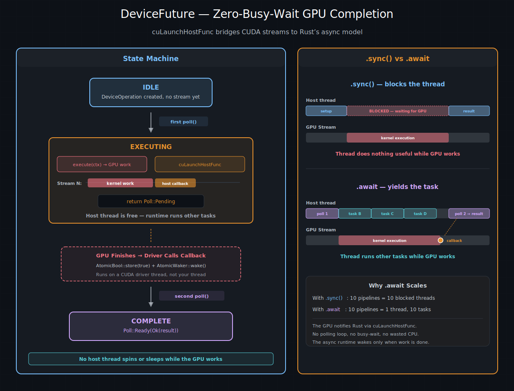

# 调度与流（Scheduling and Streams）

前几章建立了一套描述 GPU 工作的词汇——`DeviceOperation`、`and_then` 链、`zip!` 组合包。但描述不等于执行。在某个时刻，这份“菜谱”必须送到“厨房”。本章讨论的就是“厨房”：什么是 CUDA 流，cuda-oxide 的调度策略如何将工作分配给流，以及当一个 `DeviceOperation` 变成一个正在运行的 `DeviceFuture` 时背后发生了什么。

> 另请参阅：[CUDA 编程指南 – 流](https://docs.nvidia.com/cuda/cuda-programming-guide/#streams) —— 调度策略所依赖的底层 CUDA 流语义。

## 结账通道

可以把 CUDA 流想象成杂货店的**结账通道**。每个通道按顺序处理顾客——谁排在前面谁先被服务。但是多个通道独立运行，所以通道 1 可以为一位顾客结账，同时通道 2 为另一个订单装袋。不同通道上的工作在时间上重叠，因此商店获得了更高的吞吐量。

GPU 的工作方式相同。**流**是一个有序的操作队列。在单个流内部，一切按顺序执行——kernel A 完成后kernel B 才开始。但是如果你把kernel A 放在流 0 上，kernel B 放在流 1 上，它们就可以在硬件上重叠执行：

```text
Stream 0:  ┌─── Kernel A ───┐
           └────────────────┘
Stream 1:       ┌─── Kernel B ───┐
                └────────────────┘

           ◄─── time ────────────────►
```

使用一个流时，一切都是串行的。使用多个流时，独立的工作相互重叠，GPU 保持更忙碌的状态。这就是 GPU 上并发的根本机制。

## 为什么你很少直接接触流

在 CUDA C++ 中，程序员需要创建流，决定每个操作进入哪个流，并且当一个流上的工作依赖另一个流的结果时，需要手动插入事件。这很强大但也很繁琐，并且使每个函数都绑定到特定的并发策略。

cuda-oxide 引入了一个间接层：**调度策略（scheduling policy）**。你不需要自己选择流，而是把你的 `DeviceOperation` 交给策略，由它为你选择流。这意味着同一个流水线可以在单个流上运行（用于调试）、在四个流的池上运行（用于提高吞吐量），或者在你自己编写的自定义策略上运行——所有这些都无需修改流水线代码。

## `SchedulingPolicy` trait

调度策略回答一个问题：“给定这个操作，它应该在哪个流上运行？” trait 包含三个方法：

- **`init`** – 在启动时调用一次，用于创建 CUDA 流。
- **`schedule`** – 选择一个流，并将操作包装成一个 `DeviceFuture` 供 `.await` 使用。
- **`sync`** – 选择一个流，执行操作，并阻塞直到完成。

策略是 `Sync` 的，意味着单个实例在设备上的所有操作之间共享。流的选择必须是线程安全的。

## `StreamPoolRoundRobin` – 默认策略

当你调用 `init_device_contexts(0, 1)` 时，cuda-oxide 会创建一个包含四个 CUDA 流的 `StreamPoolRoundRobin`。每次调度一个操作时，原子计数器前进，然后选择池中的下一个流：

```text
Operation 1  →  Stream 0  ──► ████████
Operation 2  →  Stream 1  ──►    ████████         (overlaps 1)
Operation 3  →  Stream 2  ──►       ████████      (overlaps 1, 2)
Operation 4  →  Stream 3  ──►          ████████
Operation 5  →  Stream 0  ──►                ████████  (waits for 1)
```

选择过程是无锁的——在 `AtomicUsize` 上执行一次 `fetch_add`，然后对池大小取模。与 GPU 工作的成本相比，开销可以忽略不计。

四个流是一个不错的默认值。它给了 GPU 足够的在途工作，使kernel执行与内存传输可以重叠，而又不会带来过多的上下文切换开销。对于大多数工作负载，你永远不需要考虑它——策略会自动工作。

### 轮询策略的优势场景

- **批处理推理：** 每个批次是一个独立的流水线。轮询策略将批次分布到不同的流上，使计算重叠。
- **混合计算 + 传输：** 当一个流运行kernel时，另一个流复制数据。GPU 的拷贝引擎和计算单元同时工作。
- **许多小kernel：** 重叠启动开销可以减少kernel之间的间隙，使 GPU 更忙碌。

### 何时需要重新考虑

- **依赖关系重的链：** 如果你构建了一个单一的 `and_then` 链（比如前一章中的前向传播），那么整个链无论如何都会在同一个流上运行。轮询策略只有在调度**多个独立操作**时才有意义。
- **非常大的kernel：** 如果一个kernel已经使 GPU 饱和，那么多流调度不会带来任何好处。额外的流将处于空闲状态。

## `SingleStream` – 单通道，严格顺序

> **注意**：`SingleStream` 已在调度内部实现，但**目前尚未连接到 `GlobalSchedulingPolicy`，也没有通过 `init_device_contexts` 暴露**。默认设置始终使用 `StreamPoolRoundRobin`。本节描述的是未来 API 接口的设计意图。

用于调试，或者当你需要**所有**操作之间保证顺序时，`SingleStream` 将所有操作路由到一个流上。每个操作都能看到之前所有操作的结果，从而消除任何与流相关的并发错误可能性：

```text
Operation 1  →  Stream 0  ──► ████████
Operation 2  →  Stream 0  ──►          ████████   (waits for 1)
Operation 3  →  Stream 0  ──►                  ████████
```

> **提示**：如果你怀疑 GPU 流水线中存在并发错误，切换到 `SingleStream` 是最快的检查方法。如果错误消失了，说明问题是在不同流之间的操作缺少依赖关系。如果错误仍然存在，那么问题出在别处。

## 设置运行时

在任何异步操作运行之前，你需要初始化线程局部的设备上下文：

```rust
use cuda_async::device_context::init_device_contexts;

init_device_contexts(0, 1)?;
```

第一个参数是默认 GPU 序号；第二个参数是要管理的设备数量。在底层，这会注册一个线程局部变量，在首次使用时懒加载地为每个设备创建一个 `StreamPoolRoundRobin`。该池默认持有四个流。

在你的程序开始时调用一次，在任何 `.sync()` 或 `.await` 之前。在同一个线程上调用两次会返回错误。

## 当你 `.await` 时发生了什么



左图：DeviceFuture 的三态机。首次轮询时，提交 GPU 工作和一个 `cuLaunchHostFunc` 回调——然后返回 `Poll::Pending`。当 GPU 完成时，回调设置一个 `AtomicBool` 并唤醒任务。第二次轮询时，结果被交付。右图：`.sync()`（线程全程阻塞）与 `.await`（GPU 工作时线程运行其他任务）的对比。

下面是一个操作从构造到完成的完整旅程：

```text
module.kernel_async(...)       ← 构建“菜谱”（没有 GPU 工作）
        │
        ▼
  AsyncKernelLaunch            ← 一个 DeviceOperation，惰性且不感知流
        │
        │  .await
        ▼
  IntoFuture::into_future()    ← 调度策略选择流
        │
        ▼
  DeviceFuture                 ← 绑定到某个流，准备轮询
        │
        │  第一次 poll()
        ▼
  execute() on stream 2        ← GPU 工作被提交
  cuLaunchHostFunc on stream 2 ← 在kernel之后排队的主机回调
  return Poll::Pending
        │
        │  ... GPU 正在工作，主机线程空闲 ...
        │
        │  回调在 CUDA 驱动线程上触发
        │  → 设置 AtomicBool，唤醒 AtomicWaker
        │
        │  第二次 poll()
        ▼
  return Poll::Ready(Ok(()))   ← 结果交付给调用者
```

关键在于，在第一次 `poll()` 和回调之间，**没有占用任何主机线程**。异步运行时将任务挂起，转去运行其他任务。GPU 通过 `cuLaunchHostFunc` 回调在完成时通知运行时。这就是对于并发工作负载，`.await` 比 `.sync()` 扩展性更好的原因——你可以有几十个在途操作，而不需要为每个操作占用一个线程。

## 手动流控制

大多数时候，调度策略会为你处理流。但有些情况你需要直接控制——比如与期望特定流的 CUDA 库交互、细粒度地重叠计算和传输、或者单独分析一个kernel的性能。cuda-oxide 为这些情况暴露了完整的流 API。

### 创建流

```rust
let ctx = CudaContext::new(0)?;
let default = ctx.default_stream();  // 每个上下文默认的（null）流
let custom  = ctx.new_stream()?;     // 一个新的非阻塞流
```

默认流在 CUDA 中具有特殊的同步语义（它会隐式地与大多数其他流串行化）。由 `new_stream()` 创建的非阻塞流没有这个限制，这也是调度策略专门使用它们的原因。

### Fork 和 Join

一个常见的模式是从父流 fork 出一个子流，在子流上运行独立的工作，然后将结果 join 回来。`fork` 创建一个新流，并隐式依赖父流的当前位置——子流必须等到父流上的所有先前工作完成后才能开始。`join` 则相反：父流等待子流完成之后再继续。

```rust
let main = ctx.default_stream();

// 在 main 上上传数据
let buf_a = DeviceBuffer::from_host(&main, &data_a)?;
let buf_b = DeviceBuffer::from_host(&main, &data_b)?;

// Fork: 子流可以看到上传的数据
let child_1 = main.fork()?;
let child_2 = main.fork()?;

// 并行运行独立的工作
module.process(&child_1, cfg, &mut buf_a)?;
module.process(&child_2, cfg, &mut buf_b)?;

// Join: main 等待两个子流
main.join(&child_1)?;
main.join(&child_2)?;

// 现在可以在 main 上安全地使用 buf_a 和 buf_b
module.combine(&main, cfg, &buf_a, &buf_b)?;
```

对应的 GPU 时间线：

```text
main:      ██ upload_a ██ upload_b ██ ──fork──────────────── join ──► ██ combine ██
                                         |                    ^  ^
child_1:                                 └─► ██ process_a ██ ─┘  |
                                         |                       |
child_2:                                 └─► ██ process_b ██ ────┘
```

在底层，`fork` 和 `join` 使用 CUDA 事件 —— 在一个流上 `cuEventRecord`，在另一个流上 `cuStreamWaitEvent`。事件是 GPU 端的同步令牌；在 fork 或 join 期间没有主机线程被阻塞。

### 用于细粒度排序的事件

当 `fork`/`join` 粒度太粗时，你可以直接使用事件来建立不同流中特定点之间的顺序：

```rust
// 在kernel完成后，在 stream_a 上记录一个事件
let event = stream_a.record_event(None)?;

// stream B 等待那个特定点之后再继续
stream_b.wait(&event)?;
```

CUDA 事件不属于任何流——它是一个独立的同步令牌。`record` 将事件标记在某个流上的特定位置；`wait` 将依赖关系插入到另一个流中。事件是汇合点：在事件在流 A 上触发之前，流 B 上 `wait` 之后的所有操作都不会运行。

事件也是测量 GPU 执行时间的标准方法。注意，测量时间要求事件创建时**不带** `CU_EVENT_DISABLE_TIMING` 标志——需要显式传递标志以启用计时：

```rust
use cuda_bindings::CUevent_flags_enum::CU_EVENT_DEFAULT;

let start = stream.record_event(Some(CU_EVENT_DEFAULT))?;
module.my_kernel(&stream, config)?;
let end = stream.record_event(Some(CU_EVENT_DEFAULT))?;
end.synchronize()?;
println!("Kernel took {:.2} ms", start.elapsed_ms(&end)?);
```

这测量的是实际的 GPU 时间，而不是主机端的调度开销。`record_event(None)` 默认创建计时禁用的事件，不能用于 `elapsed_ms`。

> **提示**：
>
> 对于日常的异步流水线，你永远不需要手动创建流、事件或 fork/join。调度策略和 `and_then` 链会自动处理顺序。手动 API 仅用于互操作、性能分析和高级优化。

## 选择正确的方法

| 场景 | 推荐方法 |
|------|----------|
| 简单脚本，单个kernel | `module.kernel_async(...).sync()` |
| 多阶段流水线（GEMM → ReLU → D2H） | `and_then` 链，策略选择一个流 |
| 并发运行的独立批次 | `tokio::spawn` 每个批次，轮询策略分发 |
| 调试疑似流顺序错误 | 切换到 `SingleStream` |
| 与现有 CUDA 库互操作 | 使用该库的流调用 `.sync_on(&stream)` |
| 单独分析一个kernel的性能 | 在kernel启动前后显式使用事件 |
| 追求最大吞吐量 | 使用 Nsight Systems 分析，调整池大小 |

> 另请参阅：[CUDA 编程指南 – 事件](https://docs.nvidia.com/cuda/cuda-programming-guide/#events) 了解 CUDA 事件的完整规范。[并发执行](./并发执行.md) 一章展示了将这些调度概念应用于真实的多批次工作负载。

| [上一页](./组合子与组合.md) | [下一页](./并发执行.md) |
| :--- | ---: |

