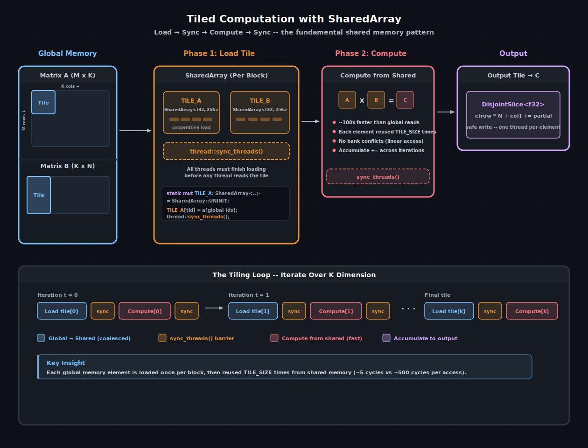

# 共享内存与同步

CUDA 线程块中的每个线程都可以访问一个称为**共享内存**（shared memory）的小型快速暂存存储器。它位于芯片上，紧邻 SM 的执行单元 —— 比全局内存快约 100 倍，比 L1 缓存快约 10 倍。缺点是容量：通常每个 SM 只有 48–228 KB（取决于架构），且由该 SM 上运行的所有块共享。

cuda-oxide 通过 `SharedArray` 和 `DynamicSharedArray` 暴露共享内存，两者的设计都力求在编译为 PTX 地址空间 3 时感觉像 Rust 数组。本章介绍如何使用它们、何时同步，以及将朴素kernel变为快速kernel的分块模式。

> 另请参阅：[CUDA 编程指南 — 共享内存](https://docs.nvidia.com/cuda/cuda-programming-guide/#shared-memory) —— 硬件层面的存储体结构、广播规则以及各架构的容量细节。

---

## 为什么共享内存很重要

回顾[异步 MLP 流水线](../projects/async-mlp-pipeline.html)项目中的朴素 GEMM。每个线程通过从全局内存读取一整行 A 和一整列 B 来计算一个输出元素。对于 64×64 的矩阵，这意味着**每个线程**进行 128 次全局加载，而块中的其他线程也会加载许多相同的元素。硬件会尽职地从 DRAM 中获取每一个元素 —— 如果幸运的话，可能会命中 L2 缓存。

共享内存改变了这种算账方式。一个线程块合作地将 A 的一个**分块**（tile）和 B 的一个分块加载到共享内存中，然后同步，之后每个线程都从分块中读取数据。每次全局加载的成本被所有重用该元素的线程分摊。对于 16×16 的分块，全局内存流量减少了 16 倍。



分块计算模式。线程合作将 A 和 B 的分块从全局内存加载到 <code>SharedArray</code> 中，同步，从快速片上内存计算部分乘积，再次同步，然后沿 K 维度重复下一个分块。

---

## SharedArray —— 静态共享内存

`SharedArray<T, N, ALIGN>` 是在编译时分配在共享内存中的固定大小数组。在kernel内部将其声明为 `static mut`：

```rust
use cuda_device::thread::Runtime2DIndex;
use cuda_device::{kernel, thread, DisjointSlice, SharedArray};

const TILE: usize = 16;

#[kernel]
pub fn tiled_sgemm(
    m: u32, n: u32, k: u32,
    a: &[f32], b: &[f32],
    mut c: DisjointSlice<f32, Runtime2DIndex>,
) {
    static mut TILE_A: SharedArray<f32, 256> = SharedArray::UNINIT;
    static mut TILE_B: SharedArray<f32, 256> = SharedArray::UNINIT;

    let n_sz = n as usize;
    let row = thread::index_2d_row();
    let col = thread::index_2d_col();
    let tx = thread::threadIdx_x() as usize;
    let ty = thread::threadIdx_y() as usize;

    let mut sum = 0.0f32;
    let mut t = 0u32;

    while t < k / TILE as u32 {
        let tile_offset = t as usize * TILE;

        // Phase 1: cooperative load
        unsafe {
            TILE_A[ty * TILE + tx] = a[row * k as usize + tile_offset + tx];
            TILE_B[ty * TILE + tx] = b[(tile_offset + ty) * n_sz + col];
        }

        // All threads must finish loading before any thread reads
        thread::sync_threads();

        // Phase 2: compute from shared memory
        let mut i = 0usize;
        while i < TILE {
            unsafe {
                sum += TILE_A[ty * TILE + i] * TILE_B[i * TILE + tx];
            }
            i += 1;
        }

        // Must sync before overwriting the tile in the next iteration
        thread::sync_threads();

        t += 1;
    }

    // SAFETY: every thread sees the same `n_sz`.
    if let Some(c_idx) = unsafe { thread::index_2d_runtime(n_sz) } {
        if let Some(c_elem) = c.get_mut(c_idx) {
            *c_elem = sum;
        }
    }
}
```

### 声明规则

`SharedArray` 必须在kernel函数体内声明为 `static mut`。这告诉编译器将其分配在 PTX 共享地址空间（`.shared`）中。`UNINIT` 常量跳过初始化 —— 其内容在线程写入之前是未定义的。

| 参数 | 含义 |
|------|------|
| `T` | 元素类型（`f32`、`u32` 等） |
| `N` | 元素数量（编译时固定） |
| `ALIGN` | 字节对齐（默认为 0 = 自然对齐；对于 TMA 目标使用 128） |

> **提示**：`SharedArray` 被设计为 `!Sync` —— 它包装了 `UnsafeCell`，防止编译器假设跨线程不可变性。这是正确的：共享内存本质上可以被块中的所有线程修改，程序员负责同步。

### API 接口

```rust
impl<T, const N: usize, const ALIGN: usize> SharedArray<T, N, ALIGN> {
    pub const UNINIT: Self;
    pub const fn len() -> usize;
    pub fn as_ptr(&self) -> *const T;
    pub fn as_mut_ptr(&mut self) -> *mut T;
}

// Indexing (unsafe access via static mut)
impl Index<usize> for SharedArray<T, N, ALIGN> { .. }
impl IndexMut<usize> for SharedArray<T, N, ALIGN> { .. }
```

在 debug 构建中索引会进行边界检查。在 release（以及 GPU 上）构建中，边界检查会被省略。如果越界，将产生未定义行为 —— 与 Rust 中任何 `static mut` 访问的规则相同。

---

## DynamicSharedArray —— 运行时大小分配

有时你在编译时不知道分块大小，或者想要在多个逻辑数组之间共享一个共享内存池。`DynamicSharedArray` 从动态共享内存区域分配，该区域的大小在启动时通过 `LaunchConfig::shared_mem_bytes` 设置：

```rust
use cuda_device::{kernel, thread, DynamicSharedArray};

#[kernel]
pub fn reduce_dynamic(input: &[f32], n: u32, mut output: DisjointSlice<f32>) {
    let tid = thread::threadIdx_x() as usize;

    // Get a pointer to the dynamic shared memory region
    let smem: *mut f32 = DynamicSharedArray::<f32>::get();

    unsafe {
        // Load from global
        let idx = thread::index_1d();
        *smem.add(tid) = if idx.get() < n as usize {
            input[idx.get()]
        } else {
            0.0
        };
    }

    thread::sync_threads();

    // Tree reduction
    let mut stride = thread::blockDim_x() as usize / 2;
    while stride > 0 {
        if tid < stride {
            unsafe {
                *smem.add(tid) += *smem.add(tid + stride);
            }
        }
        thread::sync_threads();
        stride /= 2;
    }

    if tid == 0 {
        let block_idx = thread::blockIdx_x() as usize;
        unsafe {
            *output.get_unchecked_mut(block_idx) = *smem;
        }
    }
}
```

启动方式：

```rust
let config = LaunchConfig {
    grid_dim: ((n + 255) / 256, 1, 1),
    block_dim: (256, 1, 1),
    shared_mem_bytes: 256 * std::mem::size_of::<f32>() as u32,
};
```

### 划分动态共享内存

如果需要从同一个动态池中分配多个数组，使用 `offset()`：

```rust
let pool_a: *mut f32 = DynamicSharedArray::<f32>::get();
let pool_b: *mut f32 = DynamicSharedArray::<f32>::offset(
    256 * std::mem::size_of::<f32>()
);
```

`offset` 接受从池起始位置的**字节偏移量**。确保总大小不超过 `shared_mem_bytes` —— 没有运行时检查。

### 对齐

`DynamicSharedArray` 默认 16 字节对齐。对于 TMA 操作（Hopper+），使用 `DynamicSharedArray<f32, 128>` 以获得所需的 128 字节对齐。对齐编码在 PTX 的 `.align` 指令中。

---

## 同步：sync_threads()

`thread::sync_threads()` 是一个**块级屏障**。它编译为 PTX `bar.sync 0`，并保证两点：

1. **块中的所有线程**在任何一个线程继续之前都已到达屏障。
2. 这些线程的**所有内存写入**在屏障之后对所有线程可见（它充当共享内存的内存栅栏）。

如果在加载和计算阶段之间没有 `sync_threads()`，某些线程可能在另一个线程写入共享内存位置之前读取它。硬件不保证共享内存存储在同一线程束内的任何顺序 —— 即使在同一线程束中，没有屏障也可能看到过时的值。

### 何时需要同步

规则很简单：**在读取另一个线程写入的内容之前同步**。

| 场景 | 需要同步？ |
|------|------------|
| 线程 A 写入 `TILE[i]`，线程 B 读取 `TILE[i]` | 是 |
| 线程 A 写入 `TILE[i]`，线程 A 读取 `TILE[i]` | 否（同一线程） |
| 为下一次循环迭代覆盖分块 | 是（在新加载覆盖数据之前，其他线程可能还在读取） |
| 从 `DisjointSlice` 读取（每个线程读取自己的索引） | 否 |

上面的分块 GEMM 每次迭代有两个同步点：加载之后（计算之前）和计算之后（在下一次加载覆盖分块之前）。缺少任何一个都会导致数据竞争。

> **提示**：一个常见错误是将 `sync_threads()` 放在并非所有线程都会执行的条件分支内。块中的每个线程都必须到达同一个 `sync_threads()` 调用，否则kernel将死锁。如果需要发散的控制流，请重构代码，使屏障位于分支之外。

---

## 共享内存与其他方法的对比

| 方法 | 延迟 | 容量 | 程序员工作量 |
|------|------|------|--------------|
| 全局内存（朴素） | ~500 周期 | GB 级别 | 无 |
| L1/L2 缓存（隐式） | ~30–100 周期 | 128 KB–40 MB | 无 |
| **共享内存（显式）** | **~5 周期** | **每 SM 48–228 KB** | **分块、同步、存储体感知** |
| 寄存器 | ~1 周期 | 每 SM 64K × 32-bit | 编译器管理 |

当缓存不够用时，共享内存是程序员手中的工具。L1 和 L2 缓存会自动提供帮助，但它们受限于访问模式和逐出策略。共享内存给予你显式的控制：决定加载什么、何时加载以及保留多久。

---

## 存储体冲突

共享内存被划分为 32 个**存储体**（bank，每个线程束通道一个）。如果同一线程束中的两个线程访问映射到同一存储体的不同地址，这些访问会被串行化 —— 这就是**存储体冲突**。2 路冲突的惩罚是 2 倍延迟，最高可达 32 路冲突的 32 倍延迟。

映射很简单：连续的 32 位字映射到连续的存储体。因此 `TILE[0]` 在 bank 0，`TILE[1]` 在 bank 1，……，`TILE[32]` 又回到 bank 0。一种常见的无冲突访问模式是：

```rust
// Each thread reads a different column: thread k reads TILE[row + k]
// If TILE_WIDTH = 32 (or a multiple), add padding: SharedArray<f32, 33 * 16>
```

在 16×16 分块 GEMM 中，内层循环没有存储体冲突，因为 `TILE_A[ty * 16 + i]` 读取一行（连续元素 = 不同存储体），而 `TILE_B[i * 16 + tx]` 读取一列，步长为 16。

> 另请参阅：[CUDA 编程指南 — 共享内存存储体冲突](https://docs.nvidia.com/cuda/cuda-programming-guide/#shared-memory-5-x) —— 详细讲解存储体冲突规则和填充策略。

---

## 整合起来

以下是我们 MLP 流水线中 GEMM 从朴素到分块的演进过程：

| 版本 | 每线程全局加载次数（64×64） | 每线程共享加载次数 | 加速比 |
|------|---------------------------|-------------------|--------|
| 朴素（`sgemm_naive`） | 128 | 0 | 1× |
| 分块（16×16 分块） | 8（4 次迭代 × 2 个分块） | 128 | ~4–10× |
| 分块 + 双缓冲 | 8 | 128（重叠） | ~6–15× |

分块版本用共享内存带宽和计算量换取了全局内存带宽 —— 当kernel受内存限制时，这是一个很好的权衡。双缓冲变体将下一个分块的加载与当前分块的计算重叠，隐藏了更多延迟，但需要每个矩阵有两个 `SharedArray` 以及更复杂的同步。

> 另请参阅：
> - [线程束级编程](./warp级编程.md) —— 对于小规模归约，使用基于 shuffle 的归约作为共享内存的替代方案
> - [张量内存加速器](./张量内存加速器.md) —— 硬件加速的全局→共享拷贝，可替代手动加载循环

