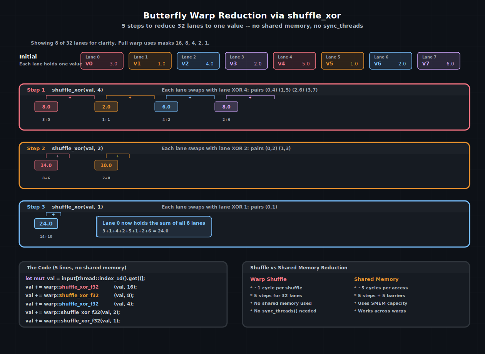

# 线程束级编程

**线程束**是 CUDA 的基本调度单元：32 个线程在同一个 SM 上以锁步方式执行。由于所有 32 个线程共享同一个指令指针，它们可以直接通过**线程束洗牌**（warp shuffle）指令交换数据 —— 寄存器到寄存器的传输，大约花费一个周期，不需要共享内存、屏障或同步。

cuda-oxide 通过 `cuda_device::warp` 模块暴露了完整的线程束内建函数集。本章介绍洗牌、投票以及它们所支持的模式：线程束归约、广播、扫描和基于 ballot 的过滤。

> 另请参阅：[CUDA 编程指南 — Warp Shuffle 函数](https://docs.nvidia.com/cuda/cuda-programming-guide/#warp-shuffle-functions) —— PTX 编码细节和完整的宽度变体。

---

## 通道与线程束标识

块中的每个线程在其线程束内都有一个**通道 ID**（lane ID，0–31）：

```rust
use cuda_device::warp;

let lane = warp::lane_id();     // 0..31, 硬件寄存器 %laneid
let warp = warp::warp_id();     // threadIdx.x / 32
```

`warp_id()` 由 `threadIdx.x / 32` 推导得出。对于多维块，这仅考虑 x 维度 —— 这通常没问题，因为大多数关心通道标识的kernel都使用 1D 块。

---

## 洗牌：寄存器到寄存器的数据交换

四种洗牌变体允许线程在不经过内存的情况下读取另一个线程的寄存器：

| 函数 | 作用 | 源通道 |
|------|------|--------|
| `shuffle(val, src)` | 从指定通道读取 | `src` |
| `shuffle_xor(val, mask)` | 从 `lane_id ^ mask` 读取 | `lane_id ^ mask` |
| `shuffle_down(val, delta)` | 从 `lane_id + delta` 读取 | `lane_id + delta` |
| `shuffle_up(val, delta)` | 从 `lane_id - delta` 读取 | `lane_id - delta` |

每个变体都有 `u32` 和 `f32` 版本：

```rust
let partner_val = warp::shuffle_xor_f32(my_val, 1);
let broadcast   = warp::shuffle_f32(my_val, 0);     // lane 0 的值广播给所有线程
let neighbor    = warp::shuffle_down_f32(my_val, 1); // 下一个通道的值
```

所有洗牌操作都是**线程束同步的** —— 它们隐式同步整个线程束。不需要 `sync_threads()`，在洗牌模式内部调用 `sync_threads()` 既没必要又浪费。

---

## 线程束归约

最常见的洗牌模式是**蝶形归约**：在 ⌈log₂(32)⌉ = 5 步内，每个通道累加所有 32 个值的和（或最小值、最大值等）。无需共享内存，无需屏障，五条指令。



使用 <code>shuffle_xor</code> 的蝶形归约。每一步，通道与它们的 XOR 伙伴交换值并相加。经过 5 步（掩码 16, 8, 4, 2, 1）后，通道 0 持有所有 32 个值的和。</figcaption>
</figure>

```rust
use cuda_device::warp;

fn warp_reduce_sum(mut val: f32) -> f32 {
    val += warp::shuffle_xor_f32(val, 16);
    val += warp::shuffle_xor_f32(val, 8);
    val += warp::shuffle_xor_f32(val, 4);
    val += warp::shuffle_xor_f32(val, 2);
    val += warp::shuffle_xor_f32(val, 1);
    val
}
```

归约之后，**所有 32 个通道**都持有总和（因为 XOR 是对称的 —— 两个伙伴都会累加）。如果你只需要通道 0 的结果，可以使用 `shuffle_down` 代替：

```rust
fn warp_reduce_sum_lane0(mut val: f32) -> f32 {
    val += warp::shuffle_down_f32(val, 16);
    val += warp::shuffle_down_f32(val, 8);
    val += warp::shuffle_down_f32(val, 4);
    val += warp::shuffle_down_f32(val, 2);
    val += warp::shuffle_down_f32(val, 1);
    val
}
```

使用 `shuffle_down` 时，只有通道 0 持有正确结果 —— 其他通道持有部分和。当只有通道 0 写入输出时，这没问题。

> **提示**：需要块级归约？在每个线程束内使用洗牌进行归约，将 32 个每线程束结果写入共享内存，`sync_threads()`，然后用最后一个线程束归约这些线程束级结果。这种混合方法比纯共享内存树更快，因为它消除了 5 层屏障。

---

## 广播

将通道 0 的值广播给所有通道只需一次洗牌：

```rust
let leader_val = warp::shuffle_f32(my_val, 0);
```

任何通道都可以作为源。这取代了“通道 0 写入共享内存、同步、所有通道读取”的共享内存模式 —— 一条指令替代三个操作。

---

## 包含性前缀和（扫描）

**包含性扫描**计算运行总和：通道 `i` 持有从通道 0 到 `i` 的值的和。该模式使用 `shuffle_up`：

```rust
fn warp_inclusive_scan(mut val: f32) -> f32 {
    let mut offset = 1u32;
    while offset < 32 {
        let n = warp::shuffle_up_f32(val, offset);
        if warp::lane_id() >= offset {
            val += n;
        }
        offset *= 2;
    }
    val
}
```

经过 5 步后，每个通道持有到其自身值为止的前缀和。这是流压缩、直方图构建和并行扫描算法的构建块。

---

## 投票：线程束范围的谓词

投票操作允许线程束集体评估一个布尔条件：

| 函数 | 返回值 |
|------|--------|
| `warp::all(pred)` | 如果**所有**活跃通道的 `pred` 都为 `true`，则返回 `true` |
| `warp::any(pred)` | 如果**任一**活跃通道的 `pred` 为 `true`，则返回 `true` |
| `warp::ballot(pred)` | 一个 `u32` 位掩码 —— 如果通道 `i` 的 `pred` 为 `true`，则第 `i` 位被设置 |
| `warp::popc(pred)` | 种群计数：有多少活跃通道的 `pred == true` |

### 使用 ballot 进行过滤

一个常见的模式是压缩数组，只保留通过谓词的元素。`ballot` + `popc` 可以给出计数和每个通道的写入偏移量：

```rust
use cuda_device::{kernel, thread, warp, DisjointSlice};

#[kernel]
pub fn compact_positive(
    input: &[f32],
    mut output: DisjointSlice<f32>,
    mut count: DisjointSlice<u32>,
) {
    let idx = thread::index_1d();
    let val = input[idx.get()];
    let is_positive = val > 0.0;

    let mask = warp::ballot(is_positive);
    let lane = warp::lane_id();

    // 统计此通道之下的位，得到写入位置
    let offset = (mask & ((1u32 << lane) - 1)).count_ones();

    if is_positive {
        unsafe {
            *output.get_unchecked_mut(offset as usize) = val;
        }
    }

    // 通道 0 记录本线程束的总数
    if lane == 0 {
        unsafe {
            *count.get_unchecked_mut(warp::warp_id() as usize) = mask.count_ones();
        }
    }
}
```

`ballot` 掩码将整个线程束的谓词结果编码在一个寄存器中。无需通信，无需共享内存 —— 硬件在一个周期内完成计算。

---

## 何时使用线程束原语 vs. 共享内存

| 任务 | 线程束洗牌 | 共享内存 |
|------|-----------|----------|
| 归约 32 个值 | 5 次洗牌，~5 周期 | 5 次加载 + 5 次同步，~50 周期 |
| 归约 256 个值 | 洗牌 + 1 次同步 + 洗牌 | 树归约，~10 次同步 |
| 模板计算（邻居访问） | `shuffle_up`/`shuffle_down` | 适用于 2D 模板 |
| 数据对其他线程束可见 | 不可能 | 需要 |
| 随机访问模式 | 不支持 | 自由索引 |
| 跨线程束持久化 | 不适用 | 块生命周期内持久 |

经验法则：如果数据适合单个线程束（32 个元素）且访问模式规则，洗牌更快。如果需要跨线程束通信、更大的数据集或随机访问，则使用共享内存。

---

## 完整示例：线程束级点积

将洗牌和投票结合起来，下面是一个使用线程束归约计算两个向量点积的kernel：

```rust
use cuda_device::{kernel, thread, warp, DisjointSlice};

#[kernel]
pub fn warp_dot_product(
    a: &[f32],
    b: &[f32],
    n: u32,
    mut result: DisjointSlice<f32>,
) {
    let idx = thread::index_1d();

    // 每个线程计算逐点乘积的一个元素
    let product = if idx.get() < n as usize {
        a[idx.get()] * b[idx.get()]
    } else {
        0.0f32
    };

    // 线程束级归约
    let mut sum = product;
    sum += warp::shuffle_xor_f32(sum, 16);
    sum += warp::shuffle_xor_f32(sum, 8);
    sum += warp::shuffle_xor_f32(sum, 4);
    sum += warp::shuffle_xor_f32(sum, 2);
    sum += warp::shuffle_xor_f32(sum, 1);

    // 每个线程束的通道 0 写入其部分和
    if warp::lane_id() == 0 {
        unsafe {
            *result.get_unchecked_mut(warp::warp_id() as usize) = sum;
        }
    }
}
```

对于完整的点积，需要启动第二趟来归约每线程束的结果 —— 要么使用另一个线程束级kernel，要么使用原子操作。第一趟仅使用寄存器洗牌就消除了绝大部分工作。

> 另请参阅：
> - [共享内存与同步](./共享内存与同步.md) —— 对于大于线程束的操作，块级对应部分
> - [张量内存加速器](./张量内存加速器.md) —— 加速全局→共享数据搬移的硬件，为这些模式提供数据

| [上一页](./共享内存与同步.md) | [下一页](./张量内存加速器.md) |
| :--- | ---: |