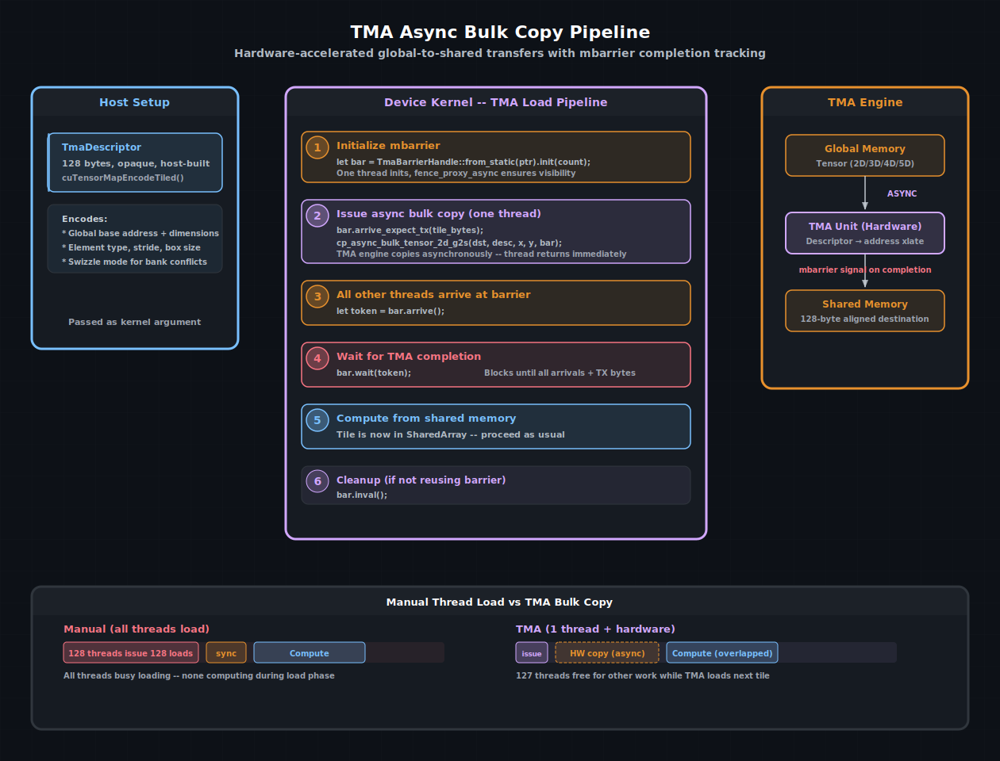

# 张量内存加速器 (TMA)

从 Hopper 架构（SM 90）开始，NVIDIA GPU 包含一个专用的硬件单元 —— **张量内存加速器**（Tensor Memory Accelerator，TMA）—— 它在不占用线程执行资源的情况下在全局内存和共享内存之间搬移数据。与块中每个线程都发出自己的加载指令不同，单个线程将一个描述符交给 TMA 引擎，然后硬件异步执行整个传输。其他 127 个线程可以自由计算、加载其他数据，或者只是在屏障处等待。

cuda-oxide 通过 `TmaDescriptor`、`cp_async_bulk_tensor_*` 系列函数以及 `ManagedBarrier` 类型状态 API 来暴露 TMA 功能。本章介绍设置、拷贝模式以及 TMA 如何与屏障集成以构建高效的加载/计算流水线。

> 另请参阅：
> [CUDA 编程指南 — 使用 TMA 进行异步数据拷贝](https://docs.nvidia.com/cuda/cuda-programming-guide/#tensor-memory-access)
完整描述了硬件单元、swizzle 模式以及支持的张量维度。


---

## TMA 解决的问题

在[共享内存](./共享内存与同步.md)一章中，块中的每个线程都参与从全局内存加载一个分块：

```rust
TILE_A[ty * TILE + tx] = a[row * k + tile_offset + tx];
```

这能工作，但这意味着块中的所有 128 个（或 256 个、1024 个）线程都花费时间计算地址并发出加载指令。对于大的分块，加载阶段可能主导kernel的运行时间。

TMA 用单个硬件指令取代了每个线程的加载循环。一个线程说“将这个 2D 区域从全局内存拷贝到共享内存”，然后 TMA 引擎处理其余所有工作 —— 包括地址计算、步长处理以及无存储体冲突的 swizzle 写入。


TMA 异步批量拷贝流水线。主机端构建编码张量布局的 `TmaDescriptor`。在设备端，一个线程发起拷贝，所有线程在一个 mbarrier 上等待。TMA 引擎异步执行传输，完成后通知屏障，然后线程继续从共享内存中计算。

---

## TmaDescriptor —— 张量映射

`TmaDescriptor` 是一个 128 字节的不透明结构体，编码了 TMA 引擎需要知道的关于张量的所有信息：基地址、维度、元素类型、步长和 swizzle 模式。它在**主机**端使用 CUDA 驱动 API 构建：

```rust
use cuda_device::tma::TmaDescriptor;

// 在主机端（简化版本 —— 实际调用有很多参数）
unsafe {
    cuTensorMapEncodeTiled(
        &mut desc as *mut TmaDescriptor as *mut _,
        CU_TENSOR_MAP_DATA_TYPE_FLOAT32,
        2,                       // 2D 张量
        global_ptr,              // 全局内存中的基地址
        &dims,                   // [rows, cols]
        &strides,                // 每个维度的字节步长
        &box_dims,               // 每次拷贝的分块大小
        &elem_strides,           // 分块内的元素步长
        CU_TENSOR_MAP_INTERLEAVE_NONE,
        CU_TENSOR_MAP_SWIZZLE_128B, // 无存储体冲突的 swizzle
        CU_TENSOR_MAP_L2_PROMOTION_L2_128B,
        CU_TENSOR_MAP_FLOAT_OOB_FILL_NONE,
    );
}
```

然后描述符作为普通参数传递给kernel。在设备端，它被视为 `*const TmaDescriptor` —— 不透明、只读，并且在其所描述的内存分配的生命周期内始终有效。

> 小贴士
> swizzle 模式是性能最关键的参数。`SWIZZLE_128B` 重新排列共享内存中的字节布局，使得来自不同线程束的 128 字节访问命中不同的存储体。没有 swizzle 时，朴素的 2D 分块加载经常产生存储体冲突。

---

## 全局到共享内存拷贝（G2S）

`cp_async_bulk_tensor_*_g2s` 函数发起从全局内存到共享内存目标的 TMA 拷贝。它们支持 1D 到 5D 张量：

```rust
use cuda_device::tma::{cp_async_bulk_tensor_2d_g2s, TmaDescriptor};
use cuda_device::barrier::Barrier;

unsafe fn load_tile(
    smem_dst: *mut u8,
    desc: *const TmaDescriptor,
    tile_x: i32,
    tile_y: i32,
    bar: *mut Barrier,
) {
    cp_async_bulk_tensor_2d_g2s(smem_dst, desc, tile_x, tile_y, bar);
}
```

坐标（`tile_x`, `tile_y`）以描述符中编码的盒尺寸为单位，指定要拷贝哪个分块。屏障指针告诉 TMA 引擎在哪里通知完成。

### 只有一个线程发起拷贝

TMA 拷贝**不是**块级的集体操作。**恰好一个**线程应该调用 `cp_async_bulk_tensor_*_g2s`。所有其他线程通过屏障机制参与：

```rust
if thread::threadIdx_x() == 0 {
    let token = bar.arrive_expect_tx(tile_bytes as u32);
    unsafe {
        cp_async_bulk_tensor_2d_g2s(dst, desc, x, y, bar.as_ptr() as *mut _);
    }
    bar.wait(token);
} else {
    let token = bar.arrive();
    bar.wait(token);
}
```

`arrive_expect_tx(bytes)` 告诉屏障，除了线程到达之外，还要额外等待 `bytes` 字节的事务完成。当所有线程都已到达**并且** TMA 引擎已交付所有期望的字节时，屏障被触发。

---

## mbarrier 的使用

TMA 完成跟踪依赖于 `ManagedBarrier`（或原始 `mbarrier_*` 函数）。类型状态 API 在类型层面强制生命周期：

```rust
use cuda_device::barrier::{Barrier, ManagedBarrier, TmaBarrierHandle, Uninit, Ready};
use cuda_device::SharedArray;

#[kernel]
pub fn tma_load_kernel(desc: *const TmaDescriptor) {
    static mut BAR: SharedArray<Barrier, 1, 128> = SharedArray::UNINIT;

    let bar: TmaBarrierHandle<Ready> = unsafe {
        TmaBarrierHandle::<Uninit>::from_static(BAR.as_mut_ptr())
            .init_by(block_size, 0) // 线程 0 初始化，包含 fence + sync
    };

    // 发起 TMA 拷贝
    if thread::threadIdx_x() == 0 {
        let token = bar.arrive_expect_tx(TILE_BYTES as u32);
        unsafe {
            cp_async_bulk_tensor_2d_g2s(
                smem_ptr, desc, tile_x, tile_y, bar.as_ptr() as *mut _
            );
        }
        bar.wait(token);
    } else {
        let token = bar.arrive();
        bar.wait(token);
    }

    // 共享内存现在包含分块 —— 可以安全读取
    // ...

    unsafe { bar.inval(); }
}
```

生命周期是：`Uninit` → `init()` → `Ready` → `arrive()` / `wait()` → `inval()` → `Invalidated`。类型系统防止在未初始化的屏障上调用 `wait` 或在已失效的屏障上调用 `arrive`。

### 关键屏障规则

| 规则                    | 原因     |
| :-------------------- | :------------------------------- |
| `init_by` 包含 `fence_proxy_async_shared_cta()`       | TMA 引擎需要看到在共享内存中已初始化的屏障                                      |
| `arrive_expect_tx` 在拷贝之前，而不是之后               | 屏障必须在kernel开始写入之前知道期望的字节数                                      |
| 所有线程必须到达（或被计入）                          | 屏障在 `expected_count` 个到达 + `TX` 字节时触发                               |
| 用完后调用 `inval()`（如果不复用）                     | 释放屏障硬件资源                                                               |

---

## 共享内存到全局拷贝（S2G）

TMA 也支持反向方向。该模式使用提交组而不是屏障：

```rust
use cuda_device::tma::{
    cp_async_bulk_tensor_2d_s2g,
    cp_async_bulk_commit_group,
    cp_async_bulk_wait_group,
};

unsafe {
    cp_async_bulk_tensor_2d_s2g(smem_src, desc, tile_x, tile_y);
    cp_async_bulk_commit_group();
    cp_async_bulk_wait_group(0); // 等待所有未完成的组
}
```

S2G 拷贝不使用屏障。相反，`commit_group` 将未完成的拷贝捆绑到一个组中，`wait_group(n)` 阻塞直到飞行中的组数不超过 `n`。`wait_group(0)` 等待所有拷贝完成。

---

## 对齐要求

共享内存中的 TMA 目标必须**128 字节对齐**。cuda-oxide 通过 `SharedArray` 和 `DynamicSharedArray` 的 `ALIGN` 参数提供此对齐：

```rust
static mut TILE: SharedArray<f32, 1024, 128> = SharedArray::UNINIT;

// 或者使用动态共享内存：
let dst: *mut u8 = DynamicSharedArray::<u8, 128>::get();
```

如果目标不是 128 字节对齐，TMA 引擎将静默产生错误结果或出错。没有运行时检查 —— 对齐必须在构造时正确设置。

---

## 多播变体

在启用簇的 Hopper+ 上，TMA 可以将一次全局加载同时多播到多个 CTA 的共享内存中：

```rust
use cuda_device::tma::cp_async_bulk_tensor_2d_g2s_multicast;

unsafe {
    cp_async_bulk_tensor_2d_g2s_multicast(
        dst, desc, x, y, bar_ptr,
        cta_mask,  // 簇中目标 CTA 的 u16 位掩码
    );
}
```

这对于 GEMM 风格的kernel特别有用，其中多个线程块需要相同的 A 或 B 分块。不是让每个块加载自己的副本，而是一次 TMA 操作为所有块服务。

> 另请参阅：
> - [簇编程](cluster-programming.md) —— 完整的簇模型和分布式共享内存，与 TMA 多播自然配合。


---

## TMA vs. 手动加载

| 属性         | 手动线程加载     | TMA 批量拷贝   |
| :------- | :---------------- | :----------------- |
| 需要的线程数  | 块中所有线程      | 1 个线程发起；硬件执行   |
| 地址计算    | 每个线程（索引计算）      | 编码在描述符中      |
| 存储体冲突的 swizzle    | 手动填充   | 描述符级别的 swizzle 模式   |
| 完成跟踪  | `sync_threads()`  | 带 TX 跟踪的 `mbarrier`    |
| 与计算重叠   | 不可能（线程在加载）  | 加载下一个分块的同时计算上一个分块 |
| 最低架构  | 任何 CUDA GPU    | Hopper（SM 90+）   |

关键优势不是原始带宽 —— TMA 和手动加载可以达到相似的峰值吞吐量。优势在于**线程利用率**：当 TMA 加载下一个分块时，所有线程都可以在当前分块上进行计算。这实现了现代 GEMM 实现所依赖的**多级软件流水线**模式。

> 另请参阅：
> - [共享内存与同步](./共享内存与同步.md) —— TMA 替代的手动加载模式
> - [矩阵乘法加速器](./矩阵乘法加速器.md) —— TMA 为张量核心提供数据的地方

| [上一页](./warp级编程.md) | [下一页](./矩阵乘法加速器.md) |
| :--- | ---: |