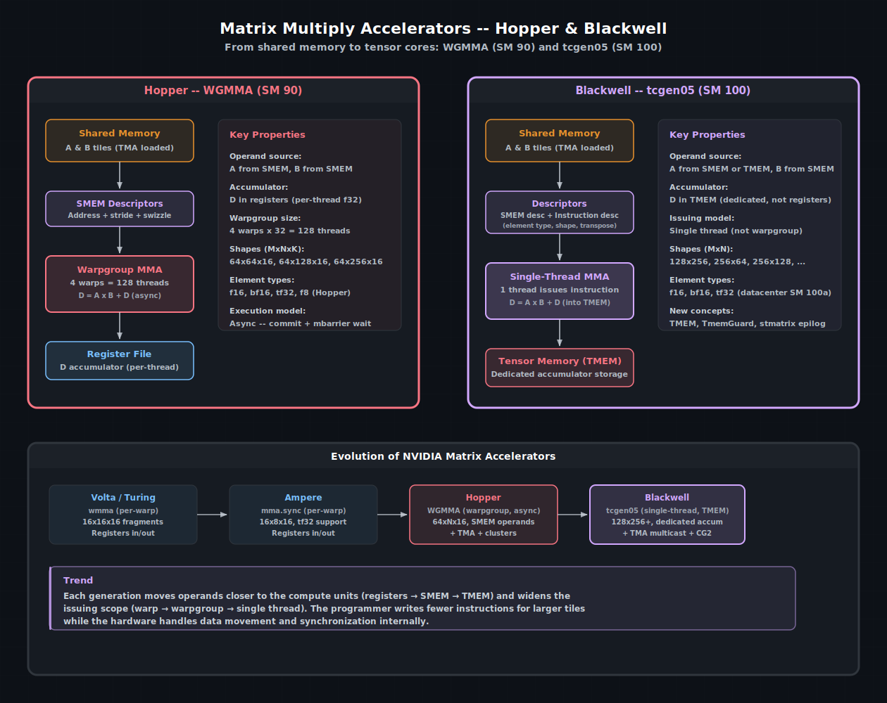

# 矩阵乘法加速器

现代 NVIDIA GPU 包含用于矩阵乘加（MMA）运算的专用硬件 —— 通常称为**张量核心**（tensor cores）。这些单元能够在远高于标准浮点 ALU 的吞吐量下计算小矩阵分块的 `D = A × B + C`。一块 Hopper H100 的 FP16 MMA 吞吐量超过 1000 TFLOPS，而同一芯片的标量 FP16 吞吐量大约为 200 TFLOPS。如果你的工作负载涉及矩阵乘法（大多数深度学习、HPC 和信号处理工作负载都如此），那么性能的关键就在于张量核心。

cuda-oxide 提供了对两代矩阵加速器的访问：Hopper（SM 90）上的 **WGMMA** 和 Blackwell（SM 100）上的 **tcgen05**。本章介绍这两者、它们的编程模型，以及它们如何与前面章节的 TMA 和屏障机制衔接。

> 另请参阅
> [CUDA 编程指南 — 线程束组级矩阵操作](https://docs.nvidia.com/cuda/cuda-programming-guide/#warpgroup-level-matrix-operations)
—— 硬件规格，包含 WGMMA 的形状、元素类型和同步要求。

---

## 大图


Hopper WGMMA 和 Blackwell tcgen05 的数据通路。两者都通过描述符从共享内存读取操作数。WGMMA 累加到每个线程的寄存器中（线程束组集体操作）。tcgen05 累加到专用的张量内存（TMEM）中，由单个线程发起。


各代之间的演进遵循一个清晰的趋势：操作数越来越靠近计算单元，发起范围越来越宽，程序员为更大分块编写的指令越来越少。cuda-oxide 通过提供针对特定代的 API 来追踪这一演进，而不是采用一刀切的抽象。

---

## WGMMA —— Hopper（SM 90）

WGMMA（**W**arp **G**roup **M**atrix **M**ultiply-**A**ccumulate）是一个**线程束组集体**操作：4 个线程束（128 个线程）合作计算一个矩阵分块。操作数 A 和 B 通过 SMEM 描述符从共享内存读取，结果累加到每个线程的寄存器中。

### 编程模型

1. **TMA 加载**将 A 和 B 的分块加载到共享内存中（参见[张量内存加速器](tensor-memory-accelerator.md)）。
2. **SMEM 描述符**编码每个操作数的基地址、步长和 swizzle 模式。
3. **WGMMA 指令**消费描述符并产生累加器更新。该指令是异步的 —— 它会提交到一个屏障。
4. **屏障等待**确保在读取累加器之前 MMA 已完成。

### 支持的形状

WGMMA 总是 M=64（行），N 和 K 取决于元素类型：

| 元素类型 | K  | N 选项      |
| :------- | :- | :---------- |
| f16, bf16 | 16 | 64, 128, 256 |
| tf32      | 8  | 64, 128, 256 |

每条指令计算一个 64×N×K 的分块。对于更大的 K 维度，你需要在循环中发出多个 WGMMA 指令，累加到同一个寄存器分块中。

### cuda-oxide API 概览

cuda-oxide 通过直接映射到硬件指令的低层内联函数暴露 WGMMA。典型用法模式：

```rust
use cuda_device::wgmma::{
    make_smem_desc, wgmma_fence, wgmma_commit_group, wgmma_wait_group,
    wgmma_mma_m64n64k16_f32_f16,
};

// 在 TMA 已将 A 和 B 分块加载到共享内存之后...

// 为加载的分块构建 SMEM 描述符
let a_desc = unsafe { make_smem_desc(tile_a_ptr as *const u8) };
let b_desc = unsafe { make_smem_desc(tile_b_ptr as *const u8) };

// 累加器（4 个线程束 × 每行 8 个浮点数 = 64×64 分块）
let mut acc = [[0.0f32; 8]; 4];

// Fence + 发出 WGMMA —— 线程束组中的所有 128 个线程都参与
unsafe {
    wgmma_fence();
    wgmma_mma_m64n64k16_f32_f16(&mut acc, a_desc, b_desc);
    wgmma_commit_group();
    wgmma_wait_group::<0>(); // 等待所有未完成的组
}

// 现在 `acc` 中的累加器有效 —— 存储、变换或传递到下一阶段
```

> 小贴士
> WGMMA 通常与**多级流水线**配对：在张量核心处理分块 *k* 的同时，TMA 将分块 *k+1* 加载到第二个共享内存缓冲区中。TMA 和 MMA 的屏障是分开的，从而实现数据搬移和计算的最大重叠。

---

## tcgen05 —— Blackwell（SM 100）

Blackwell 引入了一种根本不同的矩阵加速器：**tcgen05**。关键创新在于：

1. **单线程发起**。不再是线程束组集体指令，而是一个线程发起 MMA。硬件在内部分配工作。
2. **张量内存（TMEM）**。一种专用的片上累加器内存，与寄存器文件分离。TMEM 比寄存器更大，具有不同的访问特性。
3. **更大的分块**。tcgen05 支持高达 256×256 的形状，而 WGMMA 最大为 64×256。

### TMEM —— 张量内存

TMEM 是内存层次结构中的一个新层级，位于寄存器文件旁边，但专用于矩阵累加。它必须显式分配和释放：

```rust
use cuda_device::tcgen05::{TmemGuard, TmemUninit, TmemReady};
use cuda_device::SharedArray;

static mut TMEM_ADDR: SharedArray<u32, 1> = SharedArray::UNINIT;

// 分配 TMEM（线程束集体操作）
let tmem: TmemGuard<TmemReady, 128> = unsafe {
    TmemGuard::<TmemUninit, 128>::from_static(TMEM_ADDR.as_mut_ptr())
        .alloc()
};

// ... 使用 tmem 进行 MMA ...

// 释放（线程束集体操作，在kernel退出前必须执行）
unsafe { tmem.dealloc(); }
```

`TmemGuard` 使用类型状态：`TmemUninit` → `alloc()` → `TmemReady` → `dealloc()` → `TmemDeallocated`。类型系统防止在分配前使用 TMEM 或忘记释放 —— 后者会泄漏硬件资源并导致错误。

`N_COLS` 常量参数决定 TMEM 分块的宽度。常见配置：

| `N_COLS` | 每线程束 TMEM | 使用场景           |
| :------- | :------------ | :----------------- |
| 64       | 最小分配      | 窄分块             |
| 128      | 默认          | 标准 GEMM 分块     |
| 256      | 最大          | 宽分块，更高吞吐量 |

### 指令和 SMEM 描述符

tcgen05 每条 MMA 指令使用两个描述符：

**指令描述符** —— 编码 MMA 配置：

```rust
use cuda_device::tcgen05::{
    Tcgen05InstructionDescriptor,
    Tcgen05ElementType,
    Tcgen05MmaShape,
};

let idesc = Tcgen05InstructionDescriptor::builder()
    .shape(Tcgen05MmaShape::M128_N128)
    .a_type(Tcgen05ElementType::F16)
    .b_type(Tcgen05ElementType::F16)
    .build();
```

**SMEM 描述符** —— 指向共享内存中的操作数分块：

```rust
use cuda_device::tcgen05::{Tcgen05SmemDescriptor, Tcgen05SwizzleMode};

let a_desc = Tcgen05SmemDescriptor::for_k_major(
    smem_a_addr,
    m, k,
    2, // 每元素字节数（f16）
    Tcgen05SwizzleMode::Swizzle128B,
);
```

### 发起 MMA

一个线程发起 MMA 指令，然后所有线程等待一个屏障：

```rust
use cuda_device::tcgen05::{tcgen05_mma_f16, tcgen05_commit};

if thread::threadIdx_x() == 0 {
    unsafe {
        tcgen05_mma_f16(
            tmem.raw_address(),
            a_desc.raw(),
            b_desc.raw(),
            idesc.raw(),
            true, // 启用累加到 D
        );
        tcgen05_commit(mma_barrier_ptr);
    }
}

// 所有线程等待 MMA 完成
mma_barrier.wait(token);
```

### 尾声 —— 从 TMEM 读取结果

MMA 循环结束后，累加器存放在 TMEM 中。为了将其移动到共享内存（以便后续通过 TMA 存储到全局内存），你需要从 TMEM 加载到寄存器，然后使用 `stmatrix` 写入共享内存：

```rust
use cuda_device::tcgen05::{
    tcgen05_ld_16x256b_pure,
    tcgen05_load_wait,
    stmatrix_m8n8_x4,
    TmemF32x4,
};

unsafe {
    // 从 TMEM 加载一个 16×256 位的切片到寄存器
    let regs: TmemF32x4 = tcgen05_ld_16x256b_pure(tmem.raw_address());
    tcgen05_load_wait();

    // 从寄存器存储到共享内存（线程束集体操作）
    stmatrix_m8n8_x4(smem_ptr, regs[0], regs[1], regs[2], regs[3]);
}
```

`stmatrix` 是一个线程束集体操作 —— 所有 32 个线程都参与，每个线程贡献自己的寄存器切片以形成共享内存分块。

### CTA-group-2（CG2）

Blackwell 还支持 **CG2 模式**，其中两个 CTA（来自同一个簇）发出互相配合的 MMA 指令。这使有效分块宽度加倍，需要使用 `_cg2` API 变体：

```rust
use cuda_device::tcgen05::{tcgen05_alloc_cg2, tcgen05_mma_f16_cg2};
```

CG2 和 CG1（标准模式）不能在同一kernel中混用。

> 小贴士
> - tcgen05 仅适用于 **Blackwell 数据中心** GPU（SM 100a）。消费级 Blackwell（SM 120）使用较旧的 `mma.sync` 指令集。在调用 tcgen05 API 之前，请检查目标架构。

---

## 选择合适的加速器

| 特性               | WGMMA（Hopper）        | tcgen05（Blackwell DC） | mma.sync（Ampere/消费级） |
| :----------------- | :--------------------- | :---------------------- | :------------------------ |
| 发起模型           | 线程束组（128 线程）    | 单线程                  | 线程束（32 线程）         |
| 累加器             | 寄存器                 | TMEM（专用）            | 寄存器                    |
| 最大分块（M×N）    | 64×256                 | 256×256                 | 16×8                      |
| 异步执行           | 是（commit+屏障）      | 是（commit+屏障）       | 同步                      |
| TMA 集成           | 原生                   | 原生 + 多播 CG2         | 手动加载                  |
| 簇支持             | 是                     | 是 + CG2                | 否                        |
| 最低 SM            | 90（Hopper）           | 100a（Blackwell DC）    | 80（Ampere）              |

对大多数用户而言，选择由目标 GPU 决定。如果你正在编写一个针对多种架构的库，则需要编译时的特性门控或运行时的架构检测来选择正确的代码路径。

---

## GEMM 的演进

这些加速器并不是孤立存在的。一个高性能的 GEMM kernel会结合本章及前面章节的所有技术：

1. **TMA** 将分块从全局内存加载到共享内存（无需线程加载）
2. **屏障**跟踪每阶段的 TMA 完成情况
3. **MMA 指令**（WGMMA 或 tcgen05）消费共享内存中的分块
4. **多级流水线**将分块 *k+1* 的加载与分块 *k* 上的 MMA 重叠
5. **线程束特化**将部分线程束专用于加载，另一部分专用于 MMA
6. **尾声**（tcgen05）从 TMEM 加载、转换精度、通过 TMA 存储

这就是 cuBLAS 和 CUTLASS 内部使用的kernel结构。使用 cuda-oxide，你可以在 Rust 中构建相同的结构 —— 使用 `SharedArray` 管理分块、`ManagedBarrier` 同步、以及 MMA API 进行计算。

> 另请参阅：
> - [共享内存与同步](./共享内存与同步.md) —— MMA 操作数的分块管理
> - [张量内存加速器](./张量内存加速器.md) —— 向张量核心输送分块数据
> - [集群编程](./集群编程.md) —— CG2 模式和用于多 CTA MMA 的多播

| [上一页](./张量内存加速器.md) | [下一页](./集群编程.md) |
| :--- | ---: |