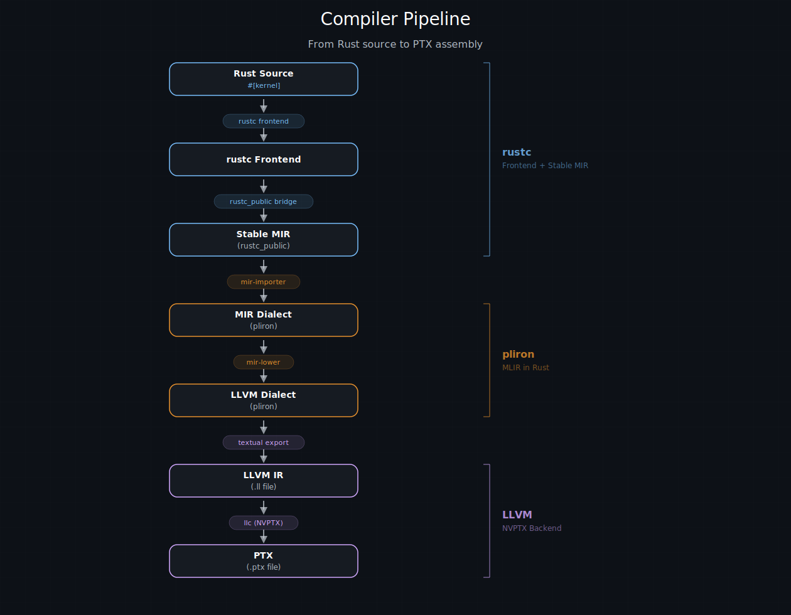
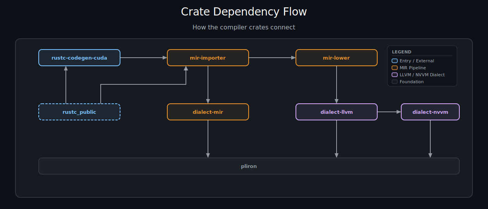
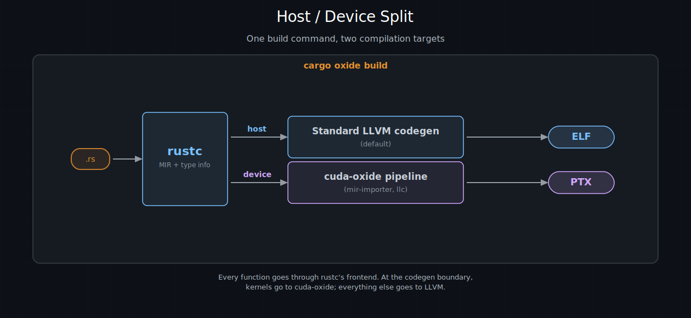

# 架构概览

你已经用 Rust 编写了一个 `#[kernel]` 函数。它通过了类型检查，也通过了借用检查。现在它需要变成能在 GPU 上运行的 PTX。本章解释 cuda-oxide 如何完成这一过程 —— 每个阶段、每个 crate，以及每个选择背后的理由。

如果你只想编写kernel，你永远不需要阅读这一页。但如果你想参与编译器开发、贡献一个优化 pass，或者满足“它到底*实际*是如何工作的？”的好奇心，欢迎。先喝杯咖啡。

---

## 设计理念

指导原则短到可以写在便利贴上：

> **在每个阶段使用最好的工具 —— 但拥有完整的流水线。**

编译器是分层蛋糕。每一层都有截然不同的工作，不同的工具各自擅长不同的部分。cuda-oxide 为每个阶段选择最强的选项，而不是从头构建一切：

- **前端：`rustc` + `rustc_public`（稳定 MIR）。**
  当有史以来最好的类型检查器之一已经存在时，为什么要重写？Rust 的编译器处理解析、名称解析、类型推断、借用检查、trait 解析、单态化和 MIR 优化。我们免费获得所有这些。

- **中端：`pliron`（Pliron IR，类 MLIR）。**
  我们需要一个将 Rust MIR 转换为 LLVM 形状的地方。pliron 是一个受 LLVM 的 MLIR 启发的可扩展 IR 框架，但完全用 Rust 编写。没有 C++ 依赖，没有 CMake，没有 tablegen —— 只有 `cargo build`。我们在这里定义了三个自定义dialect：一个用于 MIR，一个用于 LLVM IR，还有一个用于 NVIDIA GPU 内联函数。

- **后端：LLVM NVPTX。**
  NVIDIA 投入多年精力开发 LLVM 中的 NVPTX 后端。它了解每个寄存器类、每条指令编码、每个调度细节。我们文本形式发出 LLVM IR 并将其交给 `llc`。站在巨人的肩膀上胜过重新发明 PTX 汇编器。

收益：整个编译器都用 Rust 编写（除了最终的 `llc` 调用）。没有向 C++ 中端的不透明交接。你可以在任何转换 pass 中设置断点，用 `println!` 遍历 IR，如果够大胆，甚至可以在 Miri 下运行整个过程。标准 Rust 工具链，贯穿到底。

> **注意**：
> `llc` 是唯一的外部二进制文件。它来自启用了 NVPTX 后端的 LLVM 安装；仅 CUDA 工具包是不够的。cuda-oxide 直到 LLVM IR 发射的所有阶段都在 Rust 中实现；在后端写入 `.ll` 文件后，它会调用外部 LLVM `llc` 来生成 PTX。

---

## 流水线概览

以下是 `#[kernel]` 函数从源代码到硅片的完整旅程：



完整编译流水线。Rust 源代码进入 rustc 前端，经过稳定 MIR，被翻译成 `dialect-mir`（`mem2reg` 将 allocas 提升回 SSA），降级到 `dialect-llvm`，导出为文本 LLVM IR，最后由 NVPTX 后端编译成 PTX。


逐阶段：

1. **Rust 源代码。**
   你编写一个函数，贴上 `#[kernel]`，然后继续工作。过程宏将其重命名到保留的 `cuda_oxide_kernel_<hash>_<name>` 命名空间中，以便后端稍后能够识别。确切的前缀存在于工作区内部的 `reserved-oxide-symbols` crate 中；`<hash>` 使得意外冲突不可能发生。

2. **rustc 前端。**
   rustc 执行解析、类型检查、借用检查、泛型单态化，并运行 MIR 优化 pass（内联、常量传播、死代码消除）。所有繁重的工作都在这里发生。

3. **稳定 MIR。**
   代码生成后端接收 rustc 内部的 MIR，并将其桥接到 `rustc_public` 的稳定类型。这为我们提供了带版本的、稳定的 MIR 视图，不会在下一个 nightly 版本中失效。

4. **`dialect-mir`（pliron）。**
   `mir-importer` 将稳定 MIR 翻译成 `dialect-mir` —— 一个模拟 Rust MIR 语义的 pliron dialect（place、projection、`Rvalue`、`BinOp` 等）。初始形式使用每个局部的 `mir.alloca` 槽位和 `mir.load`/`mir.store` 进行跨块数据流；然后 `pliron::opts::mem2reg` 将这些槽位提升回 SSA 值。

5. **`dialect-llvm`（pliron）。**
   `mir-lower` 将 `dialect-mir` 操作转换为 `dialect-llvm` 操作：`llvm.alloca`、`llvm.load`、`llvm.store`、`llvm.getelementptr`、`llvm.call` 等。在这里，Rust 级别的概念被扁平化为面向机器的 IR。

6. **LLVM IR（.ll 文件）。**
   `dialect-llvm` 打印机将 IR 序列化为文本 LLVM IR。这是一个普通的 `.ll` 文件 —— 你可以阅读它，喂给 `opt`，或者在编译器版本之间进行 diff。

7. **PTX（.ptx 文件）。**
   带有 NVPTX 目标的 `llc` 将 `.ll` 文件编译为 PTX 汇编。结果是一个 `.ptx` 文件，准备好在运行时由 CUDA 驱动程序加载。

---

## Crate 映射

cuda-oxide 被拆分为专注的 crate。以下是每个 crate 及其角色：

| Crate    | 角色         |
| :------ | :----------------|
| `rustc-codegen-cuda` | 自定义 rustc 代码生成后端 —— 拦截 `codegen_crate()`，分离主机/设备代码                 |
| `mir-importer`       | 将稳定 MIR 翻译成 `dialect-mir`，协调整个流水线                                       |
| `dialect-mir`        | 模拟 Rust MIR 语义的 pliron dialect（place、rvalue、terminator）                          |
| `dialect-llvm`       | 模拟 LLVM IR + 文本 `.ll` 导出的 pliron dialect                                           |
| `dialect-nvvm`       | 用于 NVIDIA GPU 内联函数的 pliron dialect（`tid`、`ntid`、屏障、TMA）                     |
| `mir-lower`          | 将 `dialect-mir` 降级到 `dialect-llvm` —— 主要的转换 pass                              |
| `cargo-oxide`        | CLI 工具：`cargo oxide build`、`cargo oxide run`、`cargo oxide pipeline`               |
| `cuda-device`        | 设备端 API：内联函数、`DisjointSlice`、屏障、共享内存、线程束操作                        |
| `cuda-macros`        | 过程宏：`#[kernel]`、`#[device]`                                                      |
| `cuda-host`          | 主机端类型化模块加载和启动辅助函数                                                     |
| `cuda-core`          | CUDA 驱动 API 的安全绑定（`CudaContext`、`DeviceBuffer`、`CudaStream`）                |
| `cuda-async`         | 异步 GPU 编程：`DeviceOperation`、组合器、流池调度                                      |
| `cuda-bindings`      | 到 CUDA 驱动（`libcuda.so`）的低级 FFI 绑定                                            |

### 依赖流

编译器 crate 形成一个清晰的流水线：



编译器 crate 之间的连接方式。流水线从左到右流经代码生成后端、导入器和降级 pass。dialect crate 位于其下，全部构建在 pliron 之上。


`pliron` 位于所有三个dialect crate 之下，作为共享的 IR 框架 —— 它提供 `Context`、`Module`、`Region`、`Block`、`Operation`、`Type` 和 `Attribute` 基础设施。`rustc_public` 提供 `mir-importer` 从 rustc 读取的稳定 MIR 类型。面向用户的 crate（`cuda-device`、`cuda-macros`、`cuda-host`、`cuda-core`、`cuda-async`）独立于编译器内部，仅相互依赖。

---

## 两个关键依赖

两个外部项目使 cuda-oxide 成为可能。两者都不是可选的，在接下来的深入章节之前，都值得简要介绍。

### pliron —— Pliron IR（类 MLIR）

[pliron](https://github.com/vaivaswatha/pliron) 是一个受 LLVM 的 MLIR 启发的可扩展编译器 IR 框架，但完全用 Rust 编写。它提供相同的核心抽象 —— dialect、操作、类型、属性、区域和块 —— 而不需要 C++ 工具链、CMake 或 tablegen。

cuda-oxide 选择 pliron 而非上游 MLIR 是出于务实的考虑：我们希望整个编译器都能用 `cargo` 构建。依赖 MLIR 意味着要拉入 LLVM 单体仓库、C++ 构建系统以及 Rust-C++ FFI 胶水代码 —— 这些都会增加构建复杂度、拖慢 CI，并使贡献者入门变得痛苦。使用 pliron，dialect通过标准 Rust trait 和派生宏定义，IR 可以用任何 Rust 调试器检查。

cuda-oxide 在 pliron 之上定义了三个dialect：`dialect-mir`（模拟 Rust MIR）、`dialect-llvm`（模拟 LLVM IR + 文本导出）和 `dialect-nvvm`（NVIDIA GPU 内联函数）。

> 另请参阅：
> 有关 pliron 架构的深入探讨，请参见 [Pliron —— Rust 中的 MLIR](pliron.md)。

### rustc_public —— 稳定 MIR

`rustc_public`（历史上称为 Stable MIR 或 `stable_mir`）是 Rust 官方提供的到编译器内部的稳定接口。MIR —— 中级中间表示 —— 是借用检查、生命周期验证和大多数优化发生的地方。它也是一种丰富的高层表示，保留了类型信息，使其成为 GPU 后端的理想起点。

问题是：MIR 是一个*内部*表示。它的数据结构在每个 nightly 版本之间都会变化，没有任何稳定性保证。直接读取内部 MIR 的后端会在每次 `rustc` 重构字段名或重新排列枚举变体时失效 —— 这比你想象的要频繁得多。`rustc_public` 通过提供一个带版本的稳定 API 来解决这个问题，将内部类型桥接到公共表面。cuda-oxide 在 `CodegenBackend::codegen_crate()` 入口点挂钩，将内部类型桥接到稳定 MIR 类型，并将结果交给 `mir-importer` 进行翻译。

> 另请参阅：
> 有关 rustc_public 的深入探讨，请参见 [rustc_public —— 稳定 MIR](rustc-public.md)。

---

## 主机/设备分离

cuda-oxide 是一个单源编译器。主机代码和设备代码位于同一个 `.rs` 文件中，一次构建命令同时编译两者。以下是其工作原理的逐步说明：

**1. cargo-oxide 使用自定义后端调用 rustc。**

```bash
cargo oxide run vecadd
```

在底层，这设置了 `-Z codegen-backend=librustc_codegen_cuda.so`，告诉 rustc 将代码生成路由到 cuda-oxide 的后端，而不是默认的 LLVM 后端。

**2. rustc 为依赖树中的每个 crate 调用 `codegen_crate()`。**

这不是 cuda-oxide 特定的步骤 —— 这就是 rustc 的工作方式。对于正在编译的每个 crate（你的二进制文件、`cuda-device`、任何其他依赖项），rustc 都会调用代码生成后端。

**3. 后端扫描kernel入口点。**

它查找名称包含保留前缀 `cuda_oxide_kernel_<hash>_` 的单态化函数。这些就是 `#[kernel]` 创建的函数。

**4. 如果找到kernel：构建设备调用图并发出 PTX。**

从每个kernel开始，后端遍历调用图以收集kernel传递调用的每个设备函数。这个函数集被交给 `mir-importer`，它运行完整的流水线（`dialect-mir` -> `dialect-llvm` -> `.ll` -> PTX）。结果是一个 `.ptx` 文件，写入主机二进制文件旁边。

**5. 总是：将主机代码委托给标准 LLVM 后端。**

无论是否找到kernel，主机代码都会被正常编译。对于非设备代码的所有内容，cuda-oxide 的后端委托给 rustc 的默认 LLVM 代码生成。你的 `main()` 函数、你的 CLI 解析、你的异步运行时 —— 都按通常方式编译。

**6. 结果：一次构建产生一个主机二进制文件 + 一个 `.ptx` 文件。**

```text
target/debug/vecadd          ← 主机二进制文件（运行时加载 PTX）
target/debug/vecadd.ptx      ← 设备代码（由 CUDA 驱动程序加载）
```

> **注意**：
> 来自依赖项（如 `cuda-device`）的设备代码是惰性编译的。只有当你的 crate 中的kernel传递调用它们时，外部 crate 中的函数才会被编译成 PTX。MIR 可以从 `.rlib` 元数据中获得，因此不需要从源代码重新编译依赖项 —— 后端按需读取它们的稳定 MIR。

### 简化的心智模型



一个构建命令，两个编译目标。每个函数都经过 rustc 的前端。在代码生成边界，kernel走向 cuda-oxide；其他所有内容走向 LLVM。


每个函数都经过 rustc 的前端。在代码生成边界，后端查看每个函数并问：“你是kernel或被kernel调用的函数吗？”如果是，你走右边（cuda-oxide 流水线）。如果否，你走左边（标准 LLVM）。有些函数双向都走 —— 一个在主机和设备上都使用的泛型辅助函数将被编译两次，每个目标一次。

---

## rustc 免费提供什么

构建在 `rustc` 之上而不是发明一种新语言，最令人愉悦的事情之一是我们*不需要*做的大量工作。以下是 rustc 在 cuda-oxide 看到代码之前处理的内容：

| 什么   | 对 GPU 代码的价值    |
| :------- | :------------|
| 类型检查          | 在 GPU 编译之前捕获错误 —— 没有晦涩的 PTX 汇编器失败                                  |
| 生命周期跟踪      | 跨越主机/设备边界的安全保证                                                          |
| 借用检查          | 在编译时防止数据竞争，即使在 GPU 线程之间                                             |
| 单态化            | 泛型在 GPU 上“正常工作” —— `map<f32, _>` 变成一个具体的 PTX kernel                      |
| MIR 优化          | 内联、常量传播、死代码消除 —— 都在我们开始之前应用                                    |
| Trait 解析        | Trait 对象被解析，虚表消失，一切都是静态分发                                          |
| 模式匹配          | `match` 分支被降级为优化的 `SwitchInt` MIR terminator                                |

我们不重新实现其中的任何一个。rustc 做繁重的工作，我们在最后拿到完全优化、单态化、借用检查过的 MIR。我们的工作“只是”翻译 —— 公平地说，这仍然是一大堆工作。但这比从头构建一个 GPU 语言要小得多的问题。

> **注意**：
> 这也意味着 Rust 的错误信息正常工作。如果你在kernel中犯了类型错误，你会得到与任何其他 Rust 代码相同的、有帮助的 `rustc` 诊断 —— 包含建议、代码高亮和“你是不是想写？”提示。无需学习单独的 GPU 编译器错误格式。

---

## 下一步去哪

本章的其余部分深入到架构的每一块：

- **[Pliron —— Pliron IR（类 MLIR）](pliron.md)** —— 将流水线粘合在一起的 IR 框架。
- **[rustc_public —— 稳定 MIR](rustc-public.md)** —— 如何在不被每个 nightly 版本破坏的情况下读取 MIR。
- **[代码生成器：rustc-codegen-cuda](rustc-codegen-cuda.md)** —— 拦截 rustc 的代码生成后端。
- **[MIR 导入器](mir-importer.md)** —— 将稳定 MIR 翻译成 pliron。
- **[Pliron dialect](pliron-dialects.md)** —— 三种自定义dialect及其操作集。
- **[降级流水线](lowering-pipeline.md)** —— `dialect-mir` 到 `dialect-llvm`，逐个 pass。
- **[添加新内联函数](./添加新内联函数.md)** —— 扩展编译器的贡献者指南。
