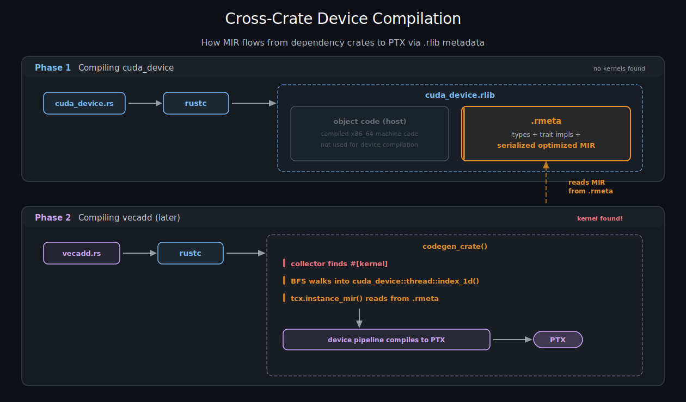
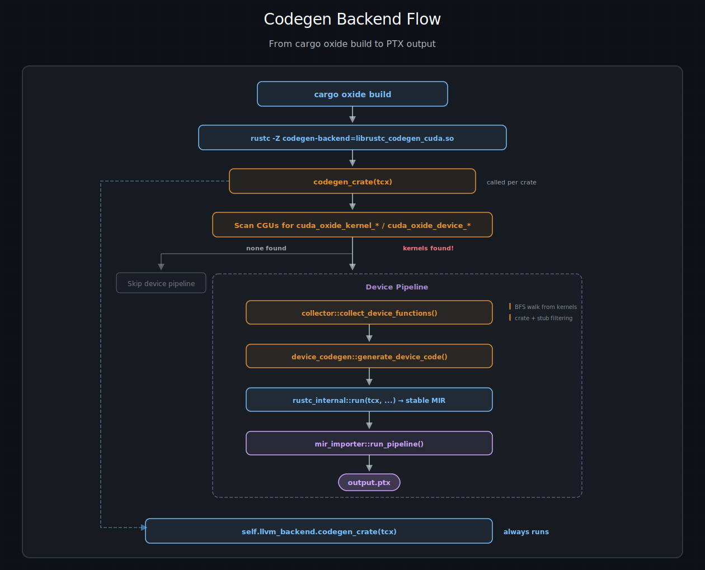

# 代码生成器：rustc-codegen-cuda

每个 Rust 程序最终都会到达代码生成后端 —— 编译器中将优化后的 MIR 转换为机器码的部分。通常，那个后端是 LLVM。cuda-oxide 插入自己的后端 `rustc-codegen-cuda`，拦截这个过程以提取设备代码，并将其路由通过 cuda-oxide 流水线，然后将所有其他内容交还给 LLVM，就好像什么都没发生过一样。

这一页解释了该后端如何加载、当 rustc 调用它时它做什么，以及它如何找到属于 GPU 的每个函数。

---

## rustc 如何加载自定义后端

rustc 有一个大多数人从未见过的标志：

```bash
rustc -Z codegen-backend=path/to/libfoo.so
```

当你传递这个标志时，rustc 会执行以下操作：

1. 调用 `dlopen` 打开共享库。
2. 调用 `dlsym("__rustc_codegen_backend")` 查找入口点。
3. 期望该函数返回一个 `Box<dyn CodegenBackend>`。

就这样。没有插件注册表，没有配置文件，没有握手协议。一个符号，一个 trait 对象，你就拥有了代码生成流水线。

cuda-oxide 提供这个入口点：

```rust
#[unsafe(no_mangle)]
pub fn __rustc_codegen_backend() -> Box<dyn CodegenBackend> {
    let config = CudaCodegenConfig::from_env();
    let llvm_backend = rustc_codegen_llvm::LlvmCodegenBackend::new();
    Box::new(CudaCodegenBackend { config, llvm_backend })
}
```

这里发生了两件事。首先，`CudaCodegenConfig::from_env()` 读取环境变量（`CUDA_OXIDE_VERBOSE`、`CUDA_OXIDE_DUMP_MIR` 等 —— 参见下文 {ref}`环境变量 <rustc-codegen-environment-variables>`）以配置后端的行为。其次，它创建标准的 LLVM 后端并将其存储在 `CudaCodegenBackend` 内部。这就是使整个架构工作的包装模式：cuda-oxide 并不*替换* LLVM 后端，而是*包装*它。

> **注意**：
> `cargo oxide build` 会自动为你设置 `-Z codegen-backend` 标志。除非你喜欢那种事情，否则你永远不需要自己输入 `dlopen` 咒语。

---

## 拦截：codegen_crate()

`CodegenBackend` trait 有几个方法，但最重要的是 `codegen_crate(tcx)`。这是 rustc 交出整个经过类型检查、借用检查、单态化的 crate 并说“把它变成机器码”的地方。

当 rustc 调用 `CudaCodegenBackend::codegen_crate(tcx)` 时，发生以下情况：

### 步骤 1：收集单态化项

```rust
let (items, cgus) = tcx.collect_and_partition_mono_items(());
```

这给了我们 crate 中每个单态化的函数，分组到**代码生成单元**（CGU）中。一个 CGU 是 rustc 的并行代码生成单元 —— 把它看作一个函数桶，最终变成一个目标文件。

### 步骤 2：扫描设备入口点

后端遍历每个 CGU 中的每个函数，并检查魔法名称前缀：

- `cuda_oxide_kernel_<hash>_` —— 由 `#[kernel]` 设置
- `cuda_oxide_device_<hash>_` —— 由 `#[device]` 设置

这些前缀是过程宏与后端通信的方式。没有特殊的属性元数据，没有侧信道 —— 只有一个在人群中脱颖而出的名字。确切的前缀字符串（以及匹配和去除它们的辅助函数）位于工作区内部的 `reserved-oxide-symbols` crate 中；宏侧和收集器侧都从那里导入，因此契约保持在一个地方。8 个十六进制字符的 `<hash>` 使得意外冲突实际上不可能：没有人会偶然写出 `cuda_oxide_kernel_246e25db_foo`。

### 步骤 3：如果找到设备代码，构建并编译

如果找到任何kernel或设备函数，则按顺序发生两件事：

**a) 收集设备调用图。**
`collector::collect_device_functions()` 从每个kernel入口点执行广度优先遍历，发现所有从设备代码传递调用的函数。更多内容见下文 {ref}`设备函数收集 <rustc-codegen-device-function-collection>`。

**b) 生成设备代码。**
`device_codegen::generate_device_code()` 将收集到的函数桥接到稳定 MIR，并运行完整的 cuda-oxide 流水线（`dialect-mir` -> `mem2reg` -> `dialect-llvm` -> `.ll` -> PTX）。

### 步骤 4：总是编译主机代码

无论是否找到设备代码：

```rust
self.llvm_backend.codegen_crate(tcx)
```

包装的 LLVM 后端编译所有主机代码 —— `main()`、你的 CLI 解析器、你的异步运行时，等等。设备流水线是一个支线任务；主机流水线总是运行。

### 其他 Trait 方法

`CodegenBackend` trait 还需要 `join_codegen()` 和 `link()`。它们分别处理等待并行代码生成线程和调用链接器。在 cuda-oxide 中，两者都是纯粹的委托：

```rust
fn join_codegen(&self, ongoing: Box<dyn Any>, sess: &Session) -> ... {
    self.llvm_backend.join_codegen(ongoing, sess)
}

fn link(&self, sess: &Session, codegen: ..., outputs: &OutputFilenames) -> ... {
    self.llvm_backend.link(sess, codegen, outputs)
}
```

没有拦截，没有修改。LLVM 后端完全按照通常的方式处理链接。

> **注意**：
> 对于依赖树中的大多数 crate —— `core`、`cuda-core`、随机工具 crate —— 没有找到kernel，后端只是委托给 LLVM。设备流水线只对实际包含 `#[kernel]` 函数的 crate 激活。对于一个典型的项目，这意味着几十个 crate 中只有一个会触发设备编译。

---

(rustc-codegen-device-function-collection)=

## 设备函数收集

找到kernel入口点是容易的部分。困难的部分是弄清楚这些kernel调用的*所有其他*函数。一个kernel可能调用一个辅助函数，该辅助函数调用一个 `cuda-device` 内联函数，该内联函数调用一个 `core` 数学函数 —— 所有这些都需要出现在 PTX 中。

`collector` 模块通过对 MIR 调用图进行广度优先遍历来处理这个问题。

### 工作列表算法

```text
worklist = [所有kernel入口点]
visited  = {}
collected = []

while worklist 不为空:
    fn = worklist.pop()
    if fn in visited: continue
    visited.add(fn)

    mir = tcx.instance_mir(fn)
    collected.push(fn)

    for basic_block in mir:
        for terminator in [Call, Drop]:
            callee = resolve_callee(terminator)
            if should_collect(callee):
                worklist.push(callee)
```

对于每个函数，收集器通过 `tcx.instance_mir()` 检索其 MIR，然后扫描每个基本块的终止符。`Call` 和 `Drop` 终止符引用被调用者，如果它们通过 crate 过滤规则，则被添加到工作列表中。

输出是一个 `Vec<CollectedFunction>`，其中每个条目包含：

- 单态化的 `Instance`（完全解析、无泛型的函数）。
- 一个 `is_kernel` 标志（用于在 PTX 元数据中标记 GPU 入口点）。
- `export_name`（在最终 PTX 中可见的符号名称）。

### 导出名称与 FQDN 对齐

收集器必须产生与 MIR 翻译器为调用目标生成的名称相匹配的导出名称。双方都使用**完全限定域名（FQDN）** —— 例如，`helper_fn::cuda_oxide_device_<hash>_vecadd_device` 而不是裸的 `vecadd_device`。

`rustc_public` API 的 `CrateDef::name()` 返回包含 crate 名称的 FQDN。在收集器端，`def_path_str()` 对于本地项省略 crate 名称，因此一个小的辅助函数（`fqdn()`）为本地定义添加前缀以产生相同的字符串。

在降级期间，`::` 在定义和调用端都被转换为 `__`，产生有效的 LLVM/PTX 标识符（例如 `helper_fn__vecadd_device`）。

对于泛型或复杂名称（尖括号、闭包），改用符号名称 —— 它是唯一的并且已经是有效的标识符。

kernel入口点遵循不同的路径：`compute_kernel_export_name` 取 `#[kernel]` 宏的基本名称，对于泛型和闭包泛型实例化，附加 `_TID_<hex32>`，其中 `<hex32>` 是 rustc 对泛型参数元组的 128 位类型 ID 哈希。主机启动器通过 `core::intrinsics::type_id` 内联函数（由 `cuda_host::type_id_u128` 包装）计算相同的哈希，因此双方逐字节达成一致。非泛型kernel保持其裸的基本名称。

> **注意**：
> 当框架升级后，这种 FQDN 对齐策略将被 pliron 的 `Legaliser` 替换。`Legaliser` 提供带有冲突检测的系统化名称清理，使手动将 `::` 替换为 `__` 变得不必要。

### Crate 过滤规则

并不是依赖树中的每个函数都属于 GPU。收集器强制执行关于哪些 crate 允许出现在设备代码中的规则：

| Crate     | 状态         | 说明              |
| :------- | :-------- | :----------- |
| 本地 crate           | 允许                    | 你的kernel代码                             |
| `cuda_device`         | 允许                    | GPU 内联函数（桩函数被过滤 —— 见下文） |
| `core`                | 允许                    | `no_std` 标准库                    |
| 其他 `no_std` crate | 允许                    | 依赖树中的任何 crate             |
| `std`                 | **禁止**              | 编译时错误                           |
| `alloc`               | 允许（如果 GPU 分配器） | 实验性                                 |

规则很简单：如果一个 crate 理论上可以在 GPU 上运行（没有操作系统依赖、没有文件 I/O、没有网络），则允许。如果它拖入了 `std`，则不允许。

### 错误消息

当有人意外地尝试在设备代码中使用 `std` —— 也许是调试时留下的一个 `println!` —— 收集器会产生一个清晰的错误，而不是让构建在三个阶段之后失败并出现难以理解的 PTX 汇编器消息：

```text
CUDA-OXIDE: FORBIDDEN CRATE IN DEVICE CODE
Device code calls: std::io::_print
From crate: 'std'
Only these crates are allowed in device code:
  - Local crate (your kernel code)
  - cuda_device (GPU intrinsics)
  - core (no_std standard library)
```

这是在调用图级别捕获问题的优势之一，而不是希望 LLVM 会产生有用的诊断。（它不会。）

### 内联函数桩过滤

`cuda_device` 包含像 `threadIdx_x()` 这样的函数，其主体仅仅是 `unreachable!()`。这些是桩 —— 存在的占位符以便 rustc 可以对设备代码进行类型检查，但它们从未被编译为真正的函数。它们在流水线的后期被 `dialect-nvvm` 操作替换（例如，`threadIdx_x()` 变为 `nvvm.read_ptx_sreg_tid_x`）。

收集器识别这些桩 —— 它们来自 `cuda_device` 并且除了单个 `unreachable` 终止符之外没有有意义的 MIR —— 并跳过它们。如果你想知道“但是如果主体是 `unreachable!()`，运行时不会 panic 吗？”：不会，因为 `mir-importer` 在任何代码生成发生之前将对这些函数的调用替换为相应的 GPU 硬件指令。桩主体永远不会执行。

---

## 跨 crate 设备编译

这里有一个听起来很简单但仔细想想却很复杂的问题：当你从kernel调用 `cuda_device::thread::index_1d()` 时，编译器如何获得该函数的 MIR？你的 crate 没有它的源代码。`cuda_device` 几小时前可能已经被另一台机器编译了。

答案在于 rustc 如何存储元数据。

### .rlib 流程

当 rustc 编译 `cuda_device` 时，该 crate 中没有 `#[kernel]` 函数。cuda-oxide 后端找不到任何要拦截的东西，并完全委托给 LLVM。输出是一个标准的 `.rlib` 归档文件，包含：

- **编译后的机器码** —— 主机端目标文件。
- **`.rmeta` 元数据块** —— 类型信息、trait 实现，以及关键的是，某些函数的**序列化优化 MIR**。

之后，当你编译你的 `vecadd` crate 时，收集器找到一个kernel入口点并开始 BFS 遍历。它遇到对 `cuda_device::thread::index_1d()` 的调用。此时，`tcx.instance_mir()` 进入 `cuda_device` 的 `.rmeta` 块并检索函数的 MIR —— 完全优化、单态化、准备翻译。


跨 crate 设备编译。阶段 1 将 cuda_device 编译为带有 .rmeta 块中序列化 MIR 的 .rlib。阶段 2 编译 vecadd —— 收集器找到一个kernel，BFS 遍历进入 cuda_device，从 .rmeta 读取 MIR，并将所有内容编译为 PTX。


来自依赖 crate 的设备代码被**惰性**编译为 PTX —— 只有当你的 crate 中的kernel传递引用它时才会发生。如果你从不调用一个函数，它永远不会出现在 PTX 中，即使它存在于依赖项中。

### 哪些函数的 MIR 被编码在 .rmeta 中？

并非每个函数的 MIR 都会保留在 `.rmeta` 块中。rustc 有关于序列化哪些内容的规则：

| 类别   | 为什么被序列化        |
| :------------- | :---------------------------- |
| 泛型函数             | 必须在下游单态化 —— MIR 是“模板” |
| `#[inline]` 函数         | 显式请求跨 crate 内联                 |
| `#[inline(always)]` 函数 | 相同，但更坚持                             |
| 小的叶函数          | 启发式：没有调用，语句少 —— 廉价内联        |

大多数 `cuda_device` 函数至少属于这些类别之一。GPU 内联函数很小。辅助函数是 `#[inline]`。元素类型上的泛型函数就是泛型的。结果是几乎所有设备端库代码的 MIR 都可用于跨 crate 编译。

> **注意**：
> 这不是 cuda-oxide 的特性 —— 这是标准的 rustc 行为，旨在支持跨 crate 内联和泛型实例化。cuda-oxide 只是碰巧从中受益匪浅，因为同样的机制让 rustc 跨 crate 内联 `Vec::push` 调用，也让我们将 `cuda_device::thread::index_1d()` 调用编译为 PTX。

---

## 通往稳定 MIR 的桥梁

收集器完成后，我们有一个 `Vec<CollectedFunction>`，其中包含作为内部 rustc `Instance` 的每个设备函数。但是 `mir-importer` 不讲 rustc 内部 —— 它使用 `rustc_public` 提供的稳定 MIR API。我们需要一座桥梁。

`device_codegen` 模块处理翻译：

```rust
rustc_internal::run(tcx, || {
    let stable_instances: Vec<_> = collected
        .iter()
        .map(|f| rustc_internal::stable(f.instance))
        .collect();
    mir_importer::run_pipeline(&stable_instances, &config)
})
```

这里发生了两件事：

1. **`rustc_internal::run(tcx, || { ... })`** 设置 `rustc_public` 所需的线程局部上下文。在此闭包内部，稳定 MIR 查询工作。在外部，它们会 panic —— 稳定 API 需要访问编译器会话，这个函数提供了它。

2. **`rustc_internal::stable(f.instance)`** 将每个内部 `rustc_middle::ty::Instance` 转换为其稳定等价物 `stable_mir::mir::mono::Instance`。这是一个单向转换 —— 内部类型可以变成稳定类型，但反过来不行。

转换完成后，`mir_importer::run_pipeline()` 接手。它读取每个实例的稳定 MIR，将其翻译为 pliron 的 MIR dialect，并运行完整的降级流水线直到 PTX。该过程在 [MIR 导入器](mir-importer.md)中介绍。

---

(rustc-codegen-environment-variables)=

## 环境变量

`CudaCodegenConfig::from_env()` 读取以下环境变量以控制后端的行为。所有变量都是可选的 —— 默认值产生一个安静的、面向生产的构建。

| 变量  | 效果        |
| :----------- | :------------- |
| `CUDA_OXIDE_VERBOSE`        | 打印编译进度（找到了哪些kernel、流水线阶段、计时）         |
| `CUDA_OXIDE_DUMP_MIR`       | 在导入后（以及在 `mem2reg` 之后）将 `dialect-mir` 模块转储到 stderr             |
| `CUDA_OXIDE_DUMP_LLVM`      | 在降级后将 `dialect-llvm` 模块转储到 stderr                                |
| `CUDA_OXIDE_PTX_DIR`        | 覆盖 `.ptx` 文件的输出目录（默认：主机二进制文件旁边）      |
| `CUDA_OXIDE_TARGET`         | 覆盖 GPU 目标架构（例如，Hopper 的 `sm_90a`）                       |
| `CUDA_OXIDE_SHOW_RUSTC_MIR` | 在翻译为 pliron 之前转储原始 rustc MIR（对调试导入错误有用） |

这些有意地设计为环境变量而不是命令行标志。代码生成后端从 rustc 的参数解析器接收的信息非常有限 —— 环境变量是在不与编译器驱动程序的标志管道斗争的情况下传递配置的最简单方法。

`CUDA_OXIDE_TARGET` 位于 `cargo oxide` 遵循的优先级链的中间：显式的 `--arch` 获胜，然后是 `CUDA_OXIDE_TARGET`，然后是 `cargo oxide run` 的主机 CC 自动检测（仅对 `run`，不是 `build` 或 `pipeline`），最后是后端基于特性的默认值。

> **注意**：
> `CUDA_OXIDE_VERBOSE=1 cargo oxide build` 是你在调试编译器时最好的朋友。它准确地显示了收集了哪些函数、它们来自哪些 crate，以及每个流水线阶段花费了多长时间。

---

## 整合起来

这是从 `cargo oxide build` 到 `.ptx` 文件的完整流程，从代码生成后端来看：


完整的代码生成后端流程。当调用 codegen_crate 时，扫描 CGU 以查找kernel/设备符号。如果找到，收集器执行 BFS 遍历，设备代码生成桥接到稳定 MIR，mir_importer 产生 PTX。LLVM 主机后端始终运行。


包装模式的美妙之处在于 cuda-oxide 对编译流水线的其余部分是不可见的。链接器看到普通的目标文件。构建系统看到普通的产物。唯一表明发生任何不寻常事情的证据是主机二进制文件旁边的一个 `.ptx` 文件，准备好在运行时由 CUDA 驱动程序加载。

---

## 下一步去哪里

收集了设备函数并掌握了稳定 MIR 后，下一阶段是翻译 —— 在 [MIR 导入器](./mir-importer.md)中介绍。

| [上一页](./rustc-public.md) | [下一页](./mir-importer.md) |
| :--- | ---: |