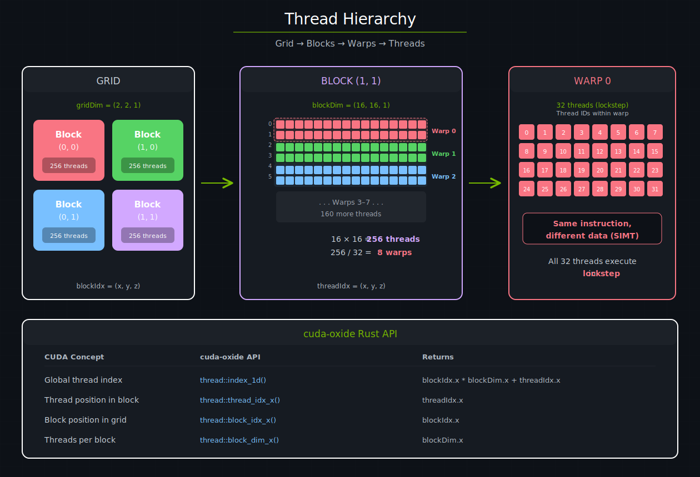
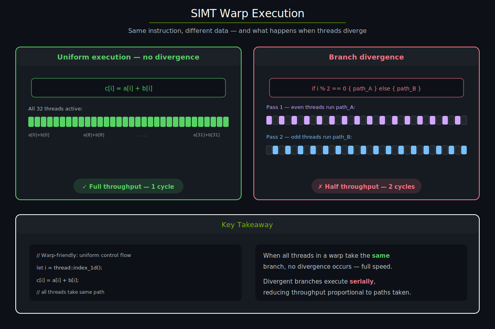
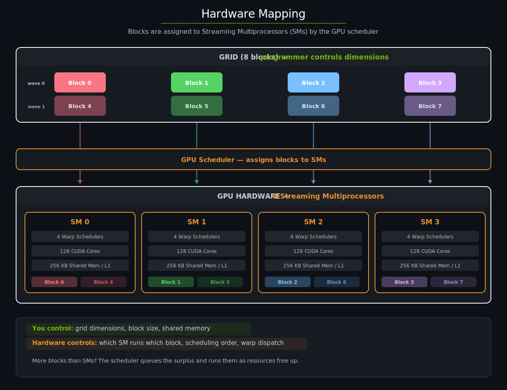

# CUDA 执行模型 — cuda-oxide

本章介绍 CUDA 的 SIMT 执行模型 —— 工作如何被组织为线程、线程束、线程块和网格 —— 以及 cuda-oxide 如何通过安全、符合人体工程学的 Rust API 暴露每个层级。

---

## 线程、线程块和网格

每次kernel启动都会创建一个由**线程块**组成的**网格**。三级层次结构是 GPU 编程的基础：

| 层级 | 定义 | 大小 | 关键特性 |
|------|------|------|----------|
| 网格 (Grid) | 一次kernel调用启动的所有线程块 | 每个维度最多 2³¹ - 1 个块 | 线程块独立执行 |
| 线程块 (Block) | 可以协作的一组线程 | 最多 1024 个线程 | 线程共享高速片上内存 |
| 线程束 (Warp) | 线程块内 32 个连续的线程 | 固定 32 个 | 按锁步执行指令 (SIMT) |


kernel启动需要指定两件事：网格中有多少个块（**网格维度**），以及每个块中有多少个线程（**线程块维度**）。然后硬件自动将每 32 个连续的线程编为一个线程束 —— 你永远不会显式地创建线程束。



*CUDA 三级线程层次结构。一个 2×2 的块网格，每个块包含 256 个线程，排列为 8 个线程束（每个 32 线程）。底部图例将 CUDA 概念映射到对应的 cuda-oxide API。*

---

## cuda-oxide 中的线程索引

在kernel内部，每个线程需要知道它应该处理**哪个**元素。CUDA 提供了内置变量（`threadIdx`、`blockIdx`、`blockDim`、`gridDim`）；cuda-oxide 将它们包装在 `cuda_device::thread` 模块中：

```rust
use cuda_device::{kernel, thread, DisjointSlice};

#[kernel]
pub fn vecadd(a: &[f32], b: &[f32], mut c: DisjointSlice<f32>) {
    let idx = thread::index_1d();
    if let Some(c_elem) = c.get_mut(idx) {
        *c_elem = a[idx.get()] + b[idx.get()];
    }
}
```

`thread::index_1d()` 计算 `blockIdx.x * blockDim.x + threadIdx.x` —— 全局扁平索引，将每个线程精确映射到一个数组元素。这是处理一维数据并行kernel的常见情况。

对于需要单独组件的场景，cuda-oxide 暴露了原始访问器：

| cuda-oxide API | 等价的 CUDA C++ | 返回值 |
|---------------|----------------|--------|
| `thread::index_1d()` | `blockIdx.x * blockDim.x +` <br> `threadIdx.x` | 全局一维线程索引 |
| `thread::threadIdx_x()` | `threadIdx.x` | 线程在其块内的位置 |
| `thread::blockIdx_x()` | `blockIdx.x` | 块在网格内的位置 |
| `thread::blockDim_x()` | `blockDim.x` | 每个块的线程数（x 维度） |

> **提示**
> 
> 对于多维索引（例如二维矩阵操作），使用 `threadIdx_y()`、`blockIdx_y()` 和 `blockDim_y()`，配合 `_x` 变体来计算行/列索引。

---

## 线程束与 SIMT 执行

**线程束 (warp)** 是 NVIDIA GPU 上的基本调度单元。块中每 32 个连续的线程组成一个线程束，线程束中的所有 32 个线程在**同一时间**执行**相同的指令** —— 但处理**不同的数据**。这种模型称为 **SIMT**（单指令多线程）。

当线程束中的所有线程遵循相同的控制流路径时，线程束达到全吞吐量。当线程发生分歧（不同线程走不同的 `if` 分支）时，硬件会串行化执行路径：先执行一个分支（部分线程被屏蔽），再执行另一个分支，然后重新汇合。这称为**分支分歧**，它会直接降低吞吐量。



*左图：统一执行，所有 32 个线程在一个周期内运行相同指令。右图：分支分歧，偶数和奇数线程走不同路径，需要两次串行执行。*

### 为什么这很重要

你不需要考虑线程束就能编写*正确*的kernel —— cuda-oxide 会处理这些细节。但理解 SIMT 有助于你编写*快速*的kernel：

- **优先统一控制流。** 当线程束中的所有线程评估相同的分支时，没有分歧惩罚。
- **数据相关的分支是可以接受的**，只要相邻线程（同一线程束内的）倾向于走相同路径。
- **避免基于线程 ID 的分支**，如 `if thread::threadIdx_x() % 2 == 0` 出现在热点循环中 —— 这会导致每个线程束都发生分歧。

---

## 硬件映射

当你启动kernel时，GPU 的硬件调度器将每个块分配给一个**流式多处理器 (SM)**。多个块可以在同一个 SM 上并发运行 —— 具体数量取决于块的资源使用量（寄存器、共享内存、线程）。

关键洞察：**你控制网格和块的维度；硬件控制其他一切。** 你永远不会指定哪个 SM 运行哪个块，或者块以什么顺序执行。这种分离使得同一个kernel可以从只有少量 SM 的笔记本 GPU 扩展到拥有 100+ SM 的数据中心 GPU。



*八个块被 GPU 调度器分配到四个 SM 上。每个 SM 有自己的线程束调度器、CUDA 核心和共享内存/L1 缓存。块 4-7（虚线箭头）在块 0-3 完成后运行，或者在资源允许时与它们一起排队执行。*

### 什么限制了并发性

每个 SM 拥有固定数量的资源。只有当 SM 拥有足够的**以下所有资源**时，块才会被分配给它：
| 资源 | 典型限制 (Ampere) | 控制方式 |
|------|-------------------|----------|
| 线程 | 每 SM 2048 个 | `block_dim` |
| 寄存器 | 每 SM 65536 个 | 编译器分配 |
| 共享内存 | 每 SM 164 KB（可配置） | `shared_mem_bytes` |
| 块槽位 | 每 SM 32 个 | 网格大小 |

当块完成后，其资源被释放，调度器立即将队列中的下一个块分配给该 SM。这就是为什么启动的块数*超过* GPU 拥有的 SM 数量不仅没问题 —— 而且是正常且预期的模式。

---

## 启动配置

在主机端，`LaunchConfig` 告诉运行时如何组织网格：

```rust
use cuda_core::LaunchConfig;

// 快速一维启动：每块 256 个线程，足够的块覆盖 N 个元素
let cfg = LaunchConfig::for_num_elems(N as u32);
```

`for_num_elems` 使用 256 的块大小，通过向上取整除法计算网格大小 —— 这是大多数逐元素kernel的正确默认值。如需更多控制，直接构造 `LaunchConfig`：

```rust
let cfg = LaunchConfig {
    grid_dim: (4, 4, 1),      // 4×4 = 16 个块
    block_dim: (16, 16, 1),   // 16×16 = 每块 256 个线程
    shared_mem_bytes: 0,       // 无动态共享内存
};
```

然后将其传递给生成的启动方法：

```rust
module
    .vecadd(&stream, LaunchConfig::for_num_elems(N as u32), &a_dev, &b_dev, &mut c_dev)
    .expect("kernel启动失败");
```

或使用异步 API：

```rust
module
    .vecadd_async(LaunchConfig::for_num_elems(N as u32), &a_dev, &b_dev, &mut c_dev)?
    .sync()?;
```

### 选择块大小

块大小是最重要的调节旋钮：

- **256 个线程**是安全的默认值。它在大多数架构上平衡了占用率（每 SM 多个块）和寄存器压力。
- **2 的幂**（128、256、512）自然对齐线程束边界，避免浪费线程。
- **太小**（<< 128）可能导致线程束调度器利用率不足。
- **太大**（1024）使用完整的块线程上限，可能减少每 SM 的并发块数量。

网格大小由块大小和问题大小决定：`grid_x = (N + block_x - 1) / block_x`。这正是 `LaunchConfig::for_num_elems` 所计算的。

### 边界检查

由于网格大小是向上取整的，某些线程的索引会超出数组长度。cuda-oxide 的 `DisjointSlice` 安全地处理这种情况 —— `get_mut` 对越界索引返回 `None`，因此这些线程简单地什么都不做：

```rust
#[kernel]
pub fn vecadd(a: &[f32], b: &[f32], mut c: DisjointSlice<f32>) {
    let idx = thread::index_1d();
    if let Some(c_elem) = c.get_mut(idx) {   // 越界线程跳过
        *c_elem = a[idx.get()] + b[idx.get()];
    }
}
```

这是与 CUDA C++ 的刻意区别，在 CUDA C++ 中边界检查是程序员的责任。cuda-oxide 的方法以单个分支的代价（除了最后一个块外，该分支在线程束内是统一的）消除了整类越界内存错误。

| [上一页](../入门/编写你的第一个kernel.md) | [下一页](./kernel和设备函数.md) |
| :--- | ---: |