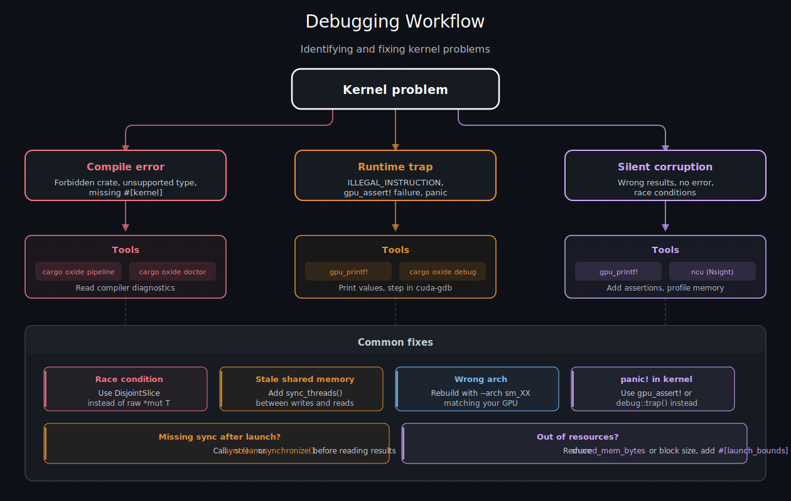

# 错误处理与调试 — cuda-oxide

GPU kernel的失败方式与 CPU 代码不同。CUDA 工具链目前不支持异常或栈展开，kernel输出中没有栈跟踪，也没有 `println!`。当出现问题时，结果要么是静默的数据损坏，要么是硬件 trap，要么是主机上晦涩的驱动错误。本章涵盖 cuda-oxide 用于诊断和修复kernel问题的工具。

---

## 当kernel出错时会发生什么

GPU 错误分为三类：

| 失败模式 | 你看到的现象 | 示例 |
|----------|------------|------|
| 静默损坏 | 结果错误，无错误码 | 竞争条件、索引差一错误 |
| 硬件 trap | 主机收到 `CUDA_ERROR_ILLEGAL_INSTRUCTION` | `gpu_assert!` 失败、panic、越界访问 |
| 启动失败 | 立即返回 `DriverError` | 网格维度错误、模块缺失、资源不足 |

CUDA 工具链目前不暴露异常机制（硬件可能支持，但 nvcc/ptxas 未接入）。trap 指令会终止kernel并使 CUDA 上下文中毒 —— 在同一上下文上的后续操作将失败，直到你处理或重新创建它。

---

## `gpu_printf!` —— 从 GPU 打印

`gpu_printf!` 允许你从设备代码打印值以进行快速调试。它使用 CUDA 内置的 `vprintf` 机制：

```rust
use cuda_device::{kernel, thread, gpu_printf, DisjointSlice};

#[kernel]
pub fn debug_kernel(data: &[f32], mut out: DisjointSlice<f32>) {
    let idx = thread::index_1d();
    if idx.get() < 4 {
        gpu_printf!("线程 {} 看到的值是 {}\n", idx.get(), data[idx.get()]);
    }
    if let Some(out_elem) = out.get_mut(idx) {
        *out_elem = data[idx.get()] * 2.0;
    }
}
```

### 重要细节

- **需要同步才能刷新。** 输出在 GPU 上缓冲，只有在流或设备同步后才出现在主机上（例如 `to_host_vec` 或 `ctx.synchronize()`）。
- **缓冲区大小。** 默认 printf 缓冲区为 1 MiB。如果许多线程打印，输出可能被截断。使用 `cudaDeviceSetLimit(cudaLimitPrintfFifoSize, size)` 扩大。
- **线程顺序。** 不同线程的输出以任意顺序出现。
- **性能。** Printf 跨线程串行化 —— 避免在热点路径中使用。仅用于调试，不用于日志记录。
- **格式转换。** 宏在编译时将 Rust `{}` 格式说明符转换为 C printf 等价物（`%d`、`%f` 等）。

### 为什么不是 `println!` 或 `Debug`？

标准 Rust 格式化（`fmt::Display`、`fmt::Debug`、`format!`、`println!`）需要动态分发、字符串分配和 I/O —— GPU 上这些都不存在。`gpu_printf!` 通过直接降级为 CUDA `vprintf` 调用来绕过所有这些。

---

## `gpu_assert!` 和 `trap()`

对于设备端的致命错误检查，使用 `gpu_assert!` 或 `debug::trap()`：

```rust
use cuda_device::{kernel, thread, debug, gpu_assert, DisjointSlice};

#[kernel]
pub fn checked_kernel(data: &[f32], len: u32, mut out: DisjointSlice<f32>) {
    let idx = thread::index_1d();
    gpu_assert!(idx.get() < len as usize);   // 为假时触发 trap

    if let Some(out_elem) = out.get_mut(idx) {
        *out_elem = data[idx.get()];
    }
}
```

| 内联函数 | 作用 | 主机端效果 |
|----------|------|-----------|
| `gpu_assert!(condition)` | 条件为假时触发 trap | `CUDA_ERROR_ILLEGAL_INSTRUCTION` |
| `debug::trap()` | 无条件触发 trap | `CUDA_ERROR_ILLEGAL_INSTRUCTION` |
| `debug::breakpoint()` | 发出 `brkpt` 指令 | 在 cuda-gdb 中暂停；无调试器时崩溃 |

### Trap 与检查模式

捕获设备端错误的常见工作流：

```rust
// 启动kernel
module.vecadd(&stream, config, &a, &b, &mut c).expect("启动失败");

// 同步并检查 trap
stream.synchronize().expect("kernel触发 trap —— 检查 gpu_assert! 条件");
```

如果 `gpu_assert!` 触发，同步返回错误。错误消息不会告诉你**哪个**断言失败，因此将 `gpu_printf!` 与断言一起使用以缩小问题范围。

---

## 主机端错误处理

### `DriverError`

同步启动路径返回 `Result<(), DriverError>`。`DriverError` 包装 CUDA 驱动结果码：

```rust
match module.vecadd(&stream, config, &a, &b, &mut c) {
    Ok(()) => { /* 成功启动 */ }
    Err(e) => eprintln!("启动失败: {e}"),
}
```

### `DeviceError`

异步路径（`{kernel}_async` / `DeviceOperation`）使用 `DeviceError`，它包装驱动错误以及上下文和调度失败：

```rust
use cuda_async::error::DeviceError;

let result: Result<Vec<f32>, DeviceError> = operation.sync();
```

`DeviceError` 变体包括 `Driver`、`Context`、`KernelCache`、`Scheduling`、`Launch` 和 `Internal`。

### `CudaContext::check_err`

在一系列操作后，调用上下文上的 `check_err()` 以暴露可能已记录的任何异步错误：

```rust
ctx.check_err().expect("检测到异步 GPU 错误");
```

---

## `cargo oxide debug` —— cuda-gdb 集成

`cargo oxide debug` 使用调试信息构建kernel并启动 cuda-gdb：

```bash
cargo oxide debug vecadd          # 标准 GDB
cargo oxide debug vecadd --tui    # 带 TUI 的 GDB
cargo oxide debug vecadd --cgdb   # cgdb 前端
```

### 断点工作流

1. 使用调试构建：`cargo oxide debug <example>`
2. 在kernel上设置断点：`break vecadd`
3. 运行：`run`
4. 检查线程：`cuda thread`、`cuda block`、`cuda warp`
5. 打印变量：`print idx`、`print *c_elem`

对于编程式断点，在kernel代码中使用 `debug::breakpoint()`。当 cuda-gdb 命中 `brkpt` 指令时，它会暂停执行并让你检查 GPU 状态。

> **提示**
> 
> 如果没有调试器附加，`debug::breakpoint()` 会**崩溃**kernel。用编译时标志保护它，或仅在调试会话期间使用。

---

## `cargo oxide doctor` —— 环境验证

在调试kernel失败之前，验证你的环境是否正确配置：

```
cargo oxide doctor
```

Doctor 检查：

| 检查项          | 验证内容                                                        |
| ------------ | ----------------------------------------------------------- |
| Rust 工具链     | 带有必需组件的 Nightly 编译器                                         |
| CUDA Toolkit | `nvcc` 已找到且版本兼容                                             |
| libNVVM      | `libnvvm.so`（CUDA Toolkit）可加载 —— libdevice 数学内核所需           |
| nvJitLink    | `libnvJitLink.so`（CUDA Toolkit）可加载 —— libdevice 数学内核所需      |
| libdevice    | `libdevice.10.bc` 可发现 —— libdevice 数学内核所需                   |
| LLVM         | `llc`（21+）可用于 PTX 生成                                        |
| 代码生成后端       | `librustc_codegen_cuda.so` 已找到（运行 `cargo oxide setup` 来构建它） |


libNVVM / nvJitLink / libdevice 检查仅在kernel调用 CUDA libdevice 数学（`sin`、`cos`、`exp`、`pow`、`sqrt`…）时触发。如果你的kernel是纯算术，这三个失败是无害的。它们都随 CUDA Toolkit 一起发布 —— 无需单独下载。如果任何检查失败，doctor 会打印该组件的标准安装位置。

---

## `cargo oxide pipeline` —— 检查编译过程

当kernel产生错误结果但没有错误时，检查编译流水线以查看确切生成了什么代码：

```bash
cargo oxide pipeline vecadd
```

这会打印完整的流水线输出：

1. **MIR 收集** —— 收集器找到了哪些函数
2. **`dialect-mir`** —— 建模 Rust MIR 的 pliron IR（`mem2reg` 前后）
3. **`dialect-llvm`** —— 建模 LLVM IR 的 pliron IR（`mir-lower` 后）
4. **文本 LLVM IR** —— 序列化的 `.ll` 文件
5. **最终 PTX** —— 生成的汇编

### 环境变量

用于更有针对性的检查：

| 变量                            | 效果               |
| ----------------------------- | ---------------- |
| `CUDA_OXIDE_VERBOSE=1`        | 详细编译器输出          |
| `CUDA_OXIDE_SHOW_RUSTC_MIR=1` | 在导入前转储 rustc MIR |


---

## 使用 Nsight Compute 进行性能分析

对于性能调试，NVIDIA 的 **Nsight Compute**（`ncu`）提供屋顶线分析、内存吞吐量和占用率指标：

```bash
ncu --set full ./target/release/my_example
```

cuda-oxide kernel可以使用 `debug::prof_trigger::<N>()` 发出分析器触发器，它生成 `pmevent` 指令，Nsight Compute 和 Nsight Systems 可以捕获该指令以进行时间线注释。

---

## 常见陷阱

| 陷阱 | 症状 | 修复方法 |
|------|------|----------|
| 输出缓冲区上的竞争条件 | 结果错误、非确定性 | 使用 `DisjointSlice` 替代原始 `*mut T` |
| 缺少 `sync_threads()` | 读取到陈旧的共享内存 | 在写入和读取之间添加屏障 |
| `shared_mem_bytes` 错误 | `LAUNCH_OUT_OF_RESOURCES` 或垃圾数据 | 使 `LaunchConfig` 与实际 `DynamicSharedArray` 使用量匹配 |
| 原始指针越界 | Trap 或静默损坏 | 使用 `DisjointSlice::get_mut` 进行边界检查 |
| 内核中使用 `panic!("message")` | 编译错误（格式化不可用） | 使用 `gpu_assert!` 或 `debug::trap()` |
| 启动后忘记同步 | 主机读取到陈旧数据 | 调用 `to_host_vec`、`stream.synchronize()` 或 `.sync()` |
| PTX 为错误架构构建 | `NO_BINARY_FOR_GPU` | 使用 `cargo oxide build --arch sm_XX` 重新构建 |



*调试决策树：kernel问题分为三类（编译错误、运行时 trap、静默损坏），每类有不同的诊断工具。底部显示了常见修复方法。*


| [上一页](./闭包和泛型.md) | [下一页](../GPU安全/安全模型.md) |
| :--- | ---: |