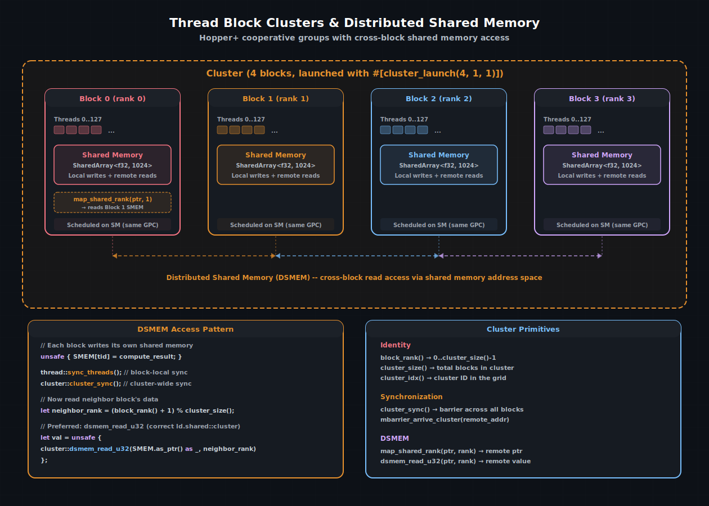

# 簇编程

**线程块簇**是一组保证在同一 GPC（图形处理簇）内的 SM 上同时运行的线程块。簇在 Hopper（SM 90）中引入，提供了标准 CUDA 所不具备的能力：**无需经过全局内存的跨块共享内存访问**。

在普通 CUDA 中，线程块是独立的。块 0 无法读取块 1 的共享内存。使用簇后，硬件会将簇内所有成员的共享内存映射到一个统一的**分布式共享内存（DSMEM）**地址空间。簇中的任何线程都可以直接读取任何块的共享内存 —— 以共享内存延迟访问，无需全局内存往返。

cuda-oxide 通过 `cuda_device::cluster` 和 `#[cluster_launch]` 属性暴露簇功能。本章介绍编程模型、DSMEM 访问模式，以及簇如何与 TMA 多播结合用于高性能矩阵kernel。

> 另请参阅：
> [CUDA 编程指南 — 线程块簇](https://docs.nvidia.com/cuda/cuda-programming-guide/#thread-block-clusters)硬件规格、GPC 约束和最大簇大小。

---

## 簇模型



一个 4 块的簇。每个块有自己的共享内存，但硬件将所有四个映射到一个统一的 DSMEM 空间。块在 `cluster_sync()` 屏障后可以读取彼此的共享内存。虚线箭头表示跨块的 DSMEM 读取。


簇在启动时定义。硬件将簇中的所有块调度到同一 GPC 内的 SM 上，确保低延迟的跨块通信。最大簇大小取决于架构 —— Hopper 支持每个簇最多 8 个块。

### 声明簇kernel

在 cuda-oxide 中，使用 `#[cluster_launch]` 注解kernel：

```rust
use cuda_device::{kernel, cluster_launch, thread, cluster, SharedArray};

#[kernel]
#[cluster_launch(4, 1, 1)]
pub fn cluster_kernel(/* ... */) {
    // 此kernel以 X 维度为 4 块的簇运行
    let rank = cluster::block_rank();
    let size = cluster::cluster_size();
    // ...
}
```

`#[cluster_launch(x, y, z)]` 属性：
1. 注入一个 `__cluster_config<X, Y, Z>()` 函数，设置 PTX `.reqnctapercluster` 指令。
2. 在主机端，启动必须使用 `launch_kernel_ex` 并匹配 `cluster_dim` 参数。

---

## 簇标识

每个线程都可以查询其在簇层次结构中的位置：

```rust
use cuda_device::cluster;

let rank = cluster::block_rank();       // 0..cluster_size()-1 在此簇内
let size = cluster::cluster_size();     // 簇中的总块数
let cidx = cluster::cluster_idx();      // 网格中的哪个簇
let ncls = cluster::num_clusters();     // 网格中的总簇数
```

`block_rank()` 是 DSMEM 访问的关键标识符 —— 它告诉你读取哪个块的共享内存。可以将其视为簇内的“块本地设备 ID”。

对于完整的 3D 簇位置：

```rust
let cx = cluster::cluster_ctaidX();     // 块在簇中的 X 位置
let cy = cluster::cluster_ctaidY();     // 块在簇中的 Y 位置
let cz = cluster::cluster_ctaidZ();     // 块在簇中的 Z 位置
```

---

## 分布式共享内存（DSMEM）

簇的核心功能是跨块共享内存访问。有两种方式读取远程块的共享内存：

### 方法 1：map_shared_rank（指针重映射）

`map_shared_rank` 接受一个本地共享内存指针，返回指向另一个块相同偏移的共享内存指针：

```rust
use cuda_device::{cluster, SharedArray, thread};

static mut DATA: SharedArray<u32, 256> = SharedArray::UNINIT;

#[kernel]
#[cluster_launch(4, 1, 1)]
pub fn halo_exchange(/* ... */) {
    let tid = thread::threadIdx_x() as usize;
    let rank = cluster::block_rank();

    // 每个块写入自己的共享内存
    unsafe { DATA[tid] = compute_value(rank, tid); }

    thread::sync_threads();    // 先本地屏障
    cluster::cluster_sync();   // 然后簇级屏障

    // 读取下一个块的共享内存
    let neighbor = (rank + 1) % cluster::cluster_size();
    let remote_ptr = unsafe {
        cluster::map_shared_rank(DATA.as_ptr().add(tid), neighbor)
    };
    let neighbor_val = unsafe { *remote_ptr };
}
```

### 方法 2：dsmem_read_u32（推荐）

`dsmem_read_u32` 是读取远程共享内存的首选方式。它编译为 `ld.shared::cluster` PTX 指令，硬件处理此指令比通过重映射指针的通用加载更高效：

```rust
let neighbor_val = unsafe {
    cluster::dsmem_read_u32(
        DATA.as_ptr() as *const u32,
        neighbor,  // 目标 rank
    )
};
```

区别微妙但对性能很重要：`map_shared_rank` 产生一个走通用加载路径的指针，而 `dsmem_read_u32` 使用专用指令，硬件可以优化。对于 `u32` 大小的读取使用 `dsmem_read_u32`；对于更大的类型，使用带适当指针类型的 `map_shared_rank` 即可。

---

## 同步

簇在块同步和全局同步之间引入了一个新的同步层级：

| 原语    | 范围   | 使用场景   |
| :----- | :----- | :-------- |
| `thread::sync_threads()`          | 块     | 在单个块内同步                                |
| `cluster::cluster_sync()`         | 簇     | 跨簇内所有块同步                              |
| `mbarrier_arrive_cluster(addr)`   | 簇     | 在远程块中通知屏障                            |

DSMEM 访问的正确同步顺序始终是：

1. **写入**本地共享内存
2. **`sync_threads()`** —— 确保所有本地线程已完成写入
3. **`cluster_sync()`** —— 确保所有块已到达此点
4. **通过 DSMEM 读取**远程共享内存

缺少任何同步都会导致数据竞争。只有 `sync_threads()` 而没有 `cluster_sync()` 意味着你的块已就绪，但邻居可能还未就绪。只有 `cluster_sync()` 而没有 `sync_threads()` 意味着簇已同步，但你自己块的写入可能尚未可见。

---

## 与簇结合的 TMA 多播

簇解锁了 TMA 最强大的功能之一：**多播拷贝**。一次 TMA 加载可以将同一分块同时写入多个块的共享内存：

```rust
use cuda_device::tma::cp_async_bulk_tensor_2d_g2s_multicast;

// CTA 掩码：位 0..3 设置 → 簇中所有 4 个块都接收分块
let cta_mask: u16 = 0b1111;

unsafe {
    cp_async_bulk_tensor_2d_g2s_multicast(
        smem_dst, desc, tile_x, tile_y, bar_ptr, cta_mask
    );
}
```

没有多播时，每个块会发出自己的 TMA 拷贝 —— 四次独立的全局内存读取。使用多播，TMA 引擎读取数据一次并将其分发到所有四个块。这对于 GEMM kernel尤其有价值，其中簇中的每个块都需要相同的 A 或 B 分块。

`cta_mask` 是一个位掩码，如果 rank *i* 应接收拷贝，则设置第 *i* 位。你可以选择性地多播到簇的一个子集。

---

## 实际示例：halo 交换

簇的一个常见用例是模板计算中的 **halo 交换**。每个块处理网格的一个分块，并需要来自其邻居的边界元素。没有簇时，这需要全局内存写入和读取（或仔细的流同步）。使用簇，它变成了本地操作：

```rust
use cuda_device::{kernel, cluster_launch, thread, cluster, SharedArray, DisjointSlice};

const TILE_W: usize = 256;
const HALO: usize = 1;
const SMEM_W: usize = TILE_W + 2 * HALO;

#[kernel]
#[cluster_launch(4, 1, 1)]
pub fn stencil_1d(input: &[f32], mut output: DisjointSlice<f32>, n: u32) {
    static mut SMEM: SharedArray<f32, { SMEM_W }> = SharedArray::UNINIT;

    let tid = thread::threadIdx_x() as usize;
    let rank = cluster::block_rank();
    let global_idx = rank as usize * TILE_W + tid;

    // 加载内部区域（为 halo 槽位偏移 HALO）
    unsafe {
        if global_idx < n as usize {
            SMEM[tid + HALO] = input[global_idx];
        }
    }

    thread::sync_threads();
    cluster::cluster_sync();

    // 从上一个块加载左 halo
    if tid == 0 && rank > 0 {
        let prev_rank = rank - 1;
        unsafe {
            SMEM[0] = f32::from_bits(cluster::dsmem_read_u32(
                SMEM.as_ptr().add(TILE_W) as *const u32, prev_rank
            ));
        }
    }

    // 从下一个块加载右 halo
    if tid == 0 && rank < cluster::cluster_size() - 1 {
        let next_rank = rank + 1;
        unsafe {
            SMEM[TILE_W + HALO] = f32::from_bits(cluster::dsmem_read_u32(
                SMEM.as_ptr().add(HALO) as *const u32, next_rank
            ));
        }
    }

    thread::sync_threads();

    // 3 点模板：output[i] = 0.25 * left + 0.5 * center + 0.25 * right
    if global_idx < n as usize {
        let left = unsafe { SMEM[tid + HALO - 1] };
        let center = unsafe { SMEM[tid + HALO] };
        let right = unsafe { SMEM[tid + HALO + 1] };

        unsafe {
            *output.get_unchecked_mut(global_idx) = 0.25 * left + 0.5 * center + 0.25 * right;
        }
    }
}
```

没有簇时，halo 交换需要将边界元素写入全局内存，通过事件或流同步，然后读回。使用簇，只需要一个 `cluster_sync()` 加上一个 `dsmem_read_u32` —— 共享内存延迟，无需全局内存。

---

## 约束与最佳实践

| 约束   | 细节    |
| :------ | :------------- |
| 最大簇大小       | 8 块（取决于架构）           |
| 调度保证   | 所有簇块在同一 GPC 上同时运行       |
| DSMEM 延迟    | 接近本地共享内存（约 5–10 周期）           |
| 必须声明簇维度      | `#[cluster_launch(x, y, z)]` + 启动配置中的主机 `cluster_dim`      |
| 块数必须可整除    | 每个维度的网格块数必须是簇大小的整数倍  |
| 混合簇/非簇      | 同一kernel中不支持    |

> **提示**：
> 簇施加了调度约束：硬件必须将所有块放置在同一 GPC 上。如果簇相对于 GPC 容量过大，占用率会下降。从较小的簇（2–4 块）开始，测量后再扩展。

> 另请参阅：
> - [张量内存加速器](./张量内存加速器.md) — TMA 多播需要簇来实现跨 CTA 分发
> - [矩阵乘法加速器](./矩阵乘法加速器.md) — CG2 模式使用簇对实现更宽的 MMA 分块
> - [共享内存与同步](./共享内存与同步.md) — DSMEM 扩展的每块基础

| [上一页](./矩阵乘法加速器.md) | [下一页](../深入编译器/架构概述.md) |
| :--- | ---: |